# Aether Code Atlas  
_generated 2025-04-30-10-41-10_

## Contents
- [Definitions Table](#definitions-table)
- [Route Definitions](#route-definitions)
- [Database Schema Summary](#database-schema-summary)
- [Dependency Graph](#dependency-graph)
- [External Dependencies](#external-dependencies)
- [TODOs / FIXMEs](#todos-/-fixmes)
- [Buckets](#buckets)

## Definitions Table
| File | Export Name | Type |
|---|---|---|
| __tests__/server/test-helpers.ts | `createInnerTRPCContext` | function |
| __tests__/server/test-helpers.ts | `createTestContext` | function |
| __tests__/server/test-helpers.ts | `MockablePostgrestResponse` | type |
| __tests__/server/test-helpers.ts | `MockableQueryBuilder` | interface |
| __tests__/server/test-helpers.ts | `MockableSupabaseClient` | interface |
| __tests__/server/test-helpers.ts | `MockableTableOperations` | interface |
| __tests__/server/test-helpers.ts | `mockDeep` | re-export |
| __tests__/server/test-helpers.ts | `mockSupabaseAdmin` | unknown |
| __tests__/server/test-helpers.ts | `resetSupabaseMocks` | function |
| __tests__/server/test-helpers.ts | `TableName` | type |
| __tests__/test-utils.tsx | `render` | re-export |
| app/(auth)/_layout.tsx | `default` | function |
| app/(auth)/forgot-password.tsx | `default` | function |
| app/(auth)/login.tsx | `default` | function |
| app/(auth)/register.tsx | `default` | function |
| app/(tabs)/_layout.tsx | `default` | function |
| app/(tabs)/compass/index.tsx | `default` | function |
| app/(tabs)/home/index.tsx | `default` | function |
| app/(tabs)/planner/_layout.tsx | `default` | function |
| app/(tabs)/planner/add-goal.tsx | `default` | function |
| app/(tabs)/planner/add-habit.tsx | `default` | function |
| app/(tabs)/planner/add-task.tsx | `default` | function |
| app/(tabs)/planner/goal/[id].tsx | `default` | function |
| app/(tabs)/planner/habit/[id].tsx | `default` | function |
| app/(tabs)/planner/index.tsx | `default` | function |
| app/(tabs)/rewards/index.tsx | `default` | function |
| app/(tabs)/settings/_layout.tsx | `default` | function |
| app/(tabs)/settings/about.tsx | `default` | function |
| app/(tabs)/settings/help.tsx | `default` | function |
| app/(tabs)/settings/index.tsx | `default` | function |
| app/(tabs)/settings/notifications.tsx | `default` | function |
| app/(tabs)/settings/privacy.tsx | `default` | function |
| app/(tabs)/settings/profile.tsx | `default` | function |
| app/(tabs)/settings/security.tsx | `default` | function |
| app/_layout.tsx | `default` | function |
| app/components/SectionCard.tsx | `SectionCard` | component |
| app/components/SwipeableRow.tsx | `SwipeableRow` | component |
| app/components/TaskRow.tsx | `TaskRow` | component |
| app/compose.tsx | `default` | function |
| app/index.tsx | `default` | function |
| app/lib/useDashboardQuery.ts | `DashboardData` | type |
| app/lib/useDashboardQuery.ts | `useDashboardQuery` | hook |
| app/lib/useToggleTaskStatus.ts | `useToggleTaskStatus` | hook |
| app/planner/add-habit.tsx | `default` | function |
| app/planner/index.tsx | `default` | unknown |
| app/settings/index.tsx | `default` | unknown |
| app/states/[id].tsx | `default` | function |
| app/utils/api-types.ts | `RouterInputs` | type |
| app/utils/api-types.ts | `RouterOutputs` | type |
| app/values/[id].tsx | `default` | function |
| components/EmptyOrSkeleton.tsx | `default` | function |
| components/EmptyOrSkeleton.tsx | `EmptyOrSkeletonProps` | interface |
| components/EmptyOrSkeleton.tsx | `EmptyStateProps` | interface |
| components/aether/ProgressRing.tsx | `default` | function |
| components/auth/FloatingInput.tsx | `default` | function |
| components/auth/FloatingInput.tsx | `FloatingInputProps` | interface |
| components/compass/PrincipleCard.tsx | `PrincipleCard` | function |
| components/compass/PrinciplesTab.tsx | `default` | function |
| components/compass/StateDefinitionCard.tsx | `StateDefinitionCard` | function |
| components/dashboard/DailyProgressBanner.tsx | `default` | function |
| components/dashboard/DashboardSection.tsx | `default` | function |
| components/dashboard/GoalSummaryCard.tsx | `default` | function |
| components/dashboard/HabitCheckItem.tsx | `default` | function |
| components/dashboard/StateIndicator.tsx | `default` | function |
| components/dashboard/TaskItem.tsx | `default` | function |
| components/lists/GoalList.tsx | `GoalCard` | function |
| components/lists/GoalList.tsx | `GoalList` | function |
| components/lists/HabitList.tsx | `HabitCard` | function |
| components/lists/HabitList.tsx | `HabitList` | function |
| components/lists/TaskList.tsx | `TaskCard` | function |
| components/lists/TaskList.tsx | `TaskList` | function |
| components/lists/index.ts | `GoalCard` | re-export |
| components/lists/index.ts | `GoalList` | re-export |
| components/lists/index.ts | `HabitCard` | re-export |
| components/lists/index.ts | `HabitList` | re-export |
| components/lists/index.ts | `TaskCard` | re-export |
| components/lists/index.ts | `TaskList` | re-export |
| components/planner/GoalsList.tsx | `default` | function |
| components/planner/GoalsList.tsx | `Goal` | interface |
| components/planner/GoalsList.tsx | `GoalsListProps` | interface |
| components/planner/HabitTracker.tsx | `HabitTracker` | function |
| components/planner/HabitsList.tsx | `default` | function |
| components/planner/HabitsList.tsx | `Habit` | interface |
| components/planner/HabitsList.tsx | `HabitsListProps` | interface |
| components/planner/StreakCalendar.tsx | `default` | function |
| components/planner/StreakCalendar.tsx | `StreakCalendarProps` | interface |
| components/rewards/ConfettiBurst.tsx | `default` | function |
| components/settings/NotificationRow.tsx | `default` | function |
| components/settings/NotificationRow.tsx | `NotificationRowProps` | interface |
| components/settings/ThemePreview.tsx | `default` | function |
| components/settings/ThemePreview.tsx | `ThemePreviewProps` | interface |
| components/ui/Container.tsx | `Container` | component |
| components/ui/Container.tsx | `default` | unknown |
| components/ui/EmptyOrSkeleton.tsx | `EmptyOrSkeleton` | component |
| components/ui/EmptyOrSkeleton.tsx | `EmptyOrSkeletonProps` | interface |
| components/ui/ErrorBanner.tsx | `ErrorBanner` | function |
| components/ui/ErrorBanner.tsx | `SectionError` | function |
| components/ui/InteractiveCard.tsx | `default` | unknown |
| components/ui/Section.tsx | `default` | unknown |
| components/ui/Skeleton.tsx | `Skeleton` | function |
| components/ui/Skeleton.tsx | `SkeletonAvatar` | function |
| components/ui/Skeleton.tsx | `SkeletonCard` | function |
| components/ui/Skeleton.tsx | `SkeletonCircle` | function |
| components/ui/Skeleton.tsx | `SkeletonProfile` | function |
| components/ui/Skeleton.tsx | `SkeletonRow` | function |
| components/ui/SwipeableRow.tsx | `default` | function |
| components/ui/primitives/AetherCard.tsx | `AetherCard` | function |
| components/ui/primitives/AetherListItem.tsx | `AetherListItem` | function |
| components/ui/primitives/AetherListItem.tsx | `AetherListItemProps` | interface |
| components/ui/primitives/SectionHeader.tsx | `SectionHeader` | function |
| components/ui/primitives/SectionHeader.tsx | `SectionHeaderProps` | interface |
| components/ui/primitives/index.ts | `AetherCard` | re-export |
| components/ui/primitives/index.ts | `AetherListItem` | re-export |
| components/ui/primitives/index.ts | `AetherListItemProps` | re-export |
| components/ui/primitives/index.ts | `SectionHeader` | re-export |
| components/ui/primitives/index.ts | `SectionHeaderProps` | re-export |
| constants/Colors.ts | `Colors` | component |
| constants/motion.ts | `componentAnimations` | unknown |
| constants/motion.ts | `durations` | unknown |
| constants/motion.ts | `easings` | unknown |
| constants/motion.ts | `presets` | unknown |
| debug/toast-test.tsx | `default` | function |
| design-system/Animations.ts | `fadeInUp` | unknown |
| design-system/Animations.ts | `korokReveal` | unknown |
| design-system/Animations.ts | `sheikahGlow` | unknown |
| design-system/Animations.ts | `slideOutLeft` | unknown |
| design-system/Animations.ts | `taskComplete` | unknown |
| design-system/Primitives.tsx | `Button` | component |
| design-system/Primitives.tsx | `Center` | component |
| design-system/Primitives.tsx | `gs` | re-export |
| design-system/Primitives.tsx | `HStack` | component |
| design-system/Primitives.tsx | `Pressable` | component |
| design-system/Primitives.tsx | `ScrollView` | component |
| design-system/Primitives.tsx | `Stack` | component |
| design-system/Primitives.tsx | `Text` | component |
| design-system/Primitives.tsx | `useColorMode` | hook |
| design-system/Primitives.tsx | `useColorModeValue` | function |
| design-system/Primitives.tsx | `useToast` | hook |
| design-system/Primitives.tsx | `VStack` | component |
| design-system/theme.glue.ts | `glueTheme` | unknown |
| design-system/tokens.ts | `colors` | unknown |
| design-system/tokens.ts | `default` | unknown |
| design-system/tokens.ts | `fonts` | unknown |
| design-system/tokens.ts | `radii` | unknown |
| design-system/tokens.ts | `sizes` | unknown |
| design-system/tokens.ts | `space` | unknown |
| hooks/useColorScheme.ts | `useColorScheme` | re-export |
| hooks/useColorScheme.web.ts | `useColorScheme` | function |
| hooks/useOfflineSync.ts | `useOfflineSync` | function |
| hooks/useSkeleton.ts | `SkeletonOptions` | interface |
| hooks/useSkeleton.ts | `useSkeleton` | function |
| hooks/useThemeColor.ts | `useThemeColor` | function |
| modals/compose.tsx | `default` | function |
| providers/AppProvider.tsx | `AppProvider` | function |
| providers/ConfettiProvider.tsx | `ConfettiProvider` | function |
| providers/ConfettiProvider.tsx | `useConfetti` | hook |
| providers/SupabaseProvider.tsx | `SupabaseContext` | component |
| providers/SupabaseProvider.tsx | `SupabaseProvider` | function |
| providers/SupabaseProvider.tsx | `useSupabase` | hook |
| providers/TRPCProvider.tsx | `trpc` | unknown |
| providers/TRPCProvider.tsx | `TRPCProvider` | function |
| server/src/context.ts | `Context` | interface |
| server/src/context.ts | `createContext` | function |
| server/src/context.ts | `supabaseAdmin` | unknown |
| server/src/router.ts | `appRouter` | unknown |
| server/src/router.ts | `AppRouter` | type |
| server/src/router.ts | `protectedProcedure` | unknown |
| server/src/router.ts | `publicProcedure` | unknown |
| server/src/router.ts | `router` | unknown |
| server/src/routers/dashboardRouter.ts | `dashboardRouter` | unknown |
| server/src/routers/goalProgressNoteRouter.ts | `goalProgressNoteRouter` | unknown |
| server/src/routers/goalRouter.ts | `goalRouter` | unknown |
| server/src/routers/habitRouter.ts | `habitRouter` | unknown |
| server/src/routers/principleRouter.ts | `principleRouter` | unknown |
| server/src/routers/reminderRouter.ts | `reminderRouter` | unknown |
| server/src/routers/rewardsRouter.ts | `rewardsRouter` | unknown |
| server/src/routers/taskRouter.ts | `taskRouter` | unknown |
| server/src/routers/trackedStateRouter.ts | `trackedStateRouter` | unknown |
| server/src/routers/userRouter.ts | `userRouter` | unknown |
| server/src/routers/valueRouter.ts | `valueRouter` | unknown |
| server/src/types/index.ts | `Badge` | interface |
| server/src/types/index.ts | `BadgeId` | type |
| server/src/types/index.ts | `Goal` | interface |
| server/src/types/index.ts | `GoalId` | type |
| server/src/types/index.ts | `Habit` | interface |
| server/src/types/index.ts | `HabitId` | type |
| server/src/types/index.ts | `KeyResult` | interface |
| server/src/types/index.ts | `Principle` | interface |
| server/src/types/index.ts | `Task` | interface |
| server/src/types/index.ts | `TaskId` | type |
| server/src/types/index.ts | `TrackedStateDef` | interface |
| server/src/types/index.ts | `Value` | interface |
| server/src/types/index.ts | `ValueId` | type |
| server/src/types/trpc-types.ts | `awardBadgeInput` | unknown |
| server/src/types/trpc-types.ts | `BadgeDefinition` | component |
| server/src/types/trpc-types.ts | `BadgeDefinition` | type |
| server/src/types/trpc-types.ts | `claimLootInput` | unknown |
| server/src/types/trpc-types.ts | `createGoalInput` | unknown |
| server/src/types/trpc-types.ts | `createGoalProgressNoteInput` | unknown |
| server/src/types/trpc-types.ts | `createHabitEntryInput` | unknown |
| server/src/types/trpc-types.ts | `createHabitInput` | unknown |
| server/src/types/trpc-types.ts | `createPrincipleInput` | unknown |
| server/src/types/trpc-types.ts | `createReminderInput` | unknown |
| server/src/types/trpc-types.ts | `CreateStateEntryInput` | component |
| server/src/types/trpc-types.ts | `createTaskInput` | unknown |
| server/src/types/trpc-types.ts | `createTrackedStateDefInput` | unknown |
| server/src/types/trpc-types.ts | `createValueInput` | unknown |
| server/src/types/trpc-types.ts | `DeleteGoalProgressNoteInput` | component |
| server/src/types/trpc-types.ts | `DeleteReminderInput` | component |
| server/src/types/trpc-types.ts | `DeleteStateEntryInput` | component |
| server/src/types/trpc-types.ts | `DeleteTrackedStateDefInput` | component |
| server/src/types/trpc-types.ts | `GetGoalProgressNotesInput` | component |
| server/src/types/trpc-types.ts | `GetRemindersForEntityInput` | component |
| server/src/types/trpc-types.ts | `GetStateEntriesInput` | component |
| server/src/types/trpc-types.ts | `GetTrackedStateDefByIdInput` | component |
| server/src/types/trpc-types.ts | `Goal` | component |
| server/src/types/trpc-types.ts | `Goal` | type |
| server/src/types/trpc-types.ts | `GoalProgressNote` | component |
| server/src/types/trpc-types.ts | `GoalProgressNote` | type |
| server/src/types/trpc-types.ts | `greetingInput` | unknown |
| server/src/types/trpc-types.ts | `greetingOutput` | unknown |
| server/src/types/trpc-types.ts | `Habit` | component |
| server/src/types/trpc-types.ts | `Habit` | type |
| server/src/types/trpc-types.ts | `HabitEntry` | component |
| server/src/types/trpc-types.ts | `HabitEntry` | type |
| server/src/types/trpc-types.ts | `HabitFrequencyPeriodEnum` | component |
| server/src/types/trpc-types.ts | `HabitTypeEnum` | component |
| server/src/types/trpc-types.ts | `NotificationPrefs` | component |
| server/src/types/trpc-types.ts | `PointTransaction` | component |
| server/src/types/trpc-types.ts | `PointTransaction` | type |
| server/src/types/trpc-types.ts | `Principle` | component |
| server/src/types/trpc-types.ts | `Principle` | type |
| server/src/types/trpc-types.ts | `Reminder` | component |
| server/src/types/trpc-types.ts | `Reminder` | type |
| server/src/types/trpc-types.ts | `Reward` | component |
| server/src/types/trpc-types.ts | `Reward` | type |
| server/src/types/trpc-types.ts | `RewardTypeEnum` | component |
| server/src/types/trpc-types.ts | `RouterInputs` | type |
| server/src/types/trpc-types.ts | `RouterOutputs` | type |
| server/src/types/trpc-types.ts | `StateEntry` | component |
| server/src/types/trpc-types.ts | `StateEntry` | type |
| server/src/types/trpc-types.ts | `Task` | component |
| server/src/types/trpc-types.ts | `Task` | type |
| server/src/types/trpc-types.ts | `TaskPriorityEnum` | component |
| server/src/types/trpc-types.ts | `TaskStatusEnum` | component |
| server/src/types/trpc-types.ts | `TrackedStateDef` | component |
| server/src/types/trpc-types.ts | `TrackedStateDef` | type |
| server/src/types/trpc-types.ts | `UiPrefs` | component |
| server/src/types/trpc-types.ts | `updateGoalInput` | unknown |
| server/src/types/trpc-types.ts | `updateGoalProgressNoteInput` | unknown |
| server/src/types/trpc-types.ts | `updateHabitEntryInput` | unknown |
| server/src/types/trpc-types.ts | `updateHabitInput` | unknown |
| server/src/types/trpc-types.ts | `updatePrincipleInput` | unknown |
| server/src/types/trpc-types.ts | `updateProfileInput` | unknown |
| server/src/types/trpc-types.ts | `updateReminderInput` | unknown |
| server/src/types/trpc-types.ts | `updateSettingsInput` | unknown |
| server/src/types/trpc-types.ts | `updateStateEntryInput` | unknown |
| server/src/types/trpc-types.ts | `updateTaskInput` | unknown |
| server/src/types/trpc-types.ts | `updateTaskStatusInput` | unknown |
| server/src/types/trpc-types.ts | `updateTrackedStateDefInput` | unknown |
| server/src/types/trpc-types.ts | `updateValueInput` | unknown |
| server/src/types/trpc-types.ts | `UserBadge` | component |
| server/src/types/trpc-types.ts | `UserBadge` | type |
| server/src/types/trpc-types.ts | `UserProfile` | component |
| server/src/types/trpc-types.ts | `UserProfile` | type |
| server/src/types/trpc-types.ts | `UserReward` | component |
| server/src/types/trpc-types.ts | `UserReward` | type |
| server/src/types/trpc-types.ts | `UserSettings` | component |
| server/src/types/trpc-types.ts | `UserSettings` | type |
| server/src/types/trpc-types.ts | `Value` | component |
| server/src/types/trpc-types.ts | `Value` | type |
| stores/uiStore.ts | `useUiStore` | hook |
| tamagui.config.ts | `default` | unknown |
| utils/api-types.ts | `RouterInputs` | type |
| utils/api-types.ts | `RouterOutputs` | type |
| utils/auth.ts | `getUserProfile` | function |
| utils/auth.ts | `logout` | function |
| utils/colors.ts | `palette` | unknown |
| utils/colors.ts | `semanticTokens` | unknown |
| utils/colors.ts | `useColors` | function |
| utils/colors.ts | `withOpacity` | function |
| utils/generated-hooks.ts | `useDashboard` | hook |
| utils/generated-hooks.ts | `useGoal` | hook |
| utils/generated-hooks.ts | `useGoalProgressNote` | hook |
| utils/generated-hooks.ts | `useHabit` | hook |
| utils/generated-hooks.ts | `usePrinciple` | hook |
| utils/generated-hooks.ts | `useReminder` | hook |
| utils/generated-hooks.ts | `useRewards` | hook |
| utils/generated-hooks.ts | `useState` | hook |
| utils/generated-hooks.ts | `useTask` | hook |
| utils/generated-hooks.ts | `useUser` | hook |
| utils/generated-hooks.ts | `useValue` | hook |
| utils/haptics.ts | `haptics` | unknown |
| utils/mock-api.ts | `appRouter` | unknown |
| utils/mock-api.ts | `AppRouter` | type |
| utils/nats-client.ts | `addSubjectHandler` | function |
| utils/nats-client.ts | `closeNatsConnection` | function |
| utils/nats-client.ts | `getNatsConnection` | function |
| utils/nats-client.ts | `initNatsClient` | function |
| utils/nats-client.ts | `subscribeWithCache` | function |
| utils/offline-mutations.ts | `asyncStoragePersister` | unknown |
| utils/offline-mutations.ts | `configureQueryClientForOffline` | function |
| utils/offline-mutations.ts | `getPendingMutations` | function |
| utils/offline-mutations.ts | `markItemAsOffline` | function |
| utils/offline-mutations.ts | `markItemAsSynced` | function |
| utils/offline-mutations.ts | `reactQueryPersistOptions` | unknown |
| utils/offline-mutations.ts | `useResumeNetworkMutations` | function |
| utils/offline-sync.ts | `getPendingItems` | function |
| utils/offline-sync.ts | `PendingItem` | interface |
| utils/offline-sync.ts | `saveOfflineMutation` | function |
| utils/offline-sync.ts | `setupBackgroundSync` | function |
| utils/offline-sync.ts | `syncOfflineMutations` | function |
| utils/query-client.ts | `queryClient` | unknown |
| utils/settings.ts | `APP_SETTINGS_KEY` | component |
| utils/settings.ts | `AppSettings` | type |
| utils/settings.ts | `getAppVersion` | function |
| utils/settings.ts | `getPlatformInfo` | function |
| utils/settings.ts | `getSettings` | function |
| utils/settings.ts | `saveSettings` | function |
| utils/settings.ts | `updateSetting` | function |
| utils/supabase.ts | `getCurrentUser` | unknown |
| utils/supabase.ts | `isAuthenticated` | unknown |
| utils/supabase.ts | `supabase` | unknown |
| utils/trpc.ts | `RouterInputs` | type |
| utils/trpc.ts | `RouterOutputs` | type |
| utils/trpc.ts | `trpc` | unknown |

## Route Definitions
| Route File | Type |
|---|---|
| app/(auth)/forgot-password.tsx | screen |
| app/(auth)/login.tsx | screen |
| app/(auth)/register.tsx | screen |
| app/(tabs)/compass/index.tsx | screen |
| app/(tabs)/home/index.tsx | screen |
| app/(tabs)/planner/add-goal.tsx | screen |
| app/(tabs)/planner/add-habit.tsx | screen |
| app/(tabs)/planner/add-task.tsx | screen |
| app/(tabs)/planner/goal/[id].tsx | screen |
| app/(tabs)/planner/habit/[id].tsx | screen |
| app/(tabs)/planner/index.tsx | screen |
| app/(tabs)/rewards/index.tsx | screen |
| app/(tabs)/settings/about.tsx | screen |
| app/(tabs)/settings/help.tsx | screen |
| app/(tabs)/settings/index.tsx | screen |
| app/(tabs)/settings/notifications.tsx | screen |
| app/(tabs)/settings/privacy.tsx | screen |
| app/(tabs)/settings/profile.tsx | screen |
| app/(tabs)/settings/security.tsx | screen |
| app/components/SectionCard.tsx | screen |
| app/components/SwipeableRow.tsx | screen |
| app/components/TaskRow.tsx | screen |
| app/compose.tsx | layout (implicit) |
| app/index.tsx | screen |
| app/planner/add-habit.tsx | screen |
| app/planner/index.tsx | screen |
| app/settings/index.tsx | screen |
| app/states/[id].tsx | screen |
| app/values/[id].tsx | screen |

## Database Schema Summary

_Extracted from: types/database.types.ts_

### Tables

**`badge_definitions`**

| Column | Type |
|---|---|
| `description` | `string \| null` |
| `icon` | `string` |
| `id` | `string` |
| `title` | `string` |

**`goal_progress_notes`**

| Column | Type |
|---|---|
| `created_at` | `string` |
| `goal_id` | `string` |
| `id` | `string` |
| `note` | `string` |
| `user_id` | `string` |

**`goal_values`**

| Column | Type |
|---|---|
| `goal_id` | `string` |
| `user_id` | `string` |
| `value_id` | `string` |

**`goals`**

| Column | Type |
|---|---|
| `archived_at` | `string \| null` |
| `created_at` | `string \| null` |
| `description` | `string \| null` |
| `id` | `string` |
| `progress` | `number \| null` |
| `sort_order` | `number \| null` |
| `target_date` | `string \| null` |
| `title` | `string` |
| `updated_at` | `string \| null` |
| `user_id` | `string` |

**`habit_entries`**

| Column | Type |
|---|---|
| `completed` | `boolean` |
| `created_at` | `string` |
| `date` | `string` |
| `habit_id` | `string` |
| `id` | `string` |
| `notes` | `string \| null` |
| `quantity_value` | `number \| null` |
| `user_id` | `string` |

**`habit_values`**

| Column | Type |
|---|---|
| `habit_id` | `string` |
| `user_id` | `string` |
| `value_id` | `string` |

**`habits`**

| Column | Type |
|---|---|
| `archived_at` | `string \| null` |
| `best_streak` | `number` |
| `created_at` | `string` |
| `cue` | `string \| null` |
| `frequency_period` | `Database[` |
| `goal_frequency` | `number` |
| `goal_quantity` | `number \| null` |
| `goal_unit` | `string \| null` |
| `habit_type` | `Database[` |
| `id` | `string` |
| `recurrence_end_date` | `string \| null` |
| `recurrence_rule` | `string \| null` |
| `reward` | `string \| null` |
| `routine` | `string \| null` |
| `streak` | `number` |
| `title` | `string` |
| `updated_at` | `string` |
| `user_id` | `string` |

**`key_results`**

| Column | Type |
|---|---|
| `created_at` | `string` |
| `goal_id` | `string` |
| `id` | `string` |
| `progress` | `number \| null` |
| `title` | `string` |
| `updated_at` | `string` |
| `user_id` | `string` |

**`point_transactions`**

| Column | Type |
|---|---|
| `created_at` | `string` |
| `id` | `string` |
| `points` | `number` |
| `reason` | `string` |
| `source_id` | `string \| null` |
| `source_type` | `string` |
| `user_id` | `string` |

**`principle_values`**

| Column | Type |
|---|---|
| `principle_id` | `string` |
| `user_id` | `string` |
| `value_id` | `string` |

**`principles`**

| Column | Type |
|---|---|
| `body` | `string` |
| `created_at` | `string` |
| `id` | `string` |
| `sort_order` | `number \| null` |
| `title` | `string` |
| `updated_at` | `string` |
| `user_id` | `string` |

**`profiles`**

| Column | Type |
|---|---|
| `created_at` | `string \| null` |
| `email` | `string` |
| `id` | `string` |
| `lifetime_points` | `number` |
| `points` | `number` |
| `username` | `string \| null` |

**`reminders`**

| Column | Type |
|---|---|
| `created_at` | `string` |
| `id` | `string` |
| `is_active` | `boolean` |
| `related_entity_id` | `string` |
| `related_entity_type` | `string` |
| `reminder_time` | `string` |
| `updated_at` | `string` |
| `user_id` | `string` |

**`rewards`**

| Column | Type |
|---|---|
| `can_earn_multiple` | `boolean` |
| `created_at` | `string` |
| `description` | `string \| null` |
| `id` | `string` |
| `image_url` | `string \| null` |
| `metadata` | `Json \| null` |
| `name` | `string` |
| `required_points` | `number` |
| `type` | `Database[` |
| `updated_at` | `string` |

**`state_entries`**

| Column | Type |
|---|---|
| `definition_id` | `string` |
| `entry_timestamp` | `string` |
| `id` | `string` |
| `notes` | `string \| null` |
| `user_id` | `string` |
| `value_numeric` | `number \| null` |
| `value_text` | `string \| null` |

**`task_values`**

| Column | Type |
|---|---|
| `task_id` | `string` |
| `user_id` | `string` |
| `value_id` | `string` |

**`tasks`**

| Column | Type |
|---|---|
| `archived_at` | `string \| null` |
| `created_at` | `string \| null` |
| `due` | `string \| null` |
| `goal_id` | `string \| null` |
| `id` | `string` |
| `notes` | `string \| null` |
| `parent_task_id` | `string \| null` |
| `priority` | `Database[` |
| `recurrence_end_date` | `string \| null` |
| `recurrence_rule` | `string \| null` |
| `sort_order` | `number \| null` |
| `status` | `Database[` |
| `title` | `string` |
| `updated_at` | `string \| null` |
| `user_id` | `string` |

**`tracked_state_defs`**

| Column | Type |
|---|---|
| `active` | `boolean` |
| `created_at` | `string` |
| `custom_labels` | `string[] \| null` |
| `id` | `string` |
| `name` | `string` |
| `priority` | `number` |
| `scale` | `Database[` |
| `target_max_value` | `number \| null` |
| `target_min_value` | `number \| null` |
| `updated_at` | `string` |
| `user_id` | `string` |

**`tracked_state_values`**

| Column | Type |
|---|---|
| `state_id` | `string` |
| `user_id` | `string` |
| `value_id` | `string` |

**`user_badges`**

| Column | Type |
|---|---|
| `badge_id` | `string` |
| `earned_at` | `string` |
| `progress` | `number \| null` |
| `user_id` | `string` |

**`user_rewards`**

| Column | Type |
|---|---|
| `created_at` | `string` |
| `earned_at` | `string` |
| `id` | `string` |
| `metadata` | `Json \| null` |
| `points_spent` | `number` |
| `reward_id` | `string` |
| `reward_type` | `string \| null` |
| `updated_at` | `string` |
| `user_id` | `string` |

**`user_settings`**

| Column | Type |
|---|---|
| `created_at` | `string` |
| `id` | `string` |
| `notification_preferences` | `Json` |
| `ui_preferences` | `Json` |
| `updated_at` | `string` |
| `user_id` | `string` |

**`values`**

| Column | Type |
|---|---|
| `color` | `string \| null` |
| `created_at` | `string` |
| `description` | `string \| null` |
| `domain_id` | `string \| null` |
| `id` | `string` |
| `sort_order` | `number \| null` |
| `title` | `string` |
| `updated_at` | `string` |
| `user_id` | `string` |

### Enums

**`habit_frequency_period`**: ``

**`habit_type`**: ``

**`reward_type`**: ``

**`task_priority`**: ``

**`task_status`**: ``

**`tracked_state_scale`**: ``

## Dependency Graph
*Note: This graph shows dependencies between local files only.*

```mermaid
graph TD;
  __tests___components_ui_primitives_AetherCard_test_tsx["__tests__/components/ui/primitives/AetherCard.test.tsx"] --> __tests___test_utils_tsx["__tests__/test-utils.tsx"];
  __tests___server_routers_dashboardRouter_getWeeklyProgress_test_ts["__tests__/server/routers/dashboardRouter.getWeeklyProgress.test.ts"] --> __tests___server_test_helpers_ts["__tests__/server/test-helpers.ts"];
  __tests___server_routers_dashboardRouter_getWeeklyProgress_test_ts["__tests__/server/routers/dashboardRouter.getWeeklyProgress.test.ts"] --> server_src_router_ts["server/src/router.ts"];
  __tests___server_routers_dashboardRouter_test_ts["__tests__/server/routers/dashboardRouter.test.ts"] --> __tests___server_test_helpers_ts["__tests__/server/test-helpers.ts"];
  __tests___server_routers_dashboardRouter_test_ts["__tests__/server/routers/dashboardRouter.test.ts"] --> server_src_router_ts["server/src/router.ts"];
  __tests___server_routers_habitRouter_test_ts["__tests__/server/routers/habitRouter.test.ts"] --> __tests___server_test_helpers_ts["__tests__/server/test-helpers.ts"];
  __tests___server_routers_habitRouter_test_ts["__tests__/server/routers/habitRouter.test.ts"] --> server_src_router_ts["server/src/router.ts"];
  __tests___server_routers_habitRouter_test_ts["__tests__/server/routers/habitRouter.test.ts"] --> server_src_types_trpc_types_ts["server/src/types/trpc-types.ts"];
  __tests___server_routers_taskRouter_toggleTask_test_ts["__tests__/server/routers/taskRouter.toggleTask.test.ts"] --> __tests___server_test_helpers_ts["__tests__/server/test-helpers.ts"];
  __tests___server_routers_taskRouter_toggleTask_test_ts["__tests__/server/routers/taskRouter.toggleTask.test.ts"] --> server_src_router_ts["server/src/router.ts"];
  __tests___test_utils_tsx["__tests__/test-utils.tsx"] --> tamagui_config_ts["tamagui.config.ts"];
  app_utils_api_types_ts["app/utils/api-types.ts"] --> server_src_router_ts["server/src/router.ts"];
  components_compass_PrinciplesTab_tsx["components/compass/PrinciplesTab.tsx"] --> components_compass_PrincipleCard_tsx["components/compass/PrincipleCard.tsx"];
  components_planner_HabitTracker_tsx["components/planner/HabitTracker.tsx"] --> components_planner_StreakCalendar_tsx["components/planner/StreakCalendar.tsx"];
  components_ui_EmptyOrSkeleton_tsx["components/ui/EmptyOrSkeleton.tsx"] --> components_ui_Skeleton_tsx["components/ui/Skeleton.tsx"];
  components_ui_EmptyOrSkeleton_tsx["components/ui/EmptyOrSkeleton.tsx"] --> components_ui_ErrorBanner_tsx["components/ui/ErrorBanner.tsx"];
  design_system_theme_glue_ts["design-system/theme.glue.ts"] --> design_system_tokens_ts["design-system/tokens.ts"];
  index_js["index.js"] --> tamagui_config_ts["tamagui.config.ts"];
  providers_AppProvider_tsx["providers/AppProvider.tsx"] --> tamagui_config_ts["tamagui.config.ts"];
  server_src_index_ts["server/src/index.ts"] --> server_src_router_ts["server/src/router.ts"];
  server_src_index_ts["server/src/index.ts"] --> server_src_context_ts["server/src/context.ts"];
  server_src_router_ts["server/src/router.ts"] --> server_src_context_ts["server/src/context.ts"];
  server_src_router_ts["server/src/router.ts"] --> server_src_routers_dashboardRouter_ts["server/src/routers/dashboardRouter.ts"];
  server_src_router_ts["server/src/router.ts"] --> server_src_routers_valueRouter_ts["server/src/routers/valueRouter.ts"];
  server_src_router_ts["server/src/router.ts"] --> server_src_routers_principleRouter_ts["server/src/routers/principleRouter.ts"];
  server_src_router_ts["server/src/router.ts"] --> server_src_routers_goalRouter_ts["server/src/routers/goalRouter.ts"];
  server_src_router_ts["server/src/router.ts"] --> server_src_routers_taskRouter_ts["server/src/routers/taskRouter.ts"];
  server_src_router_ts["server/src/router.ts"] --> server_src_routers_habitRouter_ts["server/src/routers/habitRouter.ts"];
  server_src_router_ts["server/src/router.ts"] --> server_src_routers_trackedStateRouter_ts["server/src/routers/trackedStateRouter.ts"];
  server_src_router_ts["server/src/router.ts"] --> server_src_routers_userRouter_ts["server/src/routers/userRouter.ts"];
  server_src_router_ts["server/src/router.ts"] --> server_src_routers_rewardsRouter_ts["server/src/routers/rewardsRouter.ts"];
  server_src_router_ts["server/src/router.ts"] --> server_src_routers_reminderRouter_ts["server/src/routers/reminderRouter.ts"];
  server_src_router_ts["server/src/router.ts"] --> server_src_routers_goalProgressNoteRouter_ts["server/src/routers/goalProgressNoteRouter.ts"];
  server_src_routers_dashboardRouter_ts["server/src/routers/dashboardRouter.ts"] --> server_src_router_ts["server/src/router.ts"];
  server_src_routers_goalProgressNoteRouter_ts["server/src/routers/goalProgressNoteRouter.ts"] --> server_src_router_ts["server/src/router.ts"];
  server_src_routers_goalProgressNoteRouter_ts["server/src/routers/goalProgressNoteRouter.ts"] --> server_src_types_trpc_types_ts["server/src/types/trpc-types.ts"];
  server_src_routers_goalRouter_ts["server/src/routers/goalRouter.ts"] --> server_src_router_ts["server/src/router.ts"];
  server_src_routers_goalRouter_ts["server/src/routers/goalRouter.ts"] --> server_src_types_trpc_types_ts["server/src/types/trpc-types.ts"];
  server_src_routers_habitRouter_ts["server/src/routers/habitRouter.ts"] --> server_src_router_ts["server/src/router.ts"];
  server_src_routers_habitRouter_ts["server/src/routers/habitRouter.ts"] --> server_src_types_trpc_types_ts["server/src/types/trpc-types.ts"];
  server_src_routers_principleRouter_ts["server/src/routers/principleRouter.ts"] --> server_src_router_ts["server/src/router.ts"];
  server_src_routers_principleRouter_ts["server/src/routers/principleRouter.ts"] --> server_src_types_trpc_types_ts["server/src/types/trpc-types.ts"];
  server_src_routers_reminderRouter_ts["server/src/routers/reminderRouter.ts"] --> server_src_router_ts["server/src/router.ts"];
  server_src_routers_reminderRouter_ts["server/src/routers/reminderRouter.ts"] --> server_src_types_trpc_types_ts["server/src/types/trpc-types.ts"];
  server_src_routers_rewardsRouter_ts["server/src/routers/rewardsRouter.ts"] --> server_src_router_ts["server/src/router.ts"];
  server_src_routers_rewardsRouter_ts["server/src/routers/rewardsRouter.ts"] --> server_src_context_ts["server/src/context.ts"];
  server_src_routers_rewardsRouter_ts["server/src/routers/rewardsRouter.ts"] --> server_src_types_trpc_types_ts["server/src/types/trpc-types.ts"];
  server_src_routers_taskRouter_ts["server/src/routers/taskRouter.ts"] --> server_src_router_ts["server/src/router.ts"];
  server_src_routers_taskRouter_ts["server/src/routers/taskRouter.ts"] --> server_src_types_trpc_types_ts["server/src/types/trpc-types.ts"];
  server_src_routers_trackedStateRouter_ts["server/src/routers/trackedStateRouter.ts"] --> server_src_router_ts["server/src/router.ts"];
  server_src_routers_trackedStateRouter_ts["server/src/routers/trackedStateRouter.ts"] --> server_src_types_trpc_types_ts["server/src/types/trpc-types.ts"];
  server_src_routers_userRouter_ts["server/src/routers/userRouter.ts"] --> server_src_router_ts["server/src/router.ts"];
  server_src_routers_valueRouter_ts["server/src/routers/valueRouter.ts"] --> server_src_router_ts["server/src/router.ts"];
  server_src_routers_valueRouter_ts["server/src/routers/valueRouter.ts"] --> server_src_types_trpc_types_ts["server/src/types/trpc-types.ts"];
  server_src_types_trpc_types_ts["server/src/types/trpc-types.ts"] --> server_src_router_ts["server/src/router.ts"];
  utils_api_types_ts["utils/api-types.ts"] --> server_src_router_ts["server/src/router.ts"];
  utils_auth_ts["utils/auth.ts"] --> utils_supabase_ts["utils/supabase.ts"];
  utils_generated_hooks_ts["utils/generated-hooks.ts"] --> utils_trpc_ts["utils/trpc.ts"];
  utils_generated_hooks_ts["utils/generated-hooks.ts"] --> server_src_types_trpc_types_ts["server/src/types/trpc-types.ts"];
  utils_offline_sync_ts["utils/offline-sync.ts"] --> utils_query_client_ts["utils/query-client.ts"];
  utils_offline_sync_ts["utils/offline-sync.ts"] --> utils_supabase_ts["utils/supabase.ts"];
  utils_trpc_ts["utils/trpc.ts"] --> server_src_router_ts["server/src/router.ts"];
  utils_trpc_ts["utils/trpc.ts"] --> server_src_types_trpc_types_ts["server/src/types/trpc-types.ts"];
```


## External Dependencies
- `@/app/_layout`
- `@/app/components/SectionCard`
- `@/app/components/SwipeableRow`
- `@/app/components/TaskRow`
- `@/app/lib/useDashboardQuery`
- `@/app/lib/useToggleTaskStatus`
- `@/components/EmptyOrSkeleton`
- `@/components/aether/ProgressRing`
- `@/components/compass/PrincipleCard`
- `@/components/compass/PrinciplesTab`
- `@/components/compass/StateDefinitionCard`
- `@/components/dashboard/HabitCheckItem`
- `@/components/lists/GoalList`
- `@/components/lists/HabitList`
- `@/components/lists/TaskList`
- `@/components/ui/EmptyOrSkeleton`
- `@/components/ui/ErrorBanner`
- `@/components/ui/Skeleton`
- `@/components/ui/iOS/Button`
- `@/components/ui/nativewind-setup`
- `@/components/ui/primitives`
- `@/components/ui/primitives/AetherCard`
- `@/components/ui/primitives/AetherListItem`
- `@/constants/Colors`
- `@/constants/motion`
- `@/design-system/Primitives`
- `@/design-system/theme.glue`
- `@/global.css`
- `@/hooks/useColorScheme`
- `@/hooks/useSkeleton`
- `@/providers/SupabaseProvider`
- `@/providers/TRPCProvider`
- `@/providers/ToastProvider`
- `@/server/src/context`
- `@/stores/uiStore`
- `@/utils/api-types`
- `@/utils/colors`
- `@/utils/haptics`
- `@/utils/offline-sync`
- `@/utils/query-client`
- `@/utils/supabase`
- `@/utils/trpc`
- `@expo/vector-icons`
- `@gluestack-ui/config`
- `@gluestack-ui/themed`
- `@hookform/resolvers/zod`
- `@jest/globals`
- `@react-native-async-storage/async-storage`
- `@react-native-community/netinfo`
- `@shopify/flash-list`
- `@supabase/supabase-js`
- `@tamagui/animations-react-native`
- `@tamagui/lucide-icons`
- `@tamagui/toast`
- `@tanstack/query-async-storage-persister`
- `@tanstack/react-query`
- `@tanstack/react-query-persist-client`
- `@testing-library/react-native`
- `@trpc/client`
- `@trpc/react-query`
- `@trpc/server`
- `@trpc/server/adapters/express`
- `cors`
- `date-fns`
- `dotenv`
- `expo-blur`
- `expo-haptics`
- `expo-router`
- `expo-router/entry`
- `expo-secure-store`
- `expo-status-bar`
- `express`
- `globby`
- `jest-mock-extended`
- `nativewind`
- `nats.ws`
- `node:child_process`
- `node:crypto`
- `node:fs`
- `node:path`
- `node:url`
- `react`
- `react-hook-form`
- `react-native`
- `react-native-gesture-handler`
- `react-native-gesture-handler/Swipeable`
- `react-native-reanimated`
- `react-native-safe-area-context`
- `react-native-svg`
- `react-native-url-polyfill/auto`
- `server/src/router`
- `tamagui`
- `zod`
- `zustand`

## TODOs / FIXMEs

**__tests__/server/routers/habitRouter.test.ts**
- (L595) Add describe blocks for archive/unarchive and habit entry procedures

**app/states/[id].tsx**
- (L11) Fetch state definition details using trpc.state.getDefinitionById.useQuery({ id })

**app/values/[id].tsx**
- (L11) Fetch value details using trpc.value.getValueById.useQuery({ id })

**server/src/routers/dashboardRouter.ts**
- (L355) Add logic for 'weekly', 'monthly' etc. as needed

**server/src/routers/habitRouter.ts**
- (L411) Implement logic to fetch habit entries for a specific habit
- (L543) Implement logic to find if entry exists for habitId/date/userId.

**server/src/routers/principleRouter.ts**
- (L22) Parse with Principle schema from trpc-types?
- (L53) Parse with Principle schema from trpc-types?
- (L79) Parse with Principle schema from trpc-types?
- (L120) Parse with Principle schema from trpc-types?

**server/src/routers/reminderRouter.ts**
- (L63) Potentially validate that related_entity_id exists and belongs to user?

**server/src/routers/taskRouter.ts**
- (L67) Add filters for status, priority, dates etc.?
- (L81) Add complex priority enum sorting? (e.g. high > medium > low)
- (L88) Parse with Task schema?
- (L119) Parse with Task schema?
- (L187) Parse with Task schema?
- (L265) Add deeper cycle detection if needed (check if new parent is a descendant)
- (L291) Parse with Task schema?
- (L356) Parse with Task schema?
- (L369) Consider archiving subtasks recursively?
- (L388) Parse with Task schema?
- (L402) Consider check if parent is archived?
- (L421) Parse with Task schema?
- (L458) Parse with Task schema?
- (L490) Parse with Task schema?
- (L515) Parse with Task schema?
- (L540) Parse with Task schema?

**server/src/routers/valueRouter.ts**
- (L18) Parse with Value schema from trpc-types?
- (L49) Parse with Value schema from trpc-types?
- (L75) Parse with Value schema from trpc-types?
- (L116) Parse with Value schema from trpc-types?

## Buckets

### .

- **.env** (0.4 KB, 4 lines)

- **.env.example** (0.1 KB, 2 lines)

- **.eslintrc.js** (0.5 KB, 17 lines)
  *(No explicit exports found)*

- **.gitignore** (0.4 KB, 42 lines)

- **.windsurfrules** (0.0 KB, 1 lines)

- **AETHER_TODO.md** (6.4 KB, 147 lines)

- **HAHA.js** (4.7 KB, 139 lines)
  *(No explicit exports found)*

- **README.md** (2.3 KB, 119 lines)

- **REFACTORING_PLAN_V2.yaml** (13.3 KB, 252 lines)

- **SUPABASE_INTEGRATION.md** (4.7 KB, 173 lines)

- **aetherOUT.md** (1071.6 KB, 32588 lines)

- **aether_migration_context.md** (0.0 KB, 0 lines)

- **aether_migration_context_full.md** (0.0 KB, 0 lines)

- **aether_migration_context_full_20250430_041229.md** (0.0 KB, 0 lines)

- **aether_migration_context_full_20250430_041247.md** (0.0 KB, 0 lines)

- **aether_migration_context_full_20250430_041307.md** (0.0 KB, 0 lines)

- **aether_migration_context_full_20250430_041337.md** (0.0 KB, 0 lines)

- **aether_migration_context_full_20250430_041425.md** (0.0 KB, 0 lines)

- **aether_migration_context_full_20250430_041425.md.tmp** (0.0 KB, 0 lines)

- **aether_styling_context.txt** (70.5 KB, 2247 lines)

- **app.json** (1.4 KB, 61 lines)

- **babel-tap.js** (0.3 KB, 13 lines)
  *(No explicit exports found)*

- **code-atlas_2025-04-30-10-21-29.md** (322.8 KB, 11384 lines)

- **code-atlas_2025-04-30-10-24-57.md** (298.6 KB, 10343 lines)

- **code_atlas.js** (0.0 KB, 0 lines)
  *(No explicit exports found)*

- **debug_context.txt** (35.9 KB, 1048 lines)

- **eas.json** (0.3 KB, 22 lines)

- **file_hierarchy.txt** (5.3 KB, 211 lines)

- **gather_complete_context.sh** (14.0 KB, 349 lines)

- **gather_complete_context_fixed.sh** (14.1 KB, 349 lines)

- **gather_complete_context_full.sh** (20.0 KB, 511 lines)

- **gather_complete_context_improved.sh** (15.3 KB, 375 lines)

- **gather_complete_context_v3.sh** (1.0 KB, 34 lines)

- **gather_debug_info.js** (1.6 KB, 47 lines)
  *(No explicit exports found)*

- **gather_implementation_details.sh** (4.9 KB, 133 lines)

- **gather_integrated_context.sh** (5.6 KB, 180 lines)

- **gather_project_context.sh** (11.6 KB, 285 lines)

- **gather_tamagui_styles.sh** (2.2 KB, 68 lines)

- **global.css** (0.1 KB, 4 lines)

- **implementation_details.txt** (634.7 KB, 18588 lines)

- **index.js** (0.1 KB, 4 lines)
  *(No explicit exports found)*

- **jest.server.config.js** (0.6 KB, 23 lines)
  *(No explicit exports found)*

- **o3.txt** (48.8 KB, 1480 lines)

- **package.json** (2.6 KB, 87 lines)

- **project.txt** (127.5 KB, 3939 lines)

- **project_structure.txt** (6.0 KB, 187 lines)

- **refactor_checklist.md** (5.6 KB, 134 lines)

- **refactoring_plan.md** (8.8 KB, 195 lines)

- **styling_report.txt** (6.9 KB, 235 lines)

- **tailwind.config.js** (3.1 KB, 110 lines)
  *(No explicit exports found)*

- **tamagui.config.ts** (12.8 KB, 365 lines)

  *Exports: `default` (unknown)*
  ```ts
export default config;
  ```

- **testing_strategy.md** (10.9 KB, 205 lines)

- **tsconfig.json** (0.4 KB, 27 lines)

### __tests__

- **__tests__/test-utils.tsx** (0.9 KB, 28 lines)

  *Exports: `render` (re-export)*
  ```tsx
export { customRender as render }
  ```

### __tests__/components

- **__tests__/components/dashboard/HabitCheckItem.test.tsx** (4.7 KB, 170 lines)
  *(No explicit exports found)*

- **__tests__/components/lists/GoalList.test.tsx** (3.9 KB, 140 lines)
  *(No explicit exports found)*

- **__tests__/components/lists/HabitList.test.tsx** (3.7 KB, 131 lines)
  *(No explicit exports found)*

- **__tests__/components/lists/TaskList.test.tsx** (4.5 KB, 158 lines)
  *(No explicit exports found)*

- **__tests__/components/ui/primitives/AetherCard.test.tsx** (1.7 KB, 61 lines)
  *(No explicit exports found)*

- **__tests__/components/ui/primitives/AetherListItem.test.tsx** (2.0 KB, 79 lines)
  *(No explicit exports found)*

### __tests__/server

- **__tests__/server/routers/dashboardRouter.getWeeklyProgress.test.ts** (9.1 KB, 232 lines)
  *(No explicit exports found)*

- **__tests__/server/routers/dashboardRouter.test.ts** (8.5 KB, 235 lines)
  *(No explicit exports found)*

- **__tests__/server/routers/habitRouter.test.ts** (31.5 KB, 597 lines) (1 TODOs)
  *(No explicit exports found)*

- **__tests__/server/routers/taskRouter.toggleTask.test.ts** (14.0 KB, 344 lines)
  *(No explicit exports found)*

- **__tests__/server/test-helpers.ts** (10.1 KB, 263 lines)

  *Exports: `createInnerTRPCContext` (function)*
  ```ts
function createInnerTRPCContext(opts: {
  userId: string | null;
  supabase?: any; // Keep as any for simplicity
}): Context {
  if (!opts.userId) {
    throw new TRPCError({
      code: 'UNAUTHORIZED',
      message: 'User must be authenticated to access this resource',
    });
  }

  return {
    userId: opts.userId,
    supabaseAdmin: opts.supabase || mockSupabaseAdmin,
  };
}
  ```

  *Exports: `createTestContext` (function)*
  ```ts
function createTestContext(userId: string | null = 'test-user-id', supabase?: any) {
  return createInnerTRPCContext({
    userId,
    supabase,
  });
}
  ```

  *Exports: `MockablePostgrestResponse` (type)*
  ```ts
type MockablePostgrestResponse<T> = Promise<{
  data: T | null;
  error: any;
  count?: number | null; 
  status?: number;
  statusText?: string;
}>;
  ```

  *Exports: `MockableQueryBuilder` (interface)*
  ```ts
interface MockableQueryBuilder {
select: (query?: string, options?: { head?: boolean; count?: 'exact' | 'planned' | 'estimated' }) => MockableQueryBuilder;
eq: (column: string, value: any) => MockableQueryBuilder;
neq: (column: string, value: any) => MockableQueryBuilder;
gt: (column: string, value: any) => MockableQueryBuilder;
gte: (column: string, value: any) => MockableQueryBuilder;
lt: (column: string, value: any) => MockableQueryBuilder;
lte: (column: string, value: any) => MockableQueryBuilder;
like: (column: string, pattern: string) => MockableQueryBuilder;
ilike: (column: string, pattern: string) => MockableQueryBuilder;
is: (column: string, value: boolean | null) => MockableQueryBuilder;
in: (column: string, values: any[]) => MockableQueryBuilder;
contains: (column: string, value: any) => MockableQueryBuilder;
containedBy: (column: string, value: any) => MockableQueryBuilder;
rangeGt: (column: string, range: string) => MockableQueryBuilder;
range... /* snippet truncated */
  ```

  *Exports: `MockableSupabaseClient` (interface)*
  ```ts
interface MockableSupabaseClient {
  // `from` now returns the object with both chainable and terminal methods
  from: (relation: string) => MockableTableOperations;

  // Top-level client methods
  auth: {
    getUser: (
      jwt?: string
    ) => Promise<{ data: { user: User | null }; error: AuthError | null }>;
    // Add other auth methods here if needed by tests (e.g., signUp, signInWithPassword)
  };
  rpc: <T = any>(fn: string, params?: object, options?: { head?: boolean; count?: 'exact' | 'planned' | 'estimated' }) => MockablePostgrestResponse<T>;
  // Add storage interface here if needed by tests
  // storage: { ... };
}
  ```

  *Exports: `MockableTableOperations` (interface)*
  ```ts
interface MockableTableOperations extends MockableQueryBuilder {
  // Terminal methods (return Promises)
  single: <T = any>() => MockablePostgrestResponse<T>;
  maybeSingle: <T = any>() => MockablePostgrestResponse<T>;
  // Note: Insert/Update/Upsert often return arrays in Supabase v2, but the *methods* return the builder
  insert: <T = any>(values: any | any[], options?: any) => MockableTableOperations; 
  upsert: <T = any>(values: any | any[], options?: any) => MockableTableOperations; 
  update: <T = any>(values: any, options?: any) => MockableTableOperations; 
  delete: (options?: any) => MockableTableOperations; 
}
  ```

  *Exports: `mockDeep` (re-export)*
  ```ts
export { mockDeep }
  ```

  *Exports: `mockSupabaseAdmin` (unknown)*
  ```ts
mockSupabaseAdmin = mockDeep<MockableSupabaseClient>()
  ```

  *Exports: `resetSupabaseMocks` (function)*
  ```ts
function resetSupabaseMocks() {
// Use mockReset for better compatibility with jest-mock-extended
mockReset(mockSupabaseAdmin);

// --- Re-apply default implementations after reset --- 

// Default: Successful authentication
mockSupabaseAdmin.auth.getUser.mockResolvedValue({
  data: { user: { id: 'test-user-id', /* other user props */ } as User },
  error: null,
});

// Default: Successful RPC call returning null data
mockSupabaseAdmin.rpc.mockResolvedValue({ 
    data: null, 
    error: null, 
    count: 0, 
    status: 200, 
    statusText: 'OK' 
});

// Helper type to create Promise-like chain-terminating objects
type AsyncResult<T> = Promise<{ data: T | null; error: any; count?: number; status?: number; statusText?: string; }>;

// Helper function to create a proper mock that handles both chaining AND awaiting
function createMockWithPromiseCapability<T>(defaultData: T | null = null): any {
  const mockObj = mockDeep<MockableTableOperations>... /* snippet truncated */
  ```

  *Exports: `TableName` (type)*
  ```ts
type TableName = 
| 'users' 
| 'user_profiles' 
| 'user_settings'
| 'values'
| 'principles'
| 'goals' 
| 'tasks'
| 'habits'
| 'habit_entries'
| 'tracked_state_defs' 
| 'state_entries'     
| 'reminders'         
| 'goal_progress_notes'
| 'rewards'           
| 'user_badges';
  ```

### .github/workflows

- **.github/workflows/ci.yml** (1.1 KB, 56 lines)

### app

- **app/_layout.tsx** (0.9 KB, 26 lines)

  *Exports: `default` (function)*
  ```tsx
export default function RootLayout() {
  return (
    <GestureHandlerRootView style={{ flex: 1 }}>
      <SafeAreaProvider>
        <GluestackUIProvider config={glueTheme}>
          <SupabaseProvider>
            <TRPCProvider>
              <Stack screenOptions={{ headerShown: false }} />
            </TRPCProvider>
          </SupabaseProvider>
        </GluestackUIProvider>
      </SafeAreaProvider>
    </GestureHandlerRootView>
  );
}
  ```

- **app/compose.tsx** (9.9 KB, 251 lines)

  *Exports: `default` (function)*
  ```tsx
export default function ComposeModal() {
 const router = useRouter();
 const params = useLocalSearchParams<{ type: string }>();
 const type = params.type === 'value' || params.type === 'state' ? params.type : undefined;
 const toast = useToastController();
 const utils = trpc.useUtils();

 const isValue = type === 'value';

 // 2️⃣ Define stricter default values using tagged types
 const defaultValueValues: CreateValueInputTagged = {
   __type: 'value',
   title: '', // Use 'title' instead of 'name' - Patch #4
   description: ''
 };
 const defaultStateValues: CreateStateInputTagged = {
   __type: 'state',
   name: '',
   scale: '1-5',
   description: '',
   active: true,
   priority: 50
 };

 // --- Separate useMutation hooks ---
 const createValueMutation = trpc.value.createValue.useMutation({
   onSuccess: (data) => handleSuccess(data),
   onError: (error) => handleError(error),
 });
 const createStateDefMutation = trpc.state.createDefinition.useMutation({
... /* snippet truncated */
  ```

- **app/index.tsx** (0.4 KB, 10 lines)

  *Exports: `default` (function)*
  ```tsx
export default function RootIndex() {
  // Redirect directly to a specific tab without causing infinite redirects
  // Use the path that matches how it's accessed in the proper format
  // TypeScript suggests this is the correct format for Expo Router
  return <Redirect href="/(tabs)/home" />;
}
  ```

### app/(auth)

- **app/(auth)/_layout.tsx** (0.6 KB, 32 lines)

  *Exports: `default` (function)*
  ```tsx
export default function AuthLayout() {
  return (
    <Stack>
      <Stack.Screen 
        name="login" 
        options={{ 
          title: 'Sign In',
          headerShown: false
        }} 
      />
      <Stack.Screen 
        name="register" 
        options={{ 
          title: 'Create Account',
          headerShown: false
        }} 
      />
      <Stack.Screen 
        name="forgot-password" 
        options={{ 
          title: 'Reset Password',
          headerShown: false
        }} 
      />
    </Stack>
  );
}
  ```

- **app/(auth)/forgot-password.tsx** (2.6 KB, 89 lines)

  *Exports: `default` (function)*
  ```tsx
export default function ForgotPasswordScreen() {
 const [email, setEmail] = useState('');
 const [loading, setLoading] = useState(false);
 const [success, setSuccess] = useState(false);
 const toast = useToastController();

 // Send password reset email via Supabase
 const handleResetPassword = async () => {
   if (!email) {
     toast.show('Please enter your email', { type: 'error' });
     return;
   }

   setLoading(true);

   try {
     const { error } = await supabase.auth.resetPasswordForEmail(email, {
       redirectTo: window?.location?.origin ? `${window.location.origin}/update-password` : undefined,
     });

     if (error) throw error;

     setSuccess(true);
     toast.show('Password reset email sent!', { type: 'success' });
   } catch (error: unknown) {
     const errorMessage = error instanceof Error ? error.message : 'Failed to send reset email';
     toast.show(errorMessage, { type: 'error' });
   } finally {
     setLoading(false);
   }
 };

... /* snippet truncated */
  ```

- **app/(auth)/login.tsx** (2.5 KB, 93 lines)

  *Exports: `default` (function)*
  ```tsx
export default function LoginScreen() {
const [email, setEmail] = useState('');
const [password, setPassword] = useState('');
const [loading, setLoading] = useState(false);
const toast = useToastController();

// Sign in with Supabase authentication
const handleLogin = async () => {
  if (!email || !password) {
    toast.show('Please enter both email and password', { type: 'error' });
    return;
  }

  setLoading(true);

  try {
    const { error } = await supabase.auth.signInWithPassword({
      email,
      password,
    });

    if (error) throw error;

    // Navigate to home screen on successful login
    router.replace('/(tabs)/home');
  } catch (error: unknown) {
    const errorMessage = error instanceof Error ? error.message : 'Login failed';
    toast.show(errorMessage, { type: 'error' });
  } finally {
    setLoading(false);
  }
};

return (
  <YStack flex={1} padding="$4" justifyContent="center" space="$4" backgroundCo... /* snippet truncated */
  ```

- **app/(auth)/register.tsx** (3.0 KB, 107 lines)

  *Exports: `default` (function)*
  ```tsx
export default function RegisterScreen() {
const [email, setEmail] = useState('');
const [password, setPassword] = useState('');
const [confirmPassword, setConfirmPassword] = useState('');
const [loading, setLoading] = useState(false);
const toast = useToastController();

// Create new account with Supabase authentication
const handleRegister = async () => {
  if (!email || !password) {
    toast.show('Please enter both email and password', { type: 'error' });
    return;
  }

  if (password !== confirmPassword) {
    toast.show('Passwords do not match', { type: 'error' });
    return;
  }

  setLoading(true);

  try {
    const { error } = await supabase.auth.signUp({
      email,
      password,
      options: {
        emailRedirectTo: window?.location?.origin || undefined,
      }
    });

    if (error) throw error;

    // Navigate to home screen on successful registration
    toast.show('Account created successfully!', { type... /* snippet truncated */
  ```

### app/(tabs)

- **app/(tabs)/_layout.tsx** (1.9 KB, 69 lines)

  *Exports: `default` (function)*
  ```tsx
export default function TabsLayout() {
const active = useColorModeValue('#86A5A9', '#64FFDA');
const inactive = useColorModeValue('#8e8e93', '#626262');
const bg = useColorModeValue('#FDFFE0', '#1A2E3A');
const border = useColorModeValue('#E5E5EA', '#2C2C2E');

return (
  <Tabs
    screenOptions={{
      headerShown: false,
      tabBarActiveTintColor: active,
      tabBarInactiveTintColor: inactive,
      tabBarStyle: { backgroundColor: bg, borderTopColor: border, height: 60 },
    }}
  >
    <Tabs.Screen
      name="home"
      options={{
        title: 'Home',
        tabBarIcon: ({ color, size }) => (
          <Ionicons name="home-outline" size={size} color={color} />
        ),
      }}
    />
    <Tabs.Screen
      name="planner"
      options={{
        title: 'Planner',
        tabBarIcon: ({ color, size }) => (
          <Ionicons name="calendar-outline" size={size} color={color} />
        ),
      }}
    />
   ... /* snippet truncated */
  ```

- **app/(tabs)/compass/index.tsx** (4.9 KB, 163 lines)

  *Exports: `default` (function)*
  ```tsx
export default function CompassScreen() {
const [activeTab, setActiveTab] = useState<string>('principles');
const colorScheme = useColorScheme();

const handleAddPress = () => {
  const route = `/compose?type=${activeTab === 'principles' ? 'value' : 'state'}` as Href;
  router.push(route);
};

return (
  <SafeAreaView style={{ flex: 1, backgroundColor: colorScheme === 'dark' ? '#000' : '#fff' }}>
    <YStack flex={1} padding="$4">
      {/* Header */}
      <XStack justifyContent="space-between" alignItems="center" marginBottom="$4">
        <Text fontSize={24} fontWeight="bold">Compass</Text>
        <Button
          size="$3"
          circular
          onPress={handleAddPress} 
          icon={<Ionicons name="add" size={22} color={colorScheme === 'dark' ? '#fff' : '#000'} />}
        />
      </XStack>

      {/* Tabs */}
      <Tabs
        defaultValue="principles"
        orientation="horizontal"
        flexDirection="column"
 ... /* snippet truncated */
  ```

- **app/(tabs)/home/index.tsx** (2.2 KB, 65 lines)

  *Exports: `default` (function)*
  ```tsx
export default function HomeScreen() {
const router = useRouter();
const { data, isLoading, isRefetching, refetch } = useDashboardQuery();
const toggleTask = useToggleTaskStatus();

const parchment = useColorModeValue('#FDFFE0', '#1A2E3A');

return (
  <ScrollView
    className="flex-1 px-4"
    style={{ backgroundColor: parchment }}
    refreshControl={<RefreshControl refreshing={isRefetching} onRefresh={refetch} />}
  >
    <Text className="text-2xl font-heading text-darkText mt-6 mb-4">
      Good morning, Link!
    </Text>

    {/* Tasks Section */}
    <SectionCard
      title="Tasks for today"
      action={
        <Button
          className="flex-row items-center"
          onPress={() => router.push('/(tabs)/planner/add-task')}
        >
          <Ionicons name="add" size={18} color="#86A5A9" />
          <Text className="ml-1 text-sheikahCyan">New</Text>
        </Button>
      }
    >
      {isLoading && <Text>Loading…<... /* snippet truncated */
  ```

- **app/(tabs)/planner/_layout.tsx** (0.9 KB, 19 lines)

  *Exports: `default` (function)*
  ```tsx
export default function PlannerLayout() {
  return (
    <Stack screenOptions={{ headerShown: false }}>
      {/* The index screen is the default for the planner tab */}
      <Stack.Screen name="index" />
      {/* Add screens for the sub-pages */}
      <Stack.Screen name="add-task" options={{ presentation: 'modal', title: 'Add Task' }} />
      <Stack.Screen name="add-habit" options={{ presentation: 'modal', title: 'Add Habit' }} />
      <Stack.Screen name="add-goal" options={{ presentation: 'modal', title: 'Add Goal' }} />
      <Stack.Screen name="goal/[id]" options={{ title: 'Goal Details' }} />
      <Stack.Screen name="habit/[id]" options={{ title: 'Habit Details' }} />
    </Stack>
  );
}
  ```

- **app/(tabs)/planner/add-goal.tsx** (0.7 KB, 20 lines)

  *Exports: `default` (function)*
  ```tsx
export default function AddGoalScreen() {
  const colorScheme = useColorScheme();
  return (
    <SafeAreaView style={{ flex: 1, backgroundColor: colorScheme === 'dark' ? '#000' : '#fff' }}>
      <YStack flex={1} padding="$4" space="$4">
        <H1>Add New Goal</H1>
        <Text>Goal details form will go here.</Text>
        <Button onPress={() => router.back()}>Cancel</Button>
      </YStack>
    </SafeAreaView>
  );
}
  ```

- **app/(tabs)/planner/add-habit.tsx** (0.7 KB, 20 lines)

  *Exports: `default` (function)*
  ```tsx
export default function AddHabitScreen() {
  const colorScheme = useColorScheme();
  return (
    <SafeAreaView style={{ flex: 1, backgroundColor: colorScheme === 'dark' ? '#000' : '#fff' }}>
      <YStack flex={1} padding="$4" space="$4">
        <H1>Add New Habit</H1>
        <Text>Habit details form will go here.</Text>
        <Button onPress={() => router.back()}>Cancel</Button>
      </YStack>
    </SafeAreaView>
  );
}
  ```

- **app/(tabs)/planner/add-task.tsx** (0.7 KB, 20 lines)

  *Exports: `default` (function)*
  ```tsx
export default function AddTaskScreen() {
  const colorScheme = useColorScheme();
  return (
    <SafeAreaView style={{ flex: 1, backgroundColor: colorScheme === 'dark' ? '#000' : '#fff' }}>
      <YStack flex={1} padding="$4" space="$4">
        <H1>Add New Task</H1>
        <Text>Task details form will go here.</Text>
        <Button onPress={() => router.back()}>Cancel</Button>
      </YStack>
    </SafeAreaView>
  );
}
  ```

- **app/(tabs)/planner/goal/[id].tsx** (0.8 KB, 23 lines)

  *Exports: `default` (function)*
  ```tsx
export default function GoalDetailScreen() {
  const { id } = useLocalSearchParams<{ id: string }>();
  const colorScheme = useColorScheme();

  return (
    <SafeAreaView style={{ flex: 1, backgroundColor: colorScheme === 'dark' ? '#000' : '#fff' }}>
      <YStack flex={1} padding="$4" space="$4">
        <H1>Goal Detail: {id}</H1>
        <Text>Details for goal {id} will be displayed here.</Text>
        {/* Add tRPC query to fetch goal data based on id */}
        <Button onPress={() => router.back()}>Back</Button>
      </YStack>
    </SafeAreaView>
  );
}
  ```

- **app/(tabs)/planner/habit/[id].tsx** (0.8 KB, 23 lines)

  *Exports: `default` (function)*
  ```tsx
export default function HabitDetailScreen() {
  const { id } = useLocalSearchParams<{ id: string }>();
  const colorScheme = useColorScheme();

  return (
    <SafeAreaView style={{ flex: 1, backgroundColor: colorScheme === 'dark' ? '#000' : '#fff' }}>
      <YStack flex={1} padding="$4" space="$4">
        <H1>Habit Detail: {id}</H1>
        <Text>Details for habit {id} will be displayed here.</Text>
        {/* Add tRPC query to fetch habit data based on id */}
        <Button onPress={() => router.back()}>Back</Button>
      </YStack>
    </SafeAreaView>
  );
}
  ```

- **app/(tabs)/planner/index.tsx** (7.6 KB, 266 lines)

  *Exports: `default` (function)*
  ```tsx
export default function PlannerScreen() {
const [activeTab, setActiveTab] = useState<string>('goals');
const colorScheme = useColorScheme();

return (
  <SafeAreaView style={{ flex: 1, backgroundColor: colorScheme === 'dark' ? '#000' : '#fff' }}>
    <YStack flex={1} padding="$4">
      {/* Header */}
      <XStack justifyContent="space-between" alignItems="center" marginBottom="$4">
        <Text fontSize={24} fontWeight="bold">Planner</Text>
        <Button
          size="$3"
          circular
          onPress={() => {/* Handle new item */}}
          icon={<Ionicons name="add" size={22} color={colorScheme === 'dark' ? '#fff' : '#000'} />}
        />
      </XStack>
      
      {/* Tabs */}
      <Tabs
        defaultValue="goals"
        orientation="horizontal"
        flexDirection="column"
        flex={1}
        value={activeTab}
        onValueChange={setActiveTab}
      >
        <Tabs.List 
          backgroundColor... /* snippet truncated */
  ```

- **app/(tabs)/rewards/index.tsx** (9.0 KB, 257 lines)

  *Exports: `default` (function)*
  ```tsx
export default function RewardsScreen() {
const [viewMode, setViewMode] = useState<ViewMode>(ViewMode.Grid);
const colorScheme = useColorScheme();
const theme = useTheme();

// Define fallback colors
const blue2 = theme?.blue2?.val ?? '#eff6ff';
const blue5 = theme?.blue5?.val ?? '#60a5fa';
const blue10 = theme?.blue10?.val ?? '#1e40af';
const blue11 = theme?.blue11?.val ?? '#1e3a8a';
const green9 = theme?.green9?.val ?? '#16a34a';

// Fetch available rewards from tRPC
const { 
  data: rewards, 
  isLoading, 
  error, 
  refetch 
} = trpc.rewards.getAvailableRewards.useQuery();

// Mutation for claiming rewards
const claimMutation = trpc.rewards.earnReward.useMutation({
  onSuccess: (data) => {
    console.log('Reward claimed successfully:', data);
    // Maybe show confetti?
    Alert.alert('Reward Claimed!', `You spent ${data.reward.points_spent} points. Remaining: ${data.remainingPoints}`);
    refetch(); // Refetch the list of available... /* snippet truncated */
  ```

- **app/(tabs)/settings/_layout.tsx** (0.9 KB, 20 lines)

  *Exports: `default` (function)*
  ```tsx
export default function SettingsLayout() {
  return (
    <Stack screenOptions={{ headerShown: false }}>
      {/* The index screen is the default for the settings tab */}
      <Stack.Screen name="index" />
      {/* Add screens for the sub-pages */}
      <Stack.Screen name="profile" options={{ title: 'Edit Profile' }} />
      <Stack.Screen name="security" options={{ title: 'Security' }} />
      <Stack.Screen name="privacy" options={{ title: 'Data & Privacy' }} />
      <Stack.Screen name="notifications" options={{ title: 'Notifications' }} />
      <Stack.Screen name="help" options={{ title: 'Help & Support' }} />
      <Stack.Screen name="about" options={{ title: 'About Aether' }} />
    </Stack>
  );
}
  ```

- **app/(tabs)/settings/about.tsx** (0.7 KB, 20 lines)

  *Exports: `default` (function)*
  ```tsx
export default function AboutScreen() {
  const colorScheme = useColorScheme();
  return (
    <SafeAreaView style={{ flex: 1, backgroundColor: colorScheme === 'dark' ? '#000' : '#fff' }}>
      <YStack flex={1} padding="$4" space="$4">
        <H1>About Aether</H1>
        <Text>App version, terms of service, credits, etc.</Text>
        <Button onPress={() => router.back()}>Back</Button>
      </YStack>
    </SafeAreaView>
  );
}
  ```

- **app/(tabs)/settings/help.tsx** (0.7 KB, 20 lines)

  *Exports: `default` (function)*
  ```tsx
export default function HelpScreen() {
  const colorScheme = useColorScheme();
  return (
    <SafeAreaView style={{ flex: 1, backgroundColor: colorScheme === 'dark' ? '#000' : '#fff' }}>
      <YStack flex={1} padding="$4" space="$4">
        <H1>Help & Support</H1>
        <Text>FAQ, contact support link, etc.</Text>
        <Button onPress={() => router.back()}>Back</Button>
      </YStack>
    </SafeAreaView>
  );
}
  ```

- **app/(tabs)/settings/index.tsx** (9.6 KB, 274 lines)

  *Exports: `default` (function)*
  ```tsx
export default function SettingsScreen() {
const colorScheme = useColorScheme();
const [notificationsEnabled, setNotificationsEnabled] = useState(true);
const [trackingEnabled, setTrackingEnabled] = useState(true);
const { setAccent } = useAccent(); // Get the function to update accent color
const [selectedAccent, setSelectedAccent] = useState('blue'); // Placeholder state for selected accent

const handleLogout = async () => {
  Alert.alert(
    'Log Out',
    'Are you sure you want to log out?',
    [
      { text: 'Cancel', style: 'cancel' },
      { 
        text: 'Log Out', 
        style: 'destructive',
        onPress: async () => {
          await supabase.auth.signOut();
          router.replace('/(auth)/login');
        }
      }
    ]
  );
};

const AccentSelector = ({ currentAccent, onSelect }: { currentAccent: string, onSelect: (accent: string) => void }) => {
  const accents = ['blue', 'green', 'orange', 'red']; // Example a... /* snippet truncated */
  ```

- **app/(tabs)/settings/notifications.tsx** (0.7 KB, 20 lines)

  *Exports: `default` (function)*
  ```tsx
export default function NotificationSettingsScreen() {
  const colorScheme = useColorScheme();
  return (
    <SafeAreaView style={{ flex: 1, backgroundColor: colorScheme === 'dark' ? '#000' : '#fff' }}>
      <YStack flex={1} padding="$4" space="$4">
        <H1>Notification Settings</H1>
        <Text>Granular controls for different notification types.</Text>
        <Button onPress={() => router.back()}>Back</Button>
      </YStack>
    </SafeAreaView>
  );
}
  ```

- **app/(tabs)/settings/privacy.tsx** (0.7 KB, 20 lines)

  *Exports: `default` (function)*
  ```tsx
export default function PrivacySettingsScreen() {
  const colorScheme = useColorScheme();
  return (
    <SafeAreaView style={{ flex: 1, backgroundColor: colorScheme === 'dark' ? '#000' : '#fff' }}>
      <YStack flex={1} padding="$4" space="$4">
        <H1>Data & Privacy</H1>
        <Text>Data management options, privacy policy link, etc.</Text>
        <Button onPress={() => router.back()}>Back</Button>
      </YStack>
    </SafeAreaView>
  );
}
  ```

- **app/(tabs)/settings/profile.tsx** (0.7 KB, 20 lines)

  *Exports: `default` (function)*
  ```tsx
export default function ProfileSettingsScreen() {
  const colorScheme = useColorScheme();
  return (
    <SafeAreaView style={{ flex: 1, backgroundColor: colorScheme === 'dark' ? '#000' : '#fff' }}>
      <YStack flex={1} padding="$4" space="$4">
        <H1>Edit Profile</H1>
        <Text>Profile editing form will go here.</Text>
        <Button onPress={() => router.back()}>Back</Button>
      </YStack>
    </SafeAreaView>
  );
}
  ```

- **app/(tabs)/settings/security.tsx** (0.7 KB, 20 lines)

  *Exports: `default` (function)*
  ```tsx
export default function SecuritySettingsScreen() {
  const colorScheme = useColorScheme();
  return (
    <SafeAreaView style={{ flex: 1, backgroundColor: colorScheme === 'dark' ? '#000' : '#fff' }}>
      <YStack flex={1} padding="$4" space="$4">
        <H1>Security Settings</H1>
        <Text>Password change, 2FA options, etc.</Text>
        <Button onPress={() => router.back()}>Back</Button>
      </YStack>
    </SafeAreaView>
  );
}
  ```

### app/components

- **app/components/SectionCard.tsx** (0.7 KB, 23 lines)

  *Exports: `SectionCard` (component)*
  ```tsx
SectionCard: React.FC<SectionCardProps> = ({ title, children }) => {
  return (
    <Stack className="mb-6 overflow-hidden rounded-2xl">
      <BlurView intensity={30} tint="light" className="overflow-hidden rounded-2xl">
        <Stack className="p-4 bg-parchment/50 dark:bg-sheikahCyan/10">
          <Text className="font-heading text-lg mb-2 text-darkText dark:text-parchment">{title}</Text>
          {children}
        </Stack>
      </BlurView>
    </Stack>
  );
}
  ```

- **app/components/SwipeableRow.tsx** (1.6 KB, 58 lines)

  *Exports: `SwipeableRow` (component)*
  ```tsx
SwipeableRow = ({ children, onComplete, onDelete }: SwipeableRowProps) => {
 // Render left-swipe (complete) action
 const renderLeftActions = () => {
   if (!onComplete) return null;
   return (
     <View className="flex-row">
       <Button 
         className="w-20 h-full justify-center items-center bg-korokGreen" 
         onPress={onComplete}
         aria-label="Complete task"
       >
         <Ionicons name="checkmark-outline" size={20} color="#FDFFE0" /* parchment */ />
       </Button>
     </View>
   );
 };

 // Render right-swipe (delete) action
 const renderRightActions = () => {
   if (!onDelete) return null;
   return (
     <View className="flex-row justify-end">
       <Button 
         className="w-20 h-full justify-center items-center bg-guardianOrange" 
         onPress={onDelete}
         aria-label="Delete task"
       >
         <Ionicons name="trash-outline" size={20} color="#FDFFE0" /* parchment */ />
       </Button>
     </View>
... /* snippet truncated */
  ```

- **app/components/TaskRow.tsx** (1.1 KB, 35 lines)

  *Exports: `TaskRow` (component)*
  ```tsx
TaskRow = memo(({ task }: { task: Task }) => (
  <Stack className="flex-row items-center py-3 px-4 bg-parchment/80 dark:bg-darkTealBg/50">
    {task.status === 'completed' && (
      <Ionicons 
        name="checkmark-circle" 
        size={18} 
        color="#92C582" // korokGreen
        style={{ marginRight: 8 }} 
      />
    )}
    <Text 
      className={`flex-1 ${task.status === 'completed' 
        ? 'text-darkText/50 line-through' 
        : 'text-darkText dark:text-parchment'}`}
    >
      {task.name}
    </Text>
    {task.due_date && (
      <Text className="text-xs text-darkText/70 dark:text-parchment/70">
        {new Date(task.due_date).toLocaleDateString()}
      </Text>
    )}
  </Stack>
))
  ```

### app/lib

- **app/lib/useDashboardQuery.ts** (0.5 KB, 15 lines)

  *Exports: `DashboardData` (type)*
  ```ts
type DashboardData = RouterOutputs['dashboard']['getDashboardData'];
  ```

  *Exports: `useDashboardQuery` (hook)*
  ```ts
useDashboardQuery = () =>
trpc.dashboard.getDashboardData.useQuery(undefined, { 
  staleTime: 60_000, // 1 minute stale time
  refetchOnMount: 'always', // Always refetch when component mounts
})
  ```

- **app/lib/useToggleTaskStatus.ts** (1.8 KB, 56 lines)

  *Exports: `useToggleTaskStatus` (hook)*
  ```ts
useToggleTaskStatus = () => {
const utils = trpc.useUtils();

return trpc.task.toggleTask.useMutation({
  // Optimistically update UI before server responds
  onMutate: async ({ taskId, completed }) => {
    // Cancel any outgoing refetches
    await utils.dashboard.getDashboardData.cancel();
    
    // Snapshot current data for potential rollback
    const previous = utils.dashboard.getDashboardData.getData();
    
    // Optimistically update to the new value
    utils.dashboard.getDashboardData.setData(undefined, (oldData) => {
      if (!oldData) return oldData;
      return {
        ...oldData,
        tasks: oldData.tasks.map((task) => 
          task.id === taskId ? { ...task, status: completed ? 'completed' : 'in-progress' } : task
        ),
      };
    });
    
    return { previous };
  },
  
  // On successful mutation, show success message (silent in production)
  onSuccess: () => {
    if (__DEV__) {
      Alert... /* snippet truncated */
  ```

### app/planner

- **app/planner/add-habit.tsx** (0.5 KB, 19 lines)

  *Exports: `default` (function)*
  ```tsx
export default function AddHabitScreen() {
  return (
    <SafeAreaView style={{ flex: 1 }}>
      <ScrollView>
        <YStack flex={1} padding="$4" space="$4">
          <H1>Add New Habit</H1>
          <Text>Form to add a new habit will go here.</Text>
          <Button onPress={() => router.back()}>Go Back</Button>
        </YStack>
      </ScrollView>
    </SafeAreaView>
  );
}
  ```

- **app/planner/index.tsx** (0.2 KB, 4 lines)

  *Exports: `default` (unknown)*
  ```tsx
export default () => <YStack f={1} jc="center" ai="center"><H2>Planner coming soon</H2></YStack>
  ```

### app/settings

- **app/settings/index.tsx** (0.2 KB, 4 lines)

  *Exports: `default` (unknown)*
  ```tsx
export default () => <YStack f={1} jc="center" ai="center"><H2>Settings coming soon</H2></YStack>
  ```

### app/states

- **app/states/[id].tsx** (0.9 KB, 24 lines) (1 TODOs)

  *Exports: `default` (function)*
  ```tsx
export default function StateDetailScreen() {
  const { id } = useLocalSearchParams<{ id: string }>();
  const router = useRouter();

  // TODO: Fetch state definition details using trpc.state.getDefinitionById.useQuery({ id })

  return (
    <SafeAreaView style={{ flex: 1 }}>
      <YStack flex={1} padding="$4" space="$4">
        <H2>State Definition Detail</H2>
        <Paragraph>Details for State Definition with ID: {id}</Paragraph>
        {/* TODO: Display actual state definition details and add edit functionality */}
        <Button onPress={() => router.back()}>Go Back</Button>
      </YStack>
    </SafeAreaView>
  );
}
  ```

### app/utils

- **app/utils/api-types.ts** (0.6 KB, 22 lines)

  *Exports: `RouterInputs` (type)*
  ```ts
type RouterInputs = inferRouterInputs<AppRouter>;
  ```

  *Exports: `RouterOutputs` (type)*
  ```ts
type RouterOutputs = inferRouterOutputs<AppRouter>;
  ```

### app/values

- **app/values/[id].tsx** (0.8 KB, 24 lines) (1 TODOs)

  *Exports: `default` (function)*
  ```tsx
export default function ValueDetailScreen() {
  const { id } = useLocalSearchParams<{ id: string }>();
  const router = useRouter();

  // TODO: Fetch value details using trpc.value.getValueById.useQuery({ id })

  return (
    <SafeAreaView style={{ flex: 1 }}>
      <YStack flex={1} padding="$4" space="$4">
        <H2>Principle Detail</H2>
        <Paragraph>Details for Principle (Value) with ID: {id}</Paragraph>
        {/* TODO: Display actual value details and add edit functionality */}
        <Button onPress={() => router.back()}>Go Back</Button>
      </YStack>
    </SafeAreaView>
  );
}
  ```

### assets

- **assets/refresh-sheikah.json** (14.8 KB, 1 lines)

### components

- **components/EmptyOrSkeleton.tsx** (5.1 KB, 209 lines)

  *Exports: `default` (function)*
  ```tsx
export default function EmptyOrSkeleton({
  isLoading,
  isEmpty = false,
  children,
  skeletonCount = 3,
  skeletonHeight = 80,
  skeletonWidth = '100%',
  skeletonGap = 12,
  skeletonBorderRadius = 8,
  customSkeletonComponent,
  customEmptyComponent,
  skeletonOptions,
  title,
  message,
  image,
  containerStyle,
  titleStyle,
  messageStyle,
  imageContainerStyle,
  imageStyle,
  ...stackProps
}: EmptyOrSkeletonProps) {
  // If loading, show skeleton
  if (isLoading) {
    if (customSkeletonComponent) {
      return <>{customSkeletonComponent}</>;
    }
    
    return (
      <YStack space={skeletonGap} width="100%" {...stackProps}>
        {Array.from({ length: skeletonCount }).map((_, index) => (
          <SkeletonPlaceholder
            key={`skeleton-${index}`}
            height={skeletonHeight}
            width={skeletonWidth}
            borderRadius={skeletonBorderRadius}
            options={skeletonOptions}
          />
        ))}
      </YStack>
    );
  }
  
  //... /* snippet truncated */
  ```

  *Exports: `EmptyOrSkeletonProps` (interface)*
  ```tsx
interface EmptyOrSkeletonProps extends EmptyStateProps, StackProps {
  /** Whether data is loading */
  isLoading: boolean;
  /** Children to display when not loading and not empty */
  children: ReactNode;
  /** Whether the content is empty (no data) */
  isEmpty?: boolean;
  /** Number of skeleton placeholders to display when loading */
  skeletonCount?: number;
  /** Height of each skeleton item */
  skeletonHeight?: number;
  /** Width of each skeleton item (default: 100%) */
  skeletonWidth?: number | string;
  /** Gap between skeleton items */
  skeletonGap?: number;
  /** Border radius for skeleton items */
  skeletonBorderRadius?: number;
  /** Custom skeleton component */
  customSkeletonComponent?: ReactNode;
  /** Options for the skeleton animation */
  skeletonOptions?: SkeletonOptions;
}
  ```

  *Exports: `EmptyStateProps` (interface)*
  ```tsx
interface EmptyStateProps {
  /** Title text for the empty state */
  title?: string;
  /** Subtitle/description text for the empty state */
  message?: string;
  /** Optional image/illustration to display */
  image?: ImageSourcePropType;
  /** Optional custom component to render instead of default empty state */
  customEmptyComponent?: ReactNode;
  /** Style for the container */
  containerStyle?: StyleProp<ViewStyle>;
  /** Style for the title */
  titleStyle?: StyleProp<TextStyle>;
  /** Style for the message */
  messageStyle?: StyleProp<TextStyle>;
  /** Style for the image container */
  imageContainerStyle?: StyleProp<ViewStyle>;
  /** Style for the image */
  imageStyle?: StyleProp<ImageStyle>;
}
  ```

### components/aether

- **components/aether/ProgressRing.tsx** (1.9 KB, 69 lines)

  *Exports: `default` (function)*
  ```tsx
export default function ProgressRing({
  progress: rawProgress,
  size = 60,
  strokeWidth = 6,
  primaryColor,
  secondaryColor,
  backgroundColor = 'transparent',
}: ProgressRingProps) {
  const theme = useTheme();
  
  // Normalize progress to 0-1 range
  const progress = rawProgress > 1 ? rawProgress / 100 : rawProgress;
  
  // Calculate radius and other dimensions
  const radius = (size - strokeWidth) / 2;
  const circumference = radius * 2 * Math.PI;
  const strokeDashoffset = circumference - progress * circumference;

  // Use theme colors if not explicitly provided
  const primary = primaryColor || theme.blue10.val;
  const secondary = secondaryColor || theme.gray4.val;

  return (
    <Stack width={size} height={size} backgroundColor={backgroundColor} alignItems="center" justifyContent="center">
      <Svg width={size} height={size}>
        {/* Background circle */}
        <Circle
          stroke={secondary}
          fill="none"
          cx={size / 2}
          cy={size ... /* snippet truncated */
  ```

### components/auth

- **components/auth/FloatingInput.tsx** (5.6 KB, 208 lines)

  *Exports: `default` (function)*
  ```tsx
export default function FloatingInput({
  label,
  value,
  error,
  containerStyle,
  labelStyle,
  errorStyle,
  onFocusChange,
  leftIcon,
  rightIcon,
  adjustLabel = true,
  style,
  ...props
}: FloatingInputProps) {
  const [isFocused, setIsFocused] = useState(false);
  const inputRef = useRef<RNTextInput | null>(null);
  const animatedLabelValue = useSharedValue(value ? 1 : 0);
  const theme = useTheme();
  
  // Handle label animation when focus or value changes
  useEffect(() => {
    animatedLabelValue.value = withTiming(
      (isFocused || !!value) ? 1 : 0,
      {
        duration: 200, // Match durations.standard
        easing: Easing.bezier(0.4, 0.0, 0.2, 1.0),
      }
    );
  }, [isFocused, value, animatedLabelValue]);
  
  // Get dynamic colors from theme
  const colors = {
    input: {
      background: theme.inputBackground?.get() || theme.backgroundHover?.get() || '#F3F4F6',
      text: theme.color?.get() || '#111827',
      border: theme.borderColor?.get() || '#E... /* snippet truncated */
  ```

  *Exports: `FloatingInputProps` (interface)*
  ```tsx
interface FloatingInputProps extends RNTextInputProps {
  /** Label for the input */
  label: string;
  /** Error message to display */
  error?: string;
  /** Container style */
  containerStyle?: object;
  /** Label style */
  labelStyle?: object;
  /** Error style */
  errorStyle?: object;
  /** Tamagui tokens for theming */
  tokens?: ReturnType<typeof getTokens>;
  /** Called when focus changes */
  onFocusChange?: (focused: boolean) => void;
  /** Left icon to display */
  leftIcon?: React.ReactNode;
  /** Right icon to display */
  rightIcon?: React.ReactNode;
  /** Whether to adjust label position */
  adjustLabel?: boolean;
}
  ```

### components/compass

- **components/compass/PrincipleCard.tsx** (1.1 KB, 41 lines)

  *Exports: `PrincipleCard` (function)*
  ```tsx
function PrincipleCard({ principle, onPress }: PrincipleCardProps) {
  return (
    <Card
      bordered
      padding="$4"
      elevation="$1"
      pressTheme
      hoverTheme
      onPress={onPress}
      animation="bouncy"
      scale={onPress ? 0.98 : 1} // Only apply scale if pressable
      hoverStyle={onPress ? { scale: 0.99 } : {}}
      pressStyle={onPress ? { scale: 0.96 } : {}}
    >
      <YStack>
        <Text fontSize="$5" fontWeight="bold">
          {principle.name}
        </Text>
        {principle.description && (
          <Text color="$colorFocus" marginTop="$2">
            {principle.description}
          </Text>
        )}
      </YStack>
    </Card>
  );
}
  ```

- **components/compass/PrinciplesTab.tsx** (1.2 KB, 47 lines)

  *Exports: `default` (function)*
  ```tsx
export default function PrinciplesTab() {
  const { data, isLoading, error, refetch } =
    trpc.value.getValues.useQuery();

  if (isLoading) return <EmptyOrSkeleton isLoading count={3} type="card" />;

  if (error)
    return (
      <EmptyOrSkeleton
        isError
        onRetry={refetch}
        text={error.message ?? 'Failed to load principles'}
      />
    );

  if (!Array.isArray(data) || !data.length)
    return (
      <EmptyOrSkeleton
        isEmpty
        text="No principles yet"
        actionText="Add Principle"
        onAction={() => router.push('/compose?type=value' as Href)}
      />
    );

  return (
    <YStack space="$3">
      {data.map((p: Principle) => (
        <PrincipleCard
          key={p.id}
          principle={p}
          onPress={() => router.push(`/values/${p.id}` as Href)}
        />
      ))}
    </YStack>
  );
}
  ```

- **components/compass/StateDefinitionCard.tsx** (1.3 KB, 47 lines)

  *Exports: `StateDefinitionCard` (function)*
  ```tsx
function StateDefinitionCard({ state, onPress }: StateDefinitionCardProps) {
  return (
    <Card
      bordered
      padding="$4"
      elevation="$1"
      pressTheme
      hoverTheme
      onPress={onPress}
      animation="bouncy"
      scale={onPress ? 0.98 : 1} // Only apply scale if pressable
      hoverStyle={onPress ? { scale: 0.99 } : {}}
      pressStyle={onPress ? { scale: 0.96 } : {}}
    >
      <YStack>
        <XStack alignItems="center" space="$3">
          <Text fontSize="$5" fontWeight="bold">
            {state.name}
          </Text>
          {/* Display scale type if available */}
          {state.scale && (
            <Text color="$colorFocus" fontSize="$2">({state.scale})</Text>
          )}
        </XStack>
        {state.description && (
          <Text color="$colorFocus" marginTop="$2">
            {state.description}
          </Text>
        )}
      </YStack>
    </Card>
  );
}
  ```

### components/dashboard

- **components/dashboard/DailyProgressBanner.tsx** (2.3 KB, 66 lines)

  *Exports: `default` (function)*
  ```tsx
export default function DailyProgressBanner({ 
  tasksCompleted = 3, // Placeholder
  totalTasks = 5, // Placeholder
  habitsChecked = 2, // Placeholder
  totalHabits = 4 // Placeholder
}: DailyProgressBannerProps) {
  const theme = useTheme();
  const taskProgress = totalTasks > 0 ? (tasksCompleted / totalTasks) * 100 : 0;
  const habitProgress = totalHabits > 0 ? (habitsChecked / totalHabits) * 100 : 0;

  return (
    <BlurView intensity={50} tint="default" style={{ borderRadius: 12, overflow: 'hidden', marginBottom: 16 }}>
      <XStack 
        padding="$3"
        space="$4"
        alignItems="center" 
        backgroundColor="$surfaceSubtle" // Use subtle background from theme
      >
        {/* Tasks Progress */}
        <YStack flex={1} space="$1">
          <XStack space="$2" alignItems="center">
            <CheckSquare size={16} color={theme.accent?.get()} />
            <Text fontSize="$3" fontWeight="bold" color="$onSurface">
              Tasks
            </Text>
    ... /* snippet truncated */
  ```

- **components/dashboard/DashboardSection.tsx** (2.4 KB, 83 lines)

  *Exports: `default` (function)*
  ```tsx
export default function DashboardSection<T>({ 
  title, 
  data, 
  isLoading, 
  emptyMessage,
  seeAllRoute,
  renderItem,
  skeletonCount = 2,
  error,
  onRetry,
  children,
  onSeeAll
}: DashboardSectionProps<T>) {
  return (
    <YStack space="$2">
      <XStack justifyContent="space-between" alignItems="center" marginBottom="$2" paddingHorizontal="$2">
        <H4>{title}</H4>
        {((data && data.length > 0 && seeAllRoute) || onSeeAll) && (
          <Button 
            chromeless 
            size="$2" 
            onPress={() => {
              if (onSeeAll) {
                onSeeAll();
              } else if (seeAllRoute) {
                // Navigate to route using type assertions
                // Safe because the route will be a tab/screen name within the app
                router.push(seeAllRoute as any);
              }
            }}
          >
            See All
          </Button>
        )}
      </XStack>
      
      {/* Wrap content in BlurView */}
    ... /* snippet truncated */
  ```

- **components/dashboard/GoalSummaryCard.tsx** (1.5 KB, 58 lines)

  *Exports: `default` (function)*
  ```tsx
export default function GoalSummaryCard({ goal, onPress }: GoalSummaryCardProps) {
return (
  <BlurView 
    intensity={50} 
    tint="default" 
    style={{ borderRadius: 12, overflow: 'hidden' }}
  >
    <Button 
      chromeless // Remove default button styling
      padding="$3" 
      onPress={onPress}
      width="100%" // Ensure it fills the BlurView
    >
      <XStack alignItems="center" space="$3" flex={1}> 
        <ProgressRing
          progress={goal.progress}
          size={40}
          primaryColor="$primary"
        />
        <XStack flex={1} flexDirection="column">
          <Text fontSize="$4" fontWeight="500" color="$color">
            {goal.title}
          </Text>
          {goal.tasks && (
            <Text color="$gray9" fontSize="$2">
              {goal.tasks.completed}/{goal.tasks.total} tasks completed
            </Text>
          )}
        </XStack>
      </XStack>
    </Button>
  </BlurVie... /* snippet truncated */
  ```

- **components/dashboard/HabitCheckItem.tsx** (4.4 KB, 154 lines)

  *Exports: `default` (function)*
  ```tsx
export default function HabitCheckItem({ habit, onToggle }: HabitCheckItemProps) {
const [checked, setChecked] = useState(habit.completed);
const [isUpdating, setIsUpdating] = useState(false);
const theme = useTheme(); 
const utils = trpc.useUtils(); 

// Define specific theme colors with safe access and fallbacks to theme variables
const green10 = theme?.green10?.val ?? '$green10'; 
const gray10 = theme?.gray10?.val ?? '$gray10'; 
const orange10 = theme?.orange10?.val ?? '$orange10'; 


const createEntryMutation = trpc.habit.createHabitEntry.useMutation({
  onSuccess: (updatedHabit) => {
    setIsUpdating(false);
    utils.habit.getHabits.invalidate();
    utils.dashboard.getDashboardData.invalidate();
  },
  onError: (error) => {
    setChecked(!checked);
    setIsUpdating(false);
    console.error('Error creating habit entry:', error);
  }
});

const deleteEntryMutation = trpc.habit.deleteHabitEntry.useMutation({
  onSuccess: () => {
   ... /* snippet truncated */
  ```

- **components/dashboard/StateIndicator.tsx** (1.7 KB, 55 lines)

  *Exports: `default` (function)*
  ```tsx
export default function StateIndicator({ state, onPress, lastEntry }: StateIndicatorProps) {
// Format the last updated time
const formattedTime = state.lastUpdated 
  ? new Date(state.lastUpdated).toLocaleTimeString([], { 
      hour: '2-digit', 
      minute: '2-digit' 
    })
  : 'N/A';

// Use Tamagui Card component
return (
  <Card 
    onPress={onPress} 
    pressStyle={{ opacity: 0.8 }}
    padding="$3"
    // No explicit background, will use default Card background from theme
  >
    <YStack space="$1"> {/* Main container for text */}
      <XStack flex={1} alignItems="center">
        <Text fontSize="$4" fontWeight="500">{state.name}</Text>
        {lastEntry && (
          <Text fontSize="$2" color="$gray10" marginLeft="$2">
            ({formattedTime})
          </Text>
        )}
      </XStack>
      <XStack alignItems="baseline" space="$2"> {/* Align text by baseline, add space */}
        <Text fontSize="$5" fontWeig... /* snippet truncated */
  ```

- **components/dashboard/TaskItem.tsx** (5.9 KB, 181 lines)

  *Exports: `default` (function)*
  ```tsx
export default function TaskItem({ task, onPress }: TaskItemProps) {

// Setup toggleTask mutation with optimistic updates
const utils = trpc.useContext();
// Setup mutation for task toggling
const toggleTaskMutation = trpc.task.toggleTask.useMutation({
  // Optimistically update the UI
  onMutate: async ({ taskId, completed }: { taskId: string; completed?: boolean }) => {
    // Default to toggling the current state if completed is not provided
    const newCompleted = completed !== undefined ? completed : !isCompleted;
    // Cancel outgoing fetches that might overwrite our optimistic update
    await utils.task.getTasks.cancel();
    await utils.dashboard.getDashboardData.cancel();
    
    // Get previous data for potential rollback
    const prevTasksData = utils.task.getTasks.getData();
    const prevDashboardData = utils.dashboard.getDashboardData.getData();
    
    // Optimistically update tasks data if present
    if (prevTasksData) {
 ... /* snippet truncated */
  ```

### components/lists

- **components/lists/GoalList.tsx** (4.6 KB, 158 lines)

  *Exports: `GoalCard` (function)*
  ```tsx
function GoalCard({ goal, onPress }: { goal: Goal; onPress: () => void }) {
// Calculate progress percentage for the progress ring
const progressPercent = goal.progress ? goal.progress : 0;

// Format the target date
const formattedDate = goal.target_date
  ? new Date(goal.target_date).toLocaleDateString(undefined, {
      month: 'short',
      day: 'numeric',
    })
  : 'No due date';

return (
  <AetherCard 
    isInteractive 
    variant="default"
    onPress={onPress}
  >
    <YStack space="$2">
      {/* Title */}
      <YStack>
        <XStack space="$2" alignItems="center">
          <Ionicons name="trophy-outline" size={18} color="$primary" />
          <Text fontSize="$5" fontWeight="bold" color="$color">
            {goal.title}
          </Text>
        </XStack>
      </YStack>
      
      {/* Description if available */}
      {goal.description && (
        <Text color="$colorMuted" fontSize="$3" numberOfLines={2... /* snippet truncated */
  ```

  *Exports: `GoalList` (function)*
  ```tsx
function GoalList({ goals, isLoading, isError, refetch, onSelectGoal }: GoalListProps) {
const renderGoalItem: ListRenderItem<Goal> = ({ item }) => (
  <GoalCard 
    goal={item} 
    onPress={() => {
      if (onSelectGoal) {
        onSelectGoal(item);
      } else {
        // Default navigation
        router.push({ 
          pathname: '/planner/goal/[id]', 
          params: { id: item.id } 
        });
      }
    }} 
  />
);

if (isLoading) {
  return <EmptyOrSkeleton isLoading count={3} type="card" />;
}

if (isError) {
  return (
    <YStack padding="$4" space="$4" alignItems="center" justifyContent="center">
      <Ionicons name="alert-circle-outline" size={48} color="$error" />
      <YStack>
        <YStack alignItems="center">
          <Text fontSize="$5" fontWeight="bold" color="$color" textAlign="center">
            Unable to load goals
          </Text>
          <Text fontSize="$3" color="$colorMuted" textAli... /* snippet truncated */
  ```

- **components/lists/HabitList.tsx** (5.4 KB, 193 lines)

  *Exports: `HabitCard` (function)*
  ```tsx
function HabitCard({ 
  habit, 
  onPress, 
  onToggle 
}: { 
  habit: Habit; 
  onPress: () => void; 
  onToggle?: (completed: boolean) => void;
}) {
  // Calculate progress streak display
  const streakText = habit.streak === 1 
    ? '1 day'
    : `${habit.streak} days`;

  const bestStreakText = habit.best_streak === 1
    ? '1 day'
    : `${habit.best_streak} days`;

  // Check if the habit has been completed today
  const [isCompleted, setIsCompleted] = React.useState(false); // This would come from habit entries

  const handleToggle = () => {
    const newStatus = !isCompleted;
    setIsCompleted(newStatus);
    if (onToggle) {
      onToggle(newStatus);
    }
  };

  return (
    <AetherCard 
      isInteractive 
      variant="default"
      onPress={onPress}
    >
      <YStack space="$2">
        {/* Title with completion toggle */}
        <XStack space="$3" justifyContent="space-between" alignItems="center">
          <XStack space="$2" alignItems="center" flex={1}>
     ... /* snippet truncated */
  ```

  *Exports: `HabitList` (function)*
  ```tsx
function HabitList({ 
  habits, 
  isLoading, 
  isError, 
  refetch, 
  onSelectHabit,
  onToggleHabit 
}: HabitListProps) {
  const renderHabitItem: ListRenderItem<Habit> = ({ item }) => (
    <HabitCard 
      habit={item} 
      onPress={() => {
        if (onSelectHabit) {
          onSelectHabit(item);
        } else {
          // Default navigation
          router.push({ 
            pathname: '/planner/habit/[id]', 
            params: { id: item.id } 
          });
        }
      }}
      onToggle={(completed) => {
        if (onToggleHabit) {
          onToggleHabit(item.id, completed);
        }
      }}
    />
  );

  if (isLoading) {
    return <EmptyOrSkeleton isLoading count={3} type="card" />;
  }

  if (isError) {
    return (
      <YStack padding="$4" space="$4" alignItems="center" justifyContent="center">
        <Ionicons name="alert-circle-outline" size={48} color="$error" />
        <YStack>
          <YStack alignItems="center">
            <Text fontSize="$5... /* snippet truncated */
  ```

- **components/lists/TaskList.tsx** (6.2 KB, 221 lines)

  *Exports: `TaskCard` (function)*
  ```tsx
function TaskCard({ 
  task, 
  onPress, 
  onComplete 
}: { 
  task: Task; 
  onPress: () => void; 
  onComplete?: (completed: boolean) => void;
}) {
  // Get the completion status of the task
  const [isCompleted, setIsCompleted] = React.useState(Boolean(task.completed));
  
  // Format the due date
  const formattedDate = task.due
    ? new Date(task.due).toLocaleDateString(undefined, {
        month: 'short',
        day: 'numeric',
      })
    : 'No due date';
    
  // Check if task is overdue
  const isOverdue = task.due && new Date(task.due) < new Date() && !isCompleted;

  const handleToggle = () => {
    const newStatus = !isCompleted;
    setIsCompleted(newStatus);
    if (onComplete) {
      onComplete(newStatus);
    }
  };

  return (
    <AetherCard 
      isInteractive 
      variant="default"
      onPress={onPress}
    >
      <YStack space="$2">
        {/* Title with completion toggle */}
        <XStack space="$3" justifyContent="space-between" alignItems="center"... /* snippet truncated */
  ```

  *Exports: `TaskList` (function)*
  ```tsx
function TaskList({ 
  tasks, 
  isLoading, 
  isError, 
  refetch, 
  onSelectTask,
  onCompleteTask 
}: TaskListProps) {
  const renderTaskItem: ListRenderItem<Task> = ({ item }) => (
    <TaskCard 
      task={item} 
      onPress={() => {
        if (onSelectTask) {
          onSelectTask(item);
        } else {
          // Default navigation
          router.push({ 
            pathname: '/planner/task/[id]', 
            params: { id: item.id } 
          });
        }
      }}
      onComplete={(completed) => {
        if (onCompleteTask) {
          onCompleteTask(item.id, completed);
        }
      }}
    />
  );

  if (isLoading) {
    return <EmptyOrSkeleton isLoading count={3} type="card" />;
  }

  if (isError) {
    return (
      <YStack padding="$4" space="$4" alignItems="center" justifyContent="center">
        <Ionicons name="alert-circle-outline" size={48} color="$error" />
        <YStack>
          <YStack alignItems="center">
            <Text fontSize="$5" font... /* snippet truncated */
  ```

- **components/lists/index.ts** (0.3 KB, 7 lines)

  *Exports: `GoalCard` (re-export)*
  ```ts
export { GoalCard }
  ```

  *Exports: `GoalList` (re-export)*
  ```ts
export { GoalList }
  ```

  *Exports: `HabitCard` (re-export)*
  ```ts
export { HabitCard }
  ```

  *Exports: `HabitList` (re-export)*
  ```ts
export { HabitList }
  ```

  *Exports: `TaskCard` (re-export)*
  ```ts
export { TaskCard }
  ```

  *Exports: `TaskList` (re-export)*
  ```ts
export { TaskList }
  ```

### components/planner

- **components/planner/GoalsList.tsx** (5.3 KB, 198 lines)

  *Exports: `default` (function)*
  ```tsx
export default function GoalsList({
  goals = [],
  isLoading = false,
  onGoalPress,
  onAddPress,
  style,
}: GoalsListProps) {
  const colors = useColors();
  
  return (
    <YStack flex={1} style={style}>
      <EmptyOrSkeleton
        isLoading={isLoading}
        isEmpty={goals.length === 0}
        skeletonCount={3}
        skeletonHeight={160}
        skeletonBorderRadius={12}
        title="No goals yet"
        message="Create a new goal to track your progress"
      >
        <FlashList
          data={goals}
          renderItem={({ item }) => (
            <GoalCard goal={item} onPress={onGoalPress} />
          )}
          estimatedItemSize={180}
          contentContainerStyle={styles.listContent}
          ItemSeparatorComponent={() => <View style={styles.separator} />}
        />
      </EmptyOrSkeleton>
      
      {onAddPress && (
        <Pressable
          onPress={onAddPress}
          style={({ pressed }) => [
            styles.addButton,
            {
     ... /* snippet truncated */
  ```

  *Exports: `Goal` (interface)*
  ```tsx
interface Goal {
  id: string;
  title: string;
  description?: string;
  progress: number; // 0 to 1
  deadline?: string; // ISO date string
  userId: string;
  createdAt: string;
  updatedAt: string;
}
  ```

  *Exports: `GoalsListProps` (interface)*
  ```tsx
interface GoalsListProps {
  /** List of goals to display */
  goals?: Goal[];
  /** Whether the data is loading */
  isLoading?: boolean;
  /** Called when a goal is pressed */
  onGoalPress?: (goal: Goal) => void;
  /** Called when the add button is pressed */
  onAddPress?: () => void;
  /** Container style */
  style?: StyleProp<ViewStyle>;
}
  ```

- **components/planner/HabitTracker.tsx** (3.4 KB, 135 lines)

  *Exports: `HabitTracker` (function)*
  ```tsx
function HabitTracker({
  habits = [],
  onAddHabit,
  onToggleHabit,
  onHabitPress,
}: HabitTrackerProps) {
  const today = format(new Date(), "yyyy-MM-dd");

  const handleToggleHabit = (habit: Habit) => {
    if (!onToggleHabit) return;
    
    const isCompleted = habit.completedDates.includes(today);
    onToggleHabit(habit.id, today, !isCompleted);
  };

  return (
    <YStack space="$4">
      <XStack justifyContent="space-between" alignItems="center">
        <H4>Habits</H4>
        <Button 
          size="$2" 
          circular 
          icon={<Plus size={16} />} 
          onPress={onAddHabit}
        />
      </XStack>

      {habits.length === 0 ? (
        <YStack 
          p="$4"
          alignItems="center" 
          justifyContent="center" 
          backgroundColor="$gray2" 
          borderRadius="$4"
        >
          <Text color="$gray11" textAlign="center">
            No habits yet. Add your first habit to start tracking.
          </Text>
        </YStac... /* snippet truncated */
  ```

- **components/planner/HabitsList.tsx** (5.7 KB, 220 lines)

  *Exports: `default` (function)*
  ```tsx
export default function HabitsList({
  habits = [],
  isLoading = false,
  onToggleHabit,
  onHabitPress,
  onAddPress,
  style,
}: HabitsListProps) {
  const colors = useColors();
  
  return (
    <YStack flex={1} style={style}>
      <EmptyOrSkeleton
        isLoading={isLoading}
        isEmpty={habits.length === 0}
        skeletonCount={4}
        skeletonHeight={80}
        skeletonBorderRadius={12}
        title="No habits yet"
        message="Create a habit to track your daily progress"
      >
        <YStack space="$2" padding="$4">
          {habits.map((habit) => (
            <HabitItem
              key={habit.id}
              habit={habit}
              onToggle={onToggleHabit}
              onPress={onHabitPress}
            />
          ))}
        </YStack>
      </EmptyOrSkeleton>
      
      {onAddPress && (
        <Pressable
          onPress={onAddPress}
          style={({ pressed }) => [
            styles.addButton,
            {
              backgroundCo... /* snippet truncated */
  ```

  *Exports: `Habit` (interface)*
  ```tsx
interface Habit {
  id: string;
  title: string;
  description?: string;
  frequency: 'daily' | 'weekly' | 'monthly';
  completedToday: boolean;
  streak: number;
  userId: string;
  createdAt: string;
  updatedAt: string;
}
  ```

  *Exports: `HabitsListProps` (interface)*
  ```tsx
interface HabitsListProps {
  /** List of habits to display */
  habits?: Habit[];
  /** Whether the data is loading */
  isLoading?: boolean;
  /** Called when a habit's completion status is toggled */
  onToggleHabit?: (habitId: string, completed: boolean) => Promise<void>;
  /** Called when a habit item is pressed */
  onHabitPress?: (habit: Habit) => void;
  /** Called when the add button is pressed */
  onAddPress?: () => void;
  /** Container style */
  style?: StyleProp<ViewStyle>;
}
  ```

- **components/planner/StreakCalendar.tsx** (5.0 KB, 189 lines)

  *Exports: `default` (function)*
  ```tsx
export default function StreakCalendar({
  completedDates = [],
  weekCount = 4,
  style,
}: StreakCalendarProps) {
  const today = new Date();

  const completedDatesObjects = useMemo(() => {
    return completedDates.map(dateStr => new Date(dateStr));
  }, [completedDates]);

  // Generate weeks from the current week backwards
  const weeks = useMemo(() => {
    const result = [];
    const day = startOfWeek(today, { weekStartsOn: 0 }); // Sunday as first day

    // Get current week
    const currentWeek = Array(7)
      .fill(null)
      .map((_, i) => {
        const date = addDays(day, i);
        return {
          date,
          completed: completedDatesObjects.some((d) => isSameDay(d, date)),
          isToday: isSameDay(date, today),
          isPast: date < today,
          isFuture: date > today,
        };
      });
    result.push(currentWeek);

    // Get previous weeks
    for (let i = 1; i < weekCount; i++) {
      const startDay = subWeeks(day, i);
      const week =... /* snippet truncated */
  ```

  *Exports: `StreakCalendarProps` (interface)*
  ```tsx
interface StreakCalendarProps {
  /** Array of dates (ISO strings) when the habit was completed */
  completedDates: string[];
  /** Number of weeks to display (default: 4) */
  weekCount?: number;
  /** Container style */
  style?: StyleProp<ViewStyle>;
}
  ```

### components/rewards

- **components/rewards/ConfettiBurst.tsx** (5.4 KB, 224 lines)

  *Exports: `default` (function)*
  ```tsx
export default function ConfettiBurst({
  isVisible,
  onComplete,
  count = CONFETTI_COUNT,
  colors = COLORS,
  duration = 2000,
}: ConfettiBurstProps) {
  // Create confetti pieces
  const pieces = React.useMemo(() => {
    const result: ConfettiPiece[] = [];
    
    for (let i = 0; i < count; i++) {
      result.push({
        id: i,
        x: Math.random() * SCREEN_WIDTH,
        y: -20, // Start above the screen
        size: Math.random() * 8 + 4, // Size between 4-12
        color: colors[Math.floor(Math.random() * colors.length)],
        rotation: Math.random() * 360,
        delay: Math.random() * 500, // Random delay up to 500ms
        duration: Math.random() * 1000 + 1500, // Duration between 1.5-2.5s
      });
    }
    
    return result;
  }, [count, colors]);
  
  // Trigger animation complete callback
  const animationComplete = () => {
    if (onComplete) {
      onComplete();
    }
  };
  
  return (
    <>
      {isVisible && (
        <View style={styles.contai... /* snippet truncated */
  ```

### components/settings

- **components/settings/NotificationRow.tsx** (2.2 KB, 93 lines)

  *Exports: `default` (function)*
  ```tsx
export default function NotificationRow({
  title,
  description,
  enabled,
  onToggle,
  icon,
  isLoading,
  switchProps,
  style,
}: NotificationRowProps) {
  const colors = useColors();
  
  const handleToggle = (value: boolean) => {
    if (!isLoading) {
      onToggle(value);
    }
  };
  
  return (
    <XStack
      style={[styles.container, style]}
      alignItems="center"
      justifyContent="space-between"
      padding="$4"
      backgroundColor={colors.background.card}
      borderRadius="$4"
    >
      <XStack alignItems="center" space="$3" flex={1}>
        {icon && <XStack opacity={isLoading ? 0.5 : 1}>{icon}</XStack>}
        
        <YStack space="$1" flex={1} opacity={isLoading ? 0.5 : 1}>
          <Text
            fontSize="$4"
            fontWeight="$2"
            color={colors.content.primary}
          >
            {title}
          </Text>
          
          {description && (
            <Text
              fontSize="$3"
              color={colors.c... /* snippet truncated */
  ```

  *Exports: `NotificationRowProps` (interface)*
  ```tsx
interface NotificationRowProps {
  /** Title of the notification setting */
  title: string;
  /** Optional description */
  description?: string;
  /** Whether the notification is turned on */
  enabled: boolean;
  /** Called when the switch is toggled */
  onToggle: (value: boolean) => void;
  /** Icon to display in the row */
  icon?: ReactNode;
  /** Whether the control is in loading state */
  isLoading?: boolean;
  /** Switch props */
  switchProps?: Omit<SwitchProps, 'checked' | 'onCheckedChange'>;
  /** Container style */
  style?: StyleProp<ViewStyle>;
}
  ```

- **components/settings/ThemePreview.tsx** (3.6 KB, 140 lines)

  *Exports: `default` (function)*
  ```tsx
export default function ThemePreview({
  themeName,
  isSelected,
  onSelect,
  forceDark,
  forceLight,
  style,
}: ThemePreviewProps) {
  const currentTheme = useTheme();
  const previewTheme = forceDark ? 'dark' : forceLight ? 'light' : undefined;
  const colors = useColors();
  
  return (
    <Pressable 
      onPress={onSelect}
      style={({ pressed }) => [
        styles.container,
        {
          transform: [{ scale: pressed ? 0.97 : 1 }],
          borderColor: isSelected ? colors.border.focus : colors.border.default,
          borderWidth: isSelected ? 2 : 1,
        },
        style,
      ]}
    >
      <YStack space="$2">
        <Text
          fontSize="$4"
          fontWeight="$2"
          color={colors.content.primary}
          marginBottom="$1"
        >
          {themeName}
        </Text>
        
        <Theme name={previewTheme}>
          <YStack
            backgroundColor="$cardBackground"
            borderRadius="$3"
            padding="$2"
      ... /* snippet truncated */
  ```

  *Exports: `ThemePreviewProps` (interface)*
  ```tsx
interface ThemePreviewProps {
  /** The theme name to display */
  themeName: string;
  /** Whether this theme is currently selected */
  isSelected: boolean;
  /** Called when this theme is selected */
  onSelect: () => void;
  /** Whether to force dark mode for this preview */
  forceDark?: boolean;
  /** Whether to force light mode for this preview */
  forceLight?: boolean;
  /** Container style */
  style?: StyleProp<ViewStyle>;
}
  ```

### components/ui

- **components/ui/Container.tsx** (0.7 KB, 30 lines)

  *Exports: `Container` (component)*
  ```tsx
Container: React.FC<ContainerProps> = ({ style, children, ...props }) => {
  const theme = useTheme();
  return (
    <StyledSafeArea
      style={[
        { backgroundColor: theme.background.val },
        style as any
      ]}
      {...props}
    >
      <YStack flex={1}>{children}</YStack>
    </StyledSafeArea>
  );
}
  ```

  *Exports: `default` (unknown)*
  ```tsx
export default Container;
  ```

- **components/ui/EmptyOrSkeleton.tsx** (2.0 KB, 96 lines)

  *Exports: `EmptyOrSkeleton` (component)*
  ```tsx
EmptyOrSkeleton = ({
  isLoading = false,
  count = 3,
  type = 'row',
  isEmpty = false,
  text = 'No items found',
  actionText = 'Add New',
  onAction,
  isError = false,
  onRetry,
  children
}: EmptyOrSkeletonProps) => {
  // Generate skeleton based on type
  const renderSkeletons = () => {
    const skeletons = [];
    for (let i = 0; i < count; i++) {
      if (type === 'card') {
        skeletons.push(<SkeletonCard key={i} />);
      } else if (type === 'circle') {
        skeletons.push(<SkeletonCircle key={i} />);
      } else {
        skeletons.push(<SkeletonRow key={i} />);
      }
    }
    return skeletons;
  };

  // Show skeleton if loading
  if (isLoading) {
    return (
      <YStack space="$3">
        {renderSkeletons()}
      </YStack>
    );
  }
  
  // Show error state if there's an error
  if (isError) {
    return (
      <SectionError 
        message={text} 
        onRetry={onRetry} 
      />
    );
  }
  
  // Show empty state if empty
  if (isEmpty) {
   ... /* snippet truncated */
  ```

  *Exports: `EmptyOrSkeletonProps` (interface)*
  ```tsx
interface EmptyOrSkeletonProps {
  // Loading state
  isLoading?: boolean;
  count?: number;
  type?: 'card' | 'row' | 'circle';
  
  // Empty state
  isEmpty?: boolean;
  text?: string;
  actionText?: string;
  onAction?: () => void;
  
  // Error state
  isError?: boolean;
  onRetry?: () => void;
  
  // Children to render when not in any special state
  children?: React.ReactNode;
}
  ```

- **components/ui/ErrorBanner.tsx** (2.7 KB, 101 lines)

  *Exports: `ErrorBanner` (function)*
  ```tsx
function ErrorBanner({ title, message, onRetry }: ErrorBannerProps) {
const theme = useTheme();

const red3 = theme?.red3?.val ?? '#fee2e2';
const red5 = theme?.red5?.val ?? '#f87171';
const red6 = theme?.red6?.val ?? '#ef4444';
const red7 = theme?.red7?.val ?? '#dc2626';
const red10 = theme?.red10?.val ?? '#991b1b';
const red11 = theme?.red11?.val ?? '#7f1d1d';

return (
  <YStack 
    backgroundColor={red3} 
    borderColor={red7} 
    borderWidth={1} 
    borderRadius="$3"
    padding="$3"
    space="$2"
    alignItems="center"
  >
    <XStack width="100%" justifyContent="space-between" alignItems="center">
      <H4 color={red11}>{title || 'Error'}</H4> 
      {/* Optional: Add an icon */} 
      {/* <Ionicons name="alert-circle-outline" size={20} color={red10} /> */} 
    </XStack>
    <Text color={red11}>{message}</Text> 
    {onRetry && (
      <Button 
        // theme="red" 
        icon={<Ionicons name="refresh" size={16} ... /* snippet truncated */
  ```

  *Exports: `SectionError` (function)*
  ```tsx
function SectionError({ message, onRetry }: SectionErrorProps) {
const theme = useTheme();

const red3 = theme?.red3?.val ?? '#fee2e2';
const red5 = theme?.red5?.val ?? '#f87171';
const red6 = theme?.red6?.val ?? '#ef4444';
const red7 = theme?.red7?.val ?? '#dc2626';
const red10 = theme?.red10?.val ?? '#991b1b';
const red11 = theme?.red11?.val ?? '#7f1d1d';

return (
  <YStack 
    padding="$3" 
    borderRadius="$3" 
    borderWidth={1} 
    borderColor={red7} 
    backgroundColor={red3} 
    alignItems="center" 
    space="$2"
  >
    <Ionicons name="warning-outline" size={24} color={red10} /> 
    <Text color={red11} textAlign="center"> 
      {message || 'Failed to load this section.'}
    </Text>
    {onRetry && (
      <Button 
        size="$2" 
        // theme="red"
        backgroundColor={red5} 
        icon={<Ionicons name="refresh" size={16} color={red11} />} 
        onPress={onRetry}
        pressStyle={{ backgrou... /* snippet truncated */
  ```

- **components/ui/InteractiveCard.tsx** (0.6 KB, 29 lines)

  *Exports: `default` (unknown)*
  ```tsx
export default InteractiveCard;
  ```

- **components/ui/Section.tsx** (0.5 KB, 24 lines)

  *Exports: `default` (unknown)*
  ```tsx
export default Section;
  ```

- **components/ui/Skeleton.tsx** (2.6 KB, 113 lines)

  *Exports: `Skeleton` (function)*
  ```tsx
function Skeleton({ width = '100%', height = 20, borderRadius = 4 }: SkeletonProps) {
  const colorScheme = useColorScheme();
  
  return (
    <SkeletonBase
      colorMode={colorScheme === 'dark' ? 'dark' : 'light'}
      width={width}
      height={height}
      borderRadius={borderRadius}
    />
  );
}
  ```

  *Exports: `SkeletonAvatar` (function)*
  ```tsx
function SkeletonAvatar({ size = 40 }: SkeletonAvatarProps) {
  return <Skeleton width={size} height={size} borderRadius={size / 2} />;
}
  ```

  *Exports: `SkeletonCard` (function)*
  ```tsx
function SkeletonCard({ height = 100, width = '100%' }: SkeletonCardProps) {
  return (
    <YStack space="$2">
      <Skeleton height={height} width={width} borderRadius={8} />
    </YStack>
  );
}
  ```

  *Exports: `SkeletonCircle` (function)*
  ```tsx
function SkeletonCircle({ size = 60 }: SkeletonCircleProps) {
  return <Skeleton width={size} height={size} borderRadius={size / 2} />;
}
  ```

  *Exports: `SkeletonProfile` (function)*
  ```tsx
function SkeletonProfile({ avatarSize = 40 }: SkeletonProfileProps) {
  return (
    <XStack space="$3" alignItems="center">
      <SkeletonAvatar size={avatarSize} />
      <YStack space="$1" flex={1}>
        <Skeleton width="60%" height={16} />
        <Skeleton width="40%" height={12} />
      </YStack>
    </XStack>
  );
}
  ```

  *Exports: `SkeletonRow` (function)*
  ```tsx
function SkeletonRow({ height = 20, width = '100%', lines = 3, spacing = 10 }: SkeletonRowProps) {
  return (
    <YStack space={spacing}>
      {Array.from({ length: lines }).map((_, i) => (
        <Skeleton 
          key={i}
          height={height}
          width={i === lines - 1 && typeof width === 'string' ? '70%' : width}
        />
      ))}
    </YStack>
  );
}
  ```

- **components/ui/SwipeableRow.tsx** (2.2 KB, 76 lines)

  *Exports: `default` (function)*
  ```tsx
export default function SwipeableRow({ children, onDelete, onComplete }: SwipeableRowProps) {
const theme = useTheme();

const renderRightActions = () => {
  if (!onDelete) return null;
  return (
    <XStack flex={1} justifyContent="flex-end">
      <Button
        // size="$3" // Match ListItem size?
        backgroundColor="$destructive"
        borderTopRightRadius="$0" // Flatten edges
        borderBottomRightRadius="$0"
        icon={<Trash color={theme.color?.get()} />} // Use theme color for icon
        onPress={() => {
          Haptics.selectionAsync();
          onDelete();
          // Consider closing the Swipeable here if needed
        }}
        width={80} // Fixed width for the action button
        height="100%" // Fill height
        justifyContent="center"
        alignItems="center"
      />
    </XStack>
  );
};

const renderLeftActions = () => {
  if (!onComplete) return null;
  return (
    <XStack flex={... /* snippet truncated */
  ```

- **components/ui/primitives/AetherCard.tsx** (1.9 KB, 77 lines)

  *Exports: `AetherCard` (function)*
  ```tsx
function AetherCard({ children, variant, isInteractive, ...props }: AetherCardProps) {
  return (
    <StyledCard variant={variant} isInteractive={isInteractive} {...props}>
      {children}
    </StyledCard>
  );
}
  ```

- **components/ui/primitives/AetherListItem.tsx** (3.3 KB, 124 lines)

  *Exports: `AetherListItem` (function)*
  ```tsx
function AetherListItem({
  title,
  subtitle,
  leftIcon,
  rightIcon,
  showChevron = false,
  badge,
  isLast,
  interactive,
  ...props
}: AetherListItemProps) {
  return (
    <ListItemContainer isLast={isLast} interactive={interactive} {...props}>
      {/* Left section with icon and text */}
      <XStack space="$3" flex={1} alignItems="center">
        {leftIcon && (
          <Stack marginRight="$2">{leftIcon}</Stack>
        )}
        
        <YStack>
          <Text fontWeight="500" fontSize="$4">{title}</Text>
          {subtitle && (
            <Text fontSize="$2" color="$gray10">{subtitle}</Text>
          )}
        </YStack>
      </XStack>
      
      {/* Right section with badge, custom icon or chevron */}
      <XStack space="$2" alignItems="center">
        {badge && (
          <XStack 
            backgroundColor="$primary"
            paddingHorizontal="$2"
            paddingVertical="$1"
            borderRadius="$2"
          >
            <Text color="whi... /* snippet truncated */
  ```

  *Exports: `AetherListItemProps` (interface)*
  ```tsx
interface AetherListItemProps extends ListItemContainerProps {
  title: string;
  subtitle?: string;
  leftIcon?: React.ReactNode;
  rightIcon?: React.ReactNode;
  showChevron?: boolean;
  badge?: string | number;
}
  ```

- **components/ui/primitives/SectionHeader.tsx** (1.4 KB, 62 lines)

  *Exports: `SectionHeader` (function)*
  ```tsx
function SectionHeader({ 
  title, 
  actionLabel, 
  onAction, 
  ...props 
}: SectionHeaderProps) {
  return (
    <SectionContainer {...props}>
      <Text 
        fontSize="$5" 
        fontWeight="600" 
        color="$color"
      >
        {title}
      </Text>
      
      {actionLabel && onAction && (
        <Button
          onPress={onAction}
          fontSize="$2"
          backgroundColor="transparent"
          color="$primary"
          paddingHorizontal="$2"
          height="$5"
        >
          {actionLabel}
        </Button>
      )}
    </SectionContainer>
  );
}
  ```

  *Exports: `SectionHeaderProps` (interface)*
  ```tsx
interface SectionHeaderProps extends SectionContainerProps {
  title: string;
  actionLabel?: string;
  onAction?: () => void;
}
  ```

- **components/ui/primitives/index.ts** (0.3 KB, 7 lines)

  *Exports: `AetherCard` (re-export)*
  ```ts
export { AetherCard }
  ```

  *Exports: `AetherListItem` (re-export)*
  ```ts
export { AetherListItem }
  ```

  *Exports: `AetherListItemProps` (re-export)*
  ```ts
export { AetherListItemProps }
  ```

  *Exports: `SectionHeader` (re-export)*
  ```ts
export { SectionHeader }
  ```

  *Exports: `SectionHeaderProps` (re-export)*
  ```ts
export { SectionHeaderProps }
  ```

### constants

- **constants/Colors.ts** (0.7 KB, 27 lines)

  *Exports: `Colors` (component)*
  ```ts
Colors = {
  light: {
    text: '#11181C',
    background: '#fff',
    tint: tintColorLight,
    icon: '#687076',
    tabIconDefault: '#687076',
    tabIconSelected: tintColorLight,
  },
  dark: {
    text: '#ECEDEE',
    background: '#151718',
    tint: tintColorDark,
    icon: '#9BA1A6',
    tabIconDefault: '#9BA1A6',
    tabIconSelected: tintColorDark,
  },
}
  ```

- **constants/motion.ts** (3.1 KB, 139 lines)

  *Exports: `componentAnimations` (unknown)*
  ```ts
componentAnimations = {
toast: {
  show: {
    duration: durations.modal,
    easing: easings.enter,
  },
  hide: {
    duration: durations.standard,
    easing: easings.exit,
  },
},
modal: {
  overlay: {
    show: {
      duration: durations.modal,
      easing: easings.standard,
    },
    hide: {
      duration: durations.modal,
      easing: easings.standard,
    },
  },
  content: {
    show: {
      duration: durations.modal,
      easing: easings.enter,
    },
    hide: {
      duration: durations.standard,
      easing: easings.exit,
    },
  },
},
button: {
  press: {
    duration: durations.tap,
    easing: easings.emphasize,
  },
  release: {
    duration: durations.tap,
    easing: easings.emphasize,
  },
},
navigation: {
  screen: {
    duration: durations.screen,
    easing: easings.standard,
  },
  tab: {
    duration: durations.standard,
    easing: easings.standard,
 ... /* snippet truncated */
  ```

  *Exports: `durations` (unknown)*
  ```ts
durations = {
  /** Ultra-fast for micro-interactions */
  micro: 80,
  /** Tap/press feedback */
  tap: 120,
  /** Default animation speed for most UI transitions */
  standard: 200,
  /** For more noticeable animations */
  medium: 250,
  /** Modal entrances/exits, complex transitions */
  modal: 300,
  /** Full screen transitions */
  screen: 350,
  /** Extended animations for emphasis */
  long: 450,
}
  ```

  *Exports: `easings` (unknown)*
  ```ts
easings = {
  /** Quick acceleration, gradual deceleration - for elements entering the screen */
  enter: Easing.bezier(0.25, 0.1, 0.25, 1.0),
  /** Gradual acceleration, quick deceleration - for elements exiting the screen */
  exit: Easing.bezier(0.25, 0.0, 0.2, 1.0),
  /** For transitions between UI states */
  standard: Easing.bezier(0.4, 0.0, 0.2, 1.0),
  /** Quick in, quick out - for emphasis */
  energetic: Easing.bezier(0.55, 0.0, 0.1, 1.0),
  /** Linear - consistent motion with no acceleration/deceleration */
  linear: Easing.linear,
  /** Slow start, fast finish */
  accelerate: Easing.in(Easing.quad),
  /** Fast start, slow finish */
  decelerate: Easing.out(Easing.quad),
  /** Fast start and end, slower in the middle */
  emphasize: Easing.inOut(Easing.quad),
}
  ```

  *Exports: `presets` (unknown)*
  ```ts
presets = {
  fadeIn: {
    duration: durations.standard,
    easing: easings.enter,
  },
  fadeOut: {
    duration: durations.standard,
    easing: easings.exit,
  },
  slideIn: {
    duration: durations.modal,
    easing: easings.enter,
  },
  slideOut: {
    duration: durations.modal,
    easing: easings.exit,
  },
  scaleIn: {
    duration: durations.standard,
    easing: easings.emphasize,
  },
  scaleOut: {
    duration: durations.standard,
    easing: easings.emphasize,
  },
  tapFeedback: {
    duration: durations.tap,
    easing: easings.emphasize,
  },
  skeleton: {
    duration: durations.long * 2,
    easing: easings.linear,
  },
}
  ```

### debug

- **debug/toast-test.tsx** (1.7 KB, 76 lines)

  *Exports: `default` (function)*
  ```tsx
export default function ToastTestScreen() {
const { showToast } = useToast();

const testSuccessToast = () => {
  showToast({
    type: 'success',
    title: 'Success',
    message: 'This is a success toast message',
    duration: 3000,
  });
};

const testErrorToast = () => {
  showToast({
    type: 'error',
    title: 'Error',
    message: 'This is an error toast message',
    duration: 3000,
  });
};

const testInfoToast = () => {
  showToast({
    type: 'info',
    message: 'This is an info toast without a title',
    duration: 3000,
  });
};

return (
  <View style={{ flex: 1 }}>
    <StatusBar style="auto" />
    <YStack
      flex={1}
      padding={20}
      space={16}
      justifyContent="center"
      alignItems="center"
    >
      <Text fontSize={24} fontWeight="bold" marginBottom={20}>
        Toast Test Screen
      </Text>
      
      <Button 
        onPress={testSuccessToast} 
        b... /* snippet truncated */
  ```

### design-system

- **design-system/Animations.ts** (1.2 KB, 41 lines)

  *Exports: `fadeInUp` (unknown)*
  ```ts
fadeInUp = {
  from: { opacity: 0, translateY: 16 },
  animate: { opacity: 1, translateY: 0 },
  exit: { opacity: 0, translateY: 16 },
  transition: { type: 'timing', duration: 350 },
}
  ```

  *Exports: `korokReveal` (unknown)*
  ```ts
korokReveal = {
  from: { opacity: 0, scale: 0.7, rotate: '-10deg' },
  animate: { opacity: 1, scale: 1, rotate: '0deg' },
  transition: { type: 'spring', dampingRatio: 0.6 },
}
  ```

  *Exports: `sheikahGlow` (unknown)*
  ```ts
sheikahGlow = {
  from: { opacity: 0.4, scale: 0.95 },
  animate: { opacity: 1, scale: 1 },
  exit: { opacity: 0.4, scale: 0.95 },
  transition: { type: 'timing', duration: 800, loop: true },
}
  ```

  *Exports: `slideOutLeft` (unknown)*
  ```ts
slideOutLeft = {
  from: { translateX: 0 },
  animate: { translateX: -100 },
  exit: { translateX: -100 },
  transition: { type: 'spring', dampingRatio: 0.7 },
}
  ```

  *Exports: `taskComplete` (unknown)*
  ```ts
taskComplete = {
  from: { opacity: 1, translateX: 0 },
  animate: { opacity: 0.6, translateX: -5 },
  transition: { type: 'spring', dampingRatio: 0.8 },
}
  ```

- **design-system/Primitives.tsx** (0.9 KB, 30 lines)

  *Exports: `Button` (component)*
  ```tsx
Button = styled(gs.Button)
  ```

  *Exports: `Center` (component)*
  ```tsx
Center = styled(gs.Center)
  ```

  *Exports: `gs` (re-export)*
  ```tsx
export { gs }
  ```

  *Exports: `HStack` (component)*
  ```tsx
HStack = styled(gs.HStack)
  ```

  *Exports: `Pressable` (component)*
  ```tsx
Pressable = styled(gs.Pressable)
  ```

  *Exports: `ScrollView` (component)*
  ```tsx
ScrollView = styled(gs.ScrollView)
  ```

  *Exports: `Stack` (component)*
  ```tsx
Stack = styled(gs.View)
  ```

  *Exports: `Text` (component)*
  ```tsx
Text = styled(gs.Text)
  ```

  *Exports: `useColorMode` (hook)*
  ```tsx
useColorMode = gs.useColorMode
  ```

  *Exports: `useColorModeValue` (function)*
  ```tsx
function useColorModeValue<T>(light: T, dark: T) {
  const { colorMode } = useColorMode();
  return colorMode === 'dark' ? dark : light;
}
  ```

  *Exports: `useToast` (hook)*
  ```tsx
useToast = gs.useToast
  ```

  *Exports: `VStack` (component)*
  ```tsx
VStack = styled(gs.VStack)
  ```

- **design-system/theme.glue.ts** (0.2 KB, 11 lines)

  *Exports: `glueTheme` (unknown)*
  ```ts
glueTheme = {
  ...base,
  tokens: {
    ...base.tokens,
    ...tokens,          // merge Zelda palette
  },
} as const
  ```

- **design-system/tokens.ts** (1.3 KB, 69 lines)

  *Exports: `colors` (unknown)*
  ```ts
colors = {
  // Zelda theme colors from memories
  'parchment': '#FDFFE0',
  'sheikahCyan': '#86A5A9',
  'korokGreen': '#92C582',
  'darkText': '#536F50',
  'guardianOrange': '#FF9F0A',
  'darkTealBg': '#1A2E3A',
  'cyanGlow': '#64FFDA',
  
  // Semantic aliases
  'surface': '#FDFFE0', // parchment in light mode
  'onSurface': '#536F50', // darkText in light mode
  'outline': '#86A5A9', // sheikahCyan in both modes
  
  // Shadow colors with opacities
  'shadowSm': 'rgba(83, 111, 80, 0.10)', // Light theme
  'shadowMd': 'rgba(83, 111, 80, 0.15)',
  'shadowLg': 'rgba(83, 111, 80, 0.20)',
  'shadowDarkSm': 'rgba(0, 0, 0, 0.20)', // Dark theme
  'shadowDarkMd': 'rgba(0, 0, 0, 0.30)',
  'shadowDarkLg': 'rgba(0, 0, 0, 0.40)',
}
  ```

  *Exports: `default` (unknown)*
  ```ts
export default {
  colors,
  radii,
  space,
  sizes,
  fonts,
};
  ```

  *Exports: `fonts` (unknown)*
  ```ts
fonts = {
  'heading': 'HyliaSerif',
  'body': 'CalamitySans',
  'mono': 'SpaceMono',
}
  ```

  *Exports: `radii` (unknown)*
  ```ts
radii = {
  'sm': 4,
  'md': 8,
  'lg': 16,
  'xl': 24,
  'full': 9999,
}
  ```

  *Exports: `sizes` (unknown)*
  ```ts
sizes = {
  ...space,
}
  ```

  *Exports: `space` (unknown)*
  ```ts
space = {
  '0': 0,
  '0.5': 2,
  '1': 4,
  '2': 8,
  '3': 12,
  '4': 16,
  '5': 20,
  '6': 24,
  '8': 32,
  '10': 40,
  '12': 48,
  '16': 64,
}
  ```

### hooks

- **hooks/useColorScheme.ts** (0.0 KB, 2 lines)

  *Exports: `useColorScheme` (re-export)*
  ```ts
export { useColorScheme }
  ```

- **hooks/useColorScheme.web.ts** (0.5 KB, 22 lines)

  *Exports: `useColorScheme` (function)*
  ```ts
function useColorScheme() {
  const [hasHydrated, setHasHydrated] = useState(false);

  useEffect(() => {
    setHasHydrated(true);
  }, []);

  const colorScheme = useRNColorScheme();

  if (hasHydrated) {
    return colorScheme;
  }

  return 'light';
}
  ```

- **hooks/useOfflineSync.ts** (6.1 KB, 172 lines)

  *Exports: `useOfflineSync` (function)*
  ```ts
function useOfflineSync<T extends { id: string }>(entityType: string) {
  const [isOnline, setIsOnline] = useState(true);
  const [pendingItems, setPendingItems] = useState<PendingItem[]>([]);
  const [isSyncing, setIsSyncing] = useState(false);

  // Load pending items on mount
  useEffect(() => {
    loadPendingItems();
    
    // Set up network status listener
    const unsubscribe = NetInfo.addEventListener(state => {
      const online = state.isConnected !== false && state.isInternetReachable !== false;
      setIsOnline(online);
      
      // If going from offline to online, try to sync
      if (online) {
        syncItems();
      }
    });
    
    // Also set up background sync (network status changes outside this component)
    const unsubscribeBackground = setupBackgroundSync();
    
    return () => {
      unsubscribe();
      unsubscribeBackground();
    };
  }, [entityType]);

  // Load pending items from storage
  const loadPendingItems = useCallback(async () => {
... /* snippet truncated */
  ```

- **hooks/useSkeleton.ts** (3.6 KB, 164 lines)

  *Exports: `SkeletonOptions` (interface)*
  ```ts
interface SkeletonOptions {
  /**
   * Width of the gradient shimmer (as % of the component width)
   * @default 0.7
   */
  shimmerWidth?: number;
  /**
   * Base color of the skeleton component
   * @default '#E1E9EE'
   */
  baseColor?: string;
  /**
   * Highlight color for the shimmer effect
   * @default '#F2F8FC'
   */
  highlightColor?: string;
  /**
   * Duration for a complete shimmer cycle in ms
   * @default 2000
   */
  duration?: number;
  /**
   * Delay before starting animation in ms
   * @default 0
   */
  delay?: number;
  /**
   * Whether animation should start automatically
   * @default true
   */
  autoStart?: boolean;
  /**
   * Loading state to determine if skeletons should be shown
   * @default false
   */
  isLoading?: boolean;
  /**
   * Number of skeleton items to generate
   * @default 1
   */
  count?: number;
  /**
   * Type of skeleton to generate
   * @default 'card'
   */
  type?: 'card' | 'row' | 'circle';
}
  ```

  *Exports: `useSkeleton` (function)*
  ```ts
function useSkeleton(options: SkeletonOptions = {}) {
const {
  shimmerWidth = 0.7,
  baseColor = '#E1E9EE',
  highlightColor = '#F2F8FC',
  duration = durations.long * 2,
  delay = 0,
  autoStart = true,
} = options;

// Animation value to track shimmer position
const translateX = useSharedValue(-1);

// Start the animation
useEffect(() => {
  if (autoStart) {
    translateX.value = withDelay(
      delay,
      withRepeat(
        withSequence(
          withTiming(-1, { duration: 0 }),
          withTiming(1, { 
            duration, 
            easing: easings.linear 
          }),
        ),
        -1, // Infinite repeat
      ),
    );
  }
}, [translateX, duration, delay, autoStart]);

// Generate the animated styles for the shimmer effect
const shimmerStyle = useAnimatedStyle(() => {
  return {
    transform: [{ translateX: translateX.value * (1 + shimmerWidth) }],
  };
});

// Create styles for both... /* snippet truncated */
  ```

- **hooks/useThemeColor.ts** (0.5 KB, 22 lines)

  *Exports: `useThemeColor` (function)*
  ```ts
function useThemeColor(
  props: { light?: string; dark?: string },
  colorName: keyof typeof Colors.light & keyof typeof Colors.dark
) {
  const theme = useColorScheme() ?? 'light';
  const colorFromProps = props[theme];

  if (colorFromProps) {
    return colorFromProps;
  } else {
    return Colors[theme][colorName];
  }
}
  ```

### modals

- **modals/compose.tsx** (3.1 KB, 101 lines)

  *Exports: `default` (function)*
  ```tsx
export default function ComposeModal() {
const router = useRouter();

// Reanimated shared value for tracking vertical translation
const translateY = useSharedValue(0);
const context = useSharedValue({ y: 0 });

// Gesture handler for swipe down
const gesture = Gesture.Pan()
  .onStart(() => {
    context.value = { y: translateY.value };
  })
  .onUpdate((event) => {
    translateY.value = Math.max(0, context.value.y + event.translationY); // Only allow downward swipe
  })
  .onEnd(() => {
    if (translateY.value > DISMISS_THRESHOLD) {
      // Animate out and navigate back
      translateY.value = withTiming(SCREEN_HEIGHT, { duration: 200 }, () => {
        runOnJS(router.back)();
      });
    } else {
      // Snap back to original position
      translateY.value = withTiming(0, { duration: 150 });
    }
  });

// Animated style for the view
const animatedStyle = useAnimatedStyle(() => {
  return {
    transform: [{ translateY: ... /* snippet truncated */
  ```

### providers

- **providers/AppProvider.tsx** (2.7 KB, 93 lines)

  *Exports: `AppProvider` (function)*
  ```tsx
function AppProvider({ children }: { children: ReactNode }) {
// Create Query Client
const [queryClient] = useState(() => new QueryClient({
  defaultOptions: {
    queries: {
      staleTime: 5 * 1000, // 5 seconds
      retry: Platform.OS === 'web' ? 3 : 1, // Less retries on mobile to save battery
    },
  },
}));

// Create tRPC client
const [trpcClient] = useState(() => 
  trpc.createClient({
    links: [
      httpBatchLink({
        url: 'http://localhost:3000/api/trpc',
        fetch: (input, init) => {
          return fetch(input, {
            ...init,
            credentials: 'include',
          });
        },
      }),
    ],
  })
);

// Get theme state from Zustand
const { isDarkMode } = useUiStore();
const currentTheme = isDarkMode ? 'dark' : 'light';

// You could add NATS initialization here
useEffect(() => {
  // Example: Initialize NATS for real-time updates
  // Note: This is commented out since w... /* snippet truncated */
  ```

- **providers/ConfettiProvider.tsx** (4.9 KB, 181 lines)

  *Exports: `ConfettiProvider` (function)*
  ```tsx
function ConfettiProvider({ children }: { children: ReactNode }) {
const [isVisible, setIsVisible] = useState(false);
const animationTimeout = useRef<NodeJS.Timeout | null>(null);

// Generate confetti pieces data
const generateConfettiData = useCallback(() => {
  const pieces = [];
  for (let i = 0; i < CONFETTI_COUNT; i++) {
    pieces.push({
      id: i,
      size: Math.random() * 8 + 4, // Size between 4-12
      color: COLORS[Math.floor(Math.random() * COLORS.length)],
      initialX: Math.random() * SCREEN_WIDTH,
      initialY: -20, // Start just above the screen
      duration: Math.random() * 1000 + 2000, // Duration between 2-3 seconds
      delay: Math.random() * 500, // Random delay up to 500ms
    });
  }
  return pieces;
}, []);

const [confettiPieces, setConfettiPieces] = useState(generateConfettiData());

const showConfetti = useCallback(() => {
  // Trigger haptic feedback
  Haptics.notificationAsync(Haptics.NotificationFe... /* snippet truncated */
  ```

  *Exports: `useConfetti` (hook)*
  ```tsx
useConfetti = () => useContext(ConfettiContext)
  ```

- **providers/SupabaseProvider.tsx** (0.4 KB, 14 lines)

  *Exports: `SupabaseContext` (component)*
  ```tsx
SupabaseContext = createContext(supabase)
  ```

  *Exports: `SupabaseProvider` (function)*
  ```tsx
function SupabaseProvider({ children }: PropsWithChildren) {
  return (
    <SupabaseContext.Provider value={supabase}>
      {children}
    </SupabaseContext.Provider>
  );
}
  ```

  *Exports: `useSupabase` (hook)*
  ```tsx
useSupabase = () => React.useContext(SupabaseContext)
  ```

- **providers/TRPCProvider.tsx** (1.1 KB, 39 lines)

  *Exports: `trpc` (unknown)*
  ```tsx
trpc = createTRPCReact<AppRouter>()
  ```

  *Exports: `TRPCProvider` (function)*
  ```tsx
function TRPCProvider({ children }: PropsWithChildren) {
  const url =
    process.env.EXPO_PUBLIC_API_URL ??
    `${process.env.EXPO_PUBLIC_SUPABASE_URL}/functions/trpc`;

  const client = React.useMemo(
    () =>
      trpc.createClient({
        links: [
          httpBatchLink({
            url,
            headers() {
              return {
                // you can inject the supabase JWT here later:
              };
            },
          }),
        ],
      }),
    [url]
  );

  return (
    <trpc.Provider client={client} queryClient={queryClient}>
      <QueryClientProvider client={queryClient}>{children}</QueryClientProvider>
    </trpc.Provider>
  );
}
  ```

- **providers/index.ts** (0.1 KB, 4 lines)
  *(No explicit exports found)*

### scripts

- **scripts/code_atlas.cjs** (16.7 KB, 256 lines)

- **scripts/generate-all.js** (1.1 KB, 32 lines)
  *(No explicit exports found)*

- **scripts/generate-trpc-client.js** (2.1 KB, 77 lines)
  *(No explicit exports found)*

- **scripts/generate-trpc-types.js** (1.1 KB, 43 lines)
  *(No explicit exports found)*

- **scripts/generate_app_code_overview.sh** (2.3 KB, 80 lines)

- **scripts/reset-project.js** (3.5 KB, 113 lines)
  *(No explicit exports found)*

### server

- **server/.env** (0.4 KB, 4 lines)

- **server/package.json** (0.7 KB, 28 lines)

- **server/tsconfig.json** (0.5 KB, 19 lines)

### server/src

- **server/src/context.ts** (1.8 KB, 61 lines)

  *Exports: `Context` (interface)*
  ```ts
interface Context {
  supabaseAdmin: typeof supabaseAdmin;
  userId: string;
}
  ```

  *Exports: `createContext` (function)*
  ```ts
async function createContext({ req }: { req: any }): Promise<Context> {
  const authHeader = req.headers.authorization;
  if (!authHeader) {
    throw new TRPCError({ code: 'UNAUTHORIZED', message: 'Missing Authorization header' });
  }
  const token = authHeader.split(' ')[1];
  if (!token) {
    throw new TRPCError({ code: 'UNAUTHORIZED', message: 'Invalid Authorization header' });
  }

  // Validate JWT and get user
  const { data, error } = await supabaseAdmin.auth.getUser(token);
  if (error || !data.user) {
    throw new TRPCError({ code: 'UNAUTHORIZED', message: error?.message || 'Invalid token' });
  }

  return {
    supabaseAdmin,
    userId: data.user.id,
  };
}
  ```

  *Exports: `supabaseAdmin` (unknown)*
  ```ts
supabaseAdmin = createClient(
  supabaseUrl,
  supabaseServiceKey,
  {
    auth: {
        autoRefreshToken: false,
        persistSession: false
    }
  }
)
  ```

- **server/src/index.ts** (0.9 KB, 31 lines)
  *(No explicit exports found)*

- **server/src/router.ts** (2.0 KB, 61 lines)

  *Exports: `appRouter` (unknown)*
  ```ts
appRouter = router({
  greeting: {
    hello: publicProcedure
      .input(z.object({ name: z.string().optional() }))
      .query(async ({ input }) => {
        return { greeting: `Hello ${input.name ?? 'world'}` };
      }),
    goodbye: publicProcedure
      .query(() => {
        return { greeting: 'Goodbye!' };
      }),
  },
  user: userRouter,
  dashboard: dashboardRouter,
  value: valueRouter,
  principle: principleRouter,
  goal: goalRouter,
  task: taskRouter,
  habit: habitRouter,
  state: trackedStateRouter,
  rewards: rewardsRouter,
  reminder: reminderRouter,
  goalProgressNote: goalProgressNoteRouter,
})
  ```

  *Exports: `AppRouter` (type)*
  ```ts
type AppRouter = typeof appRouter;
  ```

  *Exports: `protectedProcedure` (unknown)*
  ```ts
protectedProcedure = t.procedure.use(({ ctx, next }) => {
  if (!ctx.userId) {
    throw new TRPCError({ code: 'UNAUTHORIZED' });
  }
  return next({ ctx: { supabaseAdmin: ctx.supabaseAdmin, userId: ctx.userId } });
})
  ```

  *Exports: `publicProcedure` (unknown)*
  ```ts
publicProcedure = t.procedure
  ```

  *Exports: `router` (unknown)*
  ```ts
router = t.router
  ```

- **server/src/routers/dashboardRouter.ts** (20.9 KB, 492 lines) (1 TODOs)

  *Exports: `dashboardRouter` (unknown)*
  ```ts
dashboardRouter = router({
getDashboardData: protectedProcedure
  .input(
    z.object({
      habitLimit: z.number().min(1).default(5),
      goalLimit: z.number().min(1).default(5),
      taskLimit: z.number().min(1).default(10)
    }).optional()
  )
  .query(async ({ ctx, input }) => {
    try {
      // Get limits from input or use defaults
      const habitLimit = input?.habitLimit || 5;
      const goalLimit = input?.goalLimit || 5;
      const taskLimit = input?.taskLimit || 10;

      // --- Fetch Habits ---
      const { data: habits, error: habitsError } = await ctx.supabaseAdmin
        .from('habits')
        .select(HABIT_FIELDS) // Use constant
        .eq('user_id', ctx.userId)
        .is('archived_at', null) // Filter out archived
        .order('sort_order', { ascending: true, nullsFirst: false }) // Correct: nullsFirst: false for nulls last
        .limit(habitLimit);
      if (habitsError) throw habitsError;

      // ... /* snippet truncated */
  ```

- **server/src/routers/goalProgressNoteRouter.ts** (5.2 KB, 168 lines)

  *Exports: `goalProgressNoteRouter` (unknown)*
  ```ts
goalProgressNoteRouter = router({
// Get all notes for a specific goal
getNotesForGoal: protectedProcedure
  .input(GetGoalProgressNotesInput)
  .query(async ({ ctx, input }) => {
    try {
      // First, ensure the goal exists and belongs to the user
      const { error: goalError } = await ctx.supabaseAdmin
        .from('goals')
        .select('id')
        .eq('id', input.goal_id)
        .eq('user_id', ctx.userId)
        .single();

      if (goalError) {
        throw new TRPCError({
          code: goalError.code === 'PGRST116' ? 'NOT_FOUND' : 'INTERNAL_SERVER_ERROR',
          message: 'Goal not found or access denied.',
        });
      }

      // Fetch the notes for that goal
      const { data, error } = await ctx.supabaseAdmin
        .from('goal_progress_notes')
        .select(GOAL_PROGRESS_NOTE_FIELDS)
        .eq('user_id', ctx.userId) // Redundant check, but good practice
        .eq('goal_id', input.goal_id)
     ... /* snippet truncated */
  ```

- **server/src/routers/goalRouter.ts** (7.6 KB, 265 lines)

  *Exports: `goalRouter` (unknown)*
  ```ts
goalRouter = router({
getGoals: protectedProcedure
  .query(async ({ ctx }) => {
    try {
      const { data: goals, error } = await ctx.supabaseAdmin
        .from('goals')
        .select(GOAL_FIELDS)
        .eq('user_id', ctx.userId)
        .is('archived_at', null)
        .order('sort_order', { ascending: true, nullsFirst: false })
        .order('created_at', { ascending: false });

      if (error) throw error;

      return goals || [];
    } catch (error: any) {
      throw new TRPCError({
        code: 'INTERNAL_SERVER_ERROR',
        message: error.message || 'Failed to fetch goals',
      });
    }
  }),

getGoalById: protectedProcedure
  .input(z.object({
    id: z.string().uuid(),
  }))
  .query(async ({ ctx, input }) => {
    try {
      const { data: goal, error } = await ctx.supabaseAdmin
        .from('goals')
        .select(GOAL_FIELDS)
        .eq('id', input.id)
        .eq('user_id', ctx.userId)
    ... /* snippet truncated */
  ```

- **server/src/routers/habitRouter.ts** (21.7 KB, 578 lines) (2 TODOs)

  *Exports: `habitRouter` (unknown)*
  ```ts
habitRouter = router({
getHabits: protectedProcedure
  .query(async ({ ctx }) => {
    try {
      const { data: habits, error: habitsError } = await ctx.supabaseAdmin
        .from('habits')
        .select(HABIT_FIELDS)
        .eq('user_id', ctx.userId)
        .is('archived_at', null)
        .order('sort_order', { ascending: true, nullsFirst: false })
        .order('created_at', { ascending: false });

      if (habitsError) throw habitsError;
      if (!habits) return [];

      const todayStr = new Date().toISOString().split('T')[0];

      const { data: habitEntriesToday, error: todayEntriesError } = await ctx.supabaseAdmin
        .from('habit_entries')
        .select('habit_id')
        .eq('user_id', ctx.userId)
        .eq('date', todayStr)
        .in('habit_id', habits.map(h => h.id));

      if (todayEntriesError) throw todayEntriesError;

      const completedMap = (habitEntriesToday || []).reduce<Record<string, boolean>>((acc... /* snippet truncated */
  ```

- **server/src/routers/principleRouter.ts** (5.7 KB, 171 lines) (4 TODOs)

  *Exports: `principleRouter` (unknown)*
  ```ts
principleRouter = router({
getPrinciples: protectedProcedure
  .query(async ({ ctx }) => {
    try {
      const { data: principles, error } = await ctx.supabaseAdmin
        .from('principles')
        .select(PRINCIPLE_FIELDS) // Use the constant with 'title' and 'body'
        .eq('user_id', ctx.userId)
        .order('sort_order', { ascending: true, nullsFirst: false })
        .order('created_at', { ascending: false });

      if (error) throw error;
      // TODO: Parse with Principle schema from trpc-types?
      return principles || []; // Return empty array if null
    } catch (error: any) {
      throw new TRPCError({
        code: 'INTERNAL_SERVER_ERROR',
        message: error.message || 'Failed to fetch principles',
      });
    }
  }),

getPrincipleById: protectedProcedure
  .input(z.object({
    id: z.string().uuid(),
  }))
  .query(async ({ ctx, input }) => {
    try {
      const { data: principle, error } = await ct... /* snippet truncated */
  ```

- **server/src/routers/reminderRouter.ts** (4.9 KB, 161 lines) (1 TODOs)

  *Exports: `reminderRouter` (unknown)*
  ```ts
reminderRouter = router({
// Get all active reminders for the user (might need refinement later)
getActiveReminders: protectedProcedure
  .query(async ({ ctx }) => {
    try {
      const { data, error } = await ctx.supabaseAdmin
        .from('reminders')
        .select(REMINDER_FIELDS)
        .eq('user_id', ctx.userId)
        .eq('is_active', true)
        .order('reminder_time', { ascending: true });

      if (error) throw error;
      return data ?? [];
    } catch (error: any) {
      throw new TRPCError({
        code: 'INTERNAL_SERVER_ERROR',
        message: error.message || 'Failed to fetch active reminders',
      });
    }
  }),

// Get reminders linked to a specific entity
getRemindersForEntity: protectedProcedure
  .input(GetRemindersForEntityInput)
  .query(async ({ ctx, input }) => {
    try {
      const { data, error } = await ctx.supabaseAdmin
        .from('reminders')
        .select(REMINDER_FIELDS)
      ... /* snippet truncated */
  ```

- **server/src/routers/rewardsRouter.ts** (10.4 KB, 336 lines)

  *Exports: `rewardsRouter` (unknown)*
  ```ts
rewardsRouter = router({
// Get all rewards for current user
getUserRewards: protectedProcedure
  .query(async ({ ctx }) => {
    try {
      // Select specific fields aligned with our Zod types
      const { data: rewards, error } = await ctx.supabaseAdmin
        .from('user_rewards')
        .select('id, user_id, reward_id, earned_at, rewards(id, name, description, emoji, image_url, required_points, type)')
        .eq('user_id', ctx.userId)
        .order('earned_at', { ascending: false });

      if (error) throw error;
      return rewards || [];
    } catch (error: any) {
      throw new TRPCError({
        code: 'INTERNAL_SERVER_ERROR',
        message: error.message || 'Failed to fetch user rewards',
      });
    }
  }),

// Get available rewards that can be earned
getAvailableRewards: protectedProcedure
  .query(async ({ ctx }) => {
    try {
      // Get all rewards with specific fields
      const { data: allRewards, error:... /* snippet truncated */
  ```

- **server/src/routers/taskRouter.ts** (21.0 KB, 616 lines) (16 TODOs)

  *Exports: `taskRouter` (unknown)*
  ```ts
taskRouter = router({
getTasks: protectedProcedure // Gets non-archived tasks
  .input(z.object({
    goalId: z.string().uuid().optional(),
    // TODO: Add filters for status, priority, dates etc.?
  }))
  .query(async ({ ctx, input }) => {
    try {
      let query = ctx.supabaseAdmin
        .from('tasks')
        .select(TASK_FIELDS)
        .eq('user_id', ctx.userId)
        .is('archived_at', null); // Filter out archived

      if (input.goalId) {
        query = query.eq('goal_id', input.goalId);
      }

      // TODO: Add complex priority enum sorting? (e.g. high > medium > low)
      const { data: tasks, error } = await query
        .order('sort_order', { ascending: true, nullsFirst: false })
        .order('due_date', { ascending: true, nullsFirst: false }) // Order by due date (nulls last)
        .order('created_at', { ascending: false });

      if (error) throw error;
      // TODO: Parse with Task schema?
      return task... /* snippet truncated */
  ```

- **server/src/routers/trackedStateRouter.ts** (11.2 KB, 325 lines)

  *Exports: `trackedStateRouter` (unknown)*
  ```ts
trackedStateRouter = router({
getDefinitions: protectedProcedure
  .query(async ({ ctx }) => {
    try {
      const { data, error } = await ctx.supabaseAdmin
        .from('tracked_state_defs')
        .select(TRACKED_STATE_DEF_FIELDS)
        .eq('user_id', ctx.userId)
        .eq('active', true)
        .order('priority', { ascending: true, nullsFirst: false }) // Corrected: nullsFirst
        .order('created_at', { ascending: true });

      if (error) throw error;
      return data ?? [];
    } catch (error: any) {
      throw new TRPCError({
        code: 'INTERNAL_SERVER_ERROR',
        message: error.message || 'Failed to fetch tracked state definitions',
      });
    }
  }),

getDefinitionById: protectedProcedure
  .input(GetTrackedStateDefByIdInput) // Use correct Zod schema
  .query(async ({ ctx, input }) => {
     try {
      const { data: definition, error } = await ctx.supabaseAdmin
        .from('tracked_state_defs')
 ... /* snippet truncated */
  ```

- **server/src/routers/userRouter.ts** (5.6 KB, 171 lines)

  *Exports: `userRouter` (unknown)*
  ```ts
userRouter = router({
getProfile: protectedProcedure
  .query(async ({ ctx }) => {
    const { data, error } = await ctx.supabaseAdmin
      .from('profiles')
      .select('id, username, avatar_url, full_name, bio, time_zone, onboarding_completed, created_at, updated_at')
      .eq('id', ctx.userId)
      .single();
      
    if (error) throw new TRPCError({ code: 'INTERNAL_SERVER_ERROR', message: error.message });
    return data;
  }),
  
updateProfile: protectedProcedure
  .input(z.object({
    full_name: z.string().optional(),
    avatar_url: z.string().optional(),
    theme: z.string().optional(),
    time_zone: z.string().optional(),
    display_name: z.string().optional(),
    bio: z.string().optional(),
  }))
  .mutation(async ({ ctx, input }) => {
    const { data, error } = await ctx.supabaseAdmin
      .from('profiles')
      .update(input)
      .eq('id', ctx.userId)
      .select()
      .single();
      
    if... /* snippet truncated */
  ```

- **server/src/routers/valueRouter.ts** (5.0 KB, 167 lines) (4 TODOs)

  *Exports: `valueRouter` (unknown)*
  ```ts
valueRouter = router({
getValues: protectedProcedure
  .query(async ({ ctx }) => {
    try {
      const { data: values, error } = await ctx.supabaseAdmin
        .from('values')
        .select('id, user_id, name, description, color, icon, sort_order, created_at, updated_at')
        .eq('user_id', ctx.userId)
        .order('sort_order', { ascending: true, nullsFirst: false })
        .order('created_at', { ascending: false });

      if (error) throw error;
      // TODO: Parse with Value schema from trpc-types?
      return values;
    } catch (error: any) {
      throw new TRPCError({
        code: 'INTERNAL_SERVER_ERROR',
        message: error.message || 'Failed to fetch values',
      });
    }
  }),

getValueById: protectedProcedure
  .input(z.object({
    id: z.string().uuid(),
  }))
  .query(async ({ ctx, input }) => {
    try {
      const { data: value, error } = await ctx.supabaseAdmin
        .from('values')
       ... /* snippet truncated */
  ```

- **server/src/types/index.ts** (1.5 KB, 75 lines)

  *Exports: `Badge` (interface)*
  ```ts
interface Badge {
  id: BadgeId;
  title: string;
  icon: string; // Hero‑icons name or emoji
  earnedAt?: string; // ISO
  progress?: number; // 0‒1 for not‑yet
}
  ```

  *Exports: `BadgeId` (type)*
  ```ts
type BadgeId = string;
  ```

  *Exports: `Goal` (interface)*
  ```ts
interface Goal {
  id: GoalId;
  title: string;
  description?: string;
  valueIds: ValueId[];
  progress: number; // 0‒1
  keyResults: KeyResult[];
  targetDate?: string; // ISO
}
  ```

  *Exports: `GoalId` (type)*
  ```ts
type GoalId = string;
  ```

  *Exports: `Habit` (interface)*
  ```ts
interface Habit {
  id: HabitId;
  title: string;
  cue?: string;
  routine?: string;
  reward?: string;
  valueIds: ValueId[];
  streak: number; // current consecutive days
  bestStreak: number;
  history: Record<string, boolean>; // ISO day → done?
}
  ```

  *Exports: `HabitId` (type)*
  ```ts
type HabitId = string;
  ```

  *Exports: `KeyResult` (interface)*
  ```ts
interface KeyResult {
  id: string;
  title: string;
  progress: number; // 0‒1
}
  ```

  *Exports: `Principle` (interface)*
  ```ts
interface Principle {
  id: string;
  title: string;
  body: string;
  valueIds: ValueId[];
}
  ```

  *Exports: `Task` (interface)*
  ```ts
interface Task {
  id: TaskId;
  title: string;
  notes?: string;
  status: 'todo' | 'doing' | 'done' | 'blocked';
  due?: string; // ISO date
  priority?: 1 | 2 | 3;
  goalId?: GoalId;
  valueIds?: ValueId[];
}
  ```

  *Exports: `TaskId` (type)*
  ```ts
type TaskId = string;
  ```

  *Exports: `TrackedStateDef` (interface)*
  ```ts
interface TrackedStateDef {
  id: string;
  name: string;
  scale: '1-5' | 'low-high' | 'custom';
  customLabels?: string[];
  valueIds: ValueId[];
}
  ```

  *Exports: `Value` (interface)*
  ```ts
interface Value {
  id: ValueId;
  name: string;
  description?: string;
  color: string; // tailwind color token (e.g. 'indigo-500')
  domainId?: string; // optional grouping
}
  ```

  *Exports: `ValueId` (type)*
  ```ts
type ValueId = string;
  ```

- **server/src/types/trpc-types.ts** (14.2 KB, 360 lines)

  *Exports: `awardBadgeInput` (unknown)*
  ```ts
awardBadgeInput = z.object({
  badgeId: z.string(), // Matches text ID in badge_definitions
  description: z.string().optional(), // Example custom field if needed
})
  ```

  *Exports: `BadgeDefinition` (component)*
  ```ts
BadgeDefinition = z.object({
  id: z.string(), // From DB: text primary key
  title: z.string(),
  description: z.string().nullish(),
  icon: z.string(),
})
  ```

  *Exports: `BadgeDefinition` (type)*
  ```ts
type BadgeDefinition = z.infer<typeof BadgeDefinition>;
  ```

  *Exports: `claimLootInput` (unknown)*
  ```ts
claimLootInput = z.object({
  rewardId: z.string().uuid(), // Use rewardId to match router
})
  ```

  *Exports: `createGoalInput` (unknown)*
  ```ts
createGoalInput = Goal.omit({ id: true, user_id: true, created_at: true, updated_at: true })
  ```

  *Exports: `createGoalProgressNoteInput` (unknown)*
  ```ts
createGoalProgressNoteInput = GoalProgressNote.omit({ id: true, user_id: true, created_at: true })
  ```

  *Exports: `createHabitEntryInput` (unknown)*
  ```ts
createHabitEntryInput = HabitEntry.omit({ id: true, user_id: true, created_at: true })
  ```

  *Exports: `createHabitInput` (unknown)*
  ```ts
createHabitInput = Habit.omit({ id: true, user_id: true, created_at: true, updated_at: true })
  ```

  *Exports: `createPrincipleInput` (unknown)*
  ```ts
createPrincipleInput = Principle.omit({ id: true, user_id: true, created_at: true, updated_at: true })
  ```

  *Exports: `createReminderInput` (unknown)*
  ```ts
createReminderInput = Reminder.omit({ id: true, user_id: true, created_at: true, updated_at: true })
  ```

  *Exports: `CreateStateEntryInput` (component)*
  ```ts
CreateStateEntryInput = StateEntry.omit({ id: true, user_id: true })
.extend({
  tracked_state_def_id: z.string().uuid(), // Ensure this is required
  // Values are optional in base schema
})
  ```

  *Exports: `createTaskInput` (unknown)*
  ```ts
createTaskInput = Task.omit({ id: true, user_id: true, created_at: true, updated_at: true })
  ```

  *Exports: `createTrackedStateDefInput` (unknown)*
  ```ts
createTrackedStateDefInput = TrackedStateDef.omit({ id: true, user_id: true, created_at: true, updated_at: true })
  ```

  *Exports: `createValueInput` (unknown)*
  ```ts
createValueInput = Value.omit({ id: true, user_id: true, created_at: true, updated_at: true })
  ```

  *Exports: `DeleteGoalProgressNoteInput` (component)*
  ```ts
DeleteGoalProgressNoteInput = z.object({ id: z.string().uuid() })
  ```

  *Exports: `DeleteReminderInput` (component)*
  ```ts
DeleteReminderInput = z.object({ id: z.string().uuid() })
  ```

  *Exports: `DeleteStateEntryInput` (component)*
  ```ts
DeleteStateEntryInput = z.object({ id: z.string().uuid() })
  ```

  *Exports: `DeleteTrackedStateDefInput` (component)*
  ```ts
DeleteTrackedStateDefInput = z.object({ id: z.string().uuid() })
  ```

  *Exports: `GetGoalProgressNotesInput` (component)*
  ```ts
GetGoalProgressNotesInput = z.object({ goal_id: z.string().uuid() })
  ```

  *Exports: `GetRemindersForEntityInput` (component)*
  ```ts
GetRemindersForEntityInput = z.object({
  related_entity_type: z.string(),
  related_entity_id: z.string().uuid(),
})
  ```

  *Exports: `GetStateEntriesInput` (component)*
  ```ts
GetStateEntriesInput = z.object({
  tracked_state_def_id: z.string().uuid(), // Renamed from definition_id to match DB? Check usage.
  startDate: z.string().datetime().optional(),
  endDate: z.string().datetime().optional(),
  limit: z.number().int().positive().optional(),
})
  ```

  *Exports: `GetTrackedStateDefByIdInput` (component)*
  ```ts
GetTrackedStateDefByIdInput = z.object({ id: z.string().uuid() })
  ```

  *Exports: `Goal` (component)*
  ```ts
Goal = z.object({
  id: z.string().uuid(),
  user_id: z.string().uuid(),
  title: z.string(),
  description: z.string().nullish(),
  progress: z.number().nullish(),
  target_date: z.string().nullish(),
  archived_at: z.string().datetime().nullish(),
  sort_order: z.number().int().nullish(),
  created_at: z.string().datetime().nullish(),
  updated_at: z.string().datetime().nullish(),
})
  ```

  *Exports: `Goal` (type)*
  ```ts
type Goal = z.infer<typeof Goal>;
  ```

  *Exports: `GoalProgressNote` (component)*
  ```ts
GoalProgressNote = z.object({
  id: z.string().uuid(),
  goal_id: z.string().uuid(),
  user_id: z.string().uuid(),
  note: z.string(),
  created_at: z.string().datetime(),
})
  ```

  *Exports: `GoalProgressNote` (type)*
  ```ts
type GoalProgressNote = z.infer<typeof GoalProgressNote>;
  ```

  *Exports: `greetingInput` (unknown)*
  ```ts
greetingInput = z.object({ name: z.string().optional() })
  ```

  *Exports: `greetingOutput` (unknown)*
  ```ts
greetingOutput = z.object({ greeting: z.string() })
  ```

  *Exports: `Habit` (component)*
  ```ts
Habit = z.object({
  id: z.string().uuid(),
  user_id: z.string().uuid(),
  title: z.string(),
  cue: z.string().nullish(),
  routine: z.string().nullish(),
  reward: z.string().nullish(),
  streak: z.number().nonnegative().default(0),
  best_streak: z.number().nonnegative().default(0),
  habit_type: HabitTypeEnum.default('boolean'),
  goal_quantity: z.number().int().nullish(),
  goal_unit: z.string().nullish(),
  frequency_period: HabitFrequencyPeriodEnum.default('day'),
  goal_frequency: z.number().int().positive().default(1),
  recurrence_rule: z.string().nullish(),
  recurrence_end_date: z.string().datetime().nullish(),
  archived_at: z.string().datetime().nullish(),
  sort_order: z.number().int().nullish(), // <<< Added sort_order
  created_at: z.string().datetime(),
  updated_at: z.string().datetime(),
})
  ```

  *Exports: `Habit` (type)*
  ```ts
type Habit = z.infer<typeof Habit>;
  ```

  *Exports: `HabitEntry` (component)*
  ```ts
HabitEntry = z.object({
  id: z.string().uuid(),
  user_id: z.string().uuid(),
  habit_id: z.string().uuid(),
  date: z.string().regex(/^\d{4}-\d{2}-\d{2}$/, "Date must be in YYYY-MM-DD format"),
  completed: z.boolean().default(false),
  quantity_value: z.number().int().nullish(),
  notes: z.string().nullish(),
  created_at: z.string().datetime(),
})
  ```

  *Exports: `HabitEntry` (type)*
  ```ts
type HabitEntry = z.infer<typeof HabitEntry>;
  ```

  *Exports: `HabitFrequencyPeriodEnum` (component)*
  ```ts
HabitFrequencyPeriodEnum = z.enum(['day', 'week', 'month'])
  ```

  *Exports: `HabitTypeEnum` (component)*
  ```ts
HabitTypeEnum = z.enum(['boolean', 'quantity'])
  ```

  *Exports: `NotificationPrefs` (component)*
  ```ts
NotificationPrefs = z.object({
  email: z.boolean().default(true),
  push: z.boolean().default(true),
  task_reminders: z.boolean().default(true),
  goal_updates: z.boolean().default(true),
  habit_reminders: z.boolean().default(true),
})
  ```

  *Exports: `PointTransaction` (component)*
  ```ts
PointTransaction = z.object({
  id: z.string().uuid(),
  user_id: z.string().uuid(),
  points: z.number().int(),
  reason: z.string(),
  source_type: z.string(),
  source_id: z.string().uuid().nullish(),
  created_at: z.string().datetime(),
})
  ```

  *Exports: `PointTransaction` (type)*
  ```ts
type PointTransaction = z.infer<typeof PointTransaction>;
  ```

  *Exports: `Principle` (component)*
  ```ts
Principle = z.object({
  id: z.string().uuid(),
  user_id: z.string().uuid(),
  title: z.string(), // <<< Changed from 'name' to 'title'
  body: z.string(), // <<< Renamed from description for clarity, matching migration
  sort_order: z.number().int().nullish(),
  created_at: z.string().datetime(),
  updated_at: z.string().datetime().nullish(),
})
  ```

  *Exports: `Principle` (type)*
  ```ts
type Principle = z.infer<typeof Principle>;
  ```

  *Exports: `Reminder` (component)*
  ```ts
Reminder = z.object({
  id: z.string().uuid(),
  user_id: z.string().uuid(),
  related_entity_type: z.string(),
  related_entity_id: z.string().uuid(),
  reminder_time: z.string().datetime(),
  is_active: z.boolean().default(true),
  created_at: z.string().datetime(),
  updated_at: z.string().datetime(),
})
  ```

  *Exports: `Reminder` (type)*
  ```ts
type Reminder = z.infer<typeof Reminder>;
  ```

  *Exports: `Reward` (component)*
  ```ts
Reward = z.object({
  id: z.string().uuid(),
  name: z.string(),
  description: z.string().nullish(),
  type: RewardTypeEnum,
  required_points: z.number().int().nonnegative().default(0),
  can_earn_multiple: z.boolean().default(false),
  image_url: z.string().url().nullish(),
  metadata: z.record(z.any()).nullish(),
  created_at: z.string().datetime(),
  updated_at: z.string().datetime(),
})
  ```

  *Exports: `Reward` (type)*
  ```ts
type Reward = z.infer<typeof Reward>;
  ```

  *Exports: `RewardTypeEnum` (component)*
  ```ts
RewardTypeEnum = z.enum(['badge', 'achievement', 'item', 'discount'])
  ```

  *Exports: `RouterInputs` (type)*
  ```ts
type RouterInputs = inferRouterInputs<AppRouter>;
  ```

  *Exports: `RouterOutputs` (type)*
  ```ts
type RouterOutputs = inferRouterOutputs<AppRouter>;
  ```

  *Exports: `StateEntry` (component)*
  ```ts
StateEntry = z.object({
  id: z.string().uuid(),
  user_id: z.string().uuid(),
  definition_id: z.string().uuid(), // <<< Renamed from tracked_state_def_id for consistency? check DB
  value_numeric: z.number().optional().nullable(),
  value_text: z.string().optional().nullable(),
  entry_timestamp: z.string().datetime({ message: "Invalid datetime string. Must be UTC ISO 8601" }).optional(),
  notes: z.string().optional().nullable(), // <<< Added notes
})
  ```

  *Exports: `StateEntry` (type)*
  ```ts
type StateEntry = z.infer<typeof StateEntry>;
  ```

  *Exports: `Task` (component)*
  ```ts
Task = z.object({
  id: z.string().uuid(),
  user_id: z.string().uuid(),
  title: z.string(),
  notes: z.string().nullish(),
  status: TaskStatusEnum.default('todo'),
  priority_enum: TaskPriorityEnum.nullish(), // <<< Renamed from priority
  due_date: z.string().datetime().nullish(),
  goal_id: z.string().uuid().nullish(),
  parent_task_id: z.string().uuid().nullish(),
  recurrence_rule: z.string().nullish(),
  recurrence_end_date: z.string().datetime().nullish(),
  archived_at: z.string().datetime().nullish(),
  sort_order: z.number().int().nullish(),
  created_at: z.string().datetime(),
  updated_at: z.string().datetime(),
})
  ```

  *Exports: `Task` (type)*
  ```ts
type Task = z.infer<typeof Task>;
  ```

  *Exports: `TaskPriorityEnum` (component)*
  ```ts
TaskPriorityEnum = z.enum(['low', 'medium', 'high'])
  ```

  *Exports: `TaskStatusEnum` (component)*
  ```ts
TaskStatusEnum = z.enum(['todo', 'doing', 'done', 'blocked', 'pending'])
  ```

  *Exports: `TrackedStateDef` (component)*
  ```ts
TrackedStateDef = z.object({
  id: z.string().uuid(),
  user_id: z.string().uuid(),
  name: z.string(),
  // category: z.string(), // Category seems removed/replaced in DB schema by scale/custom_labels
  scale: z.enum(['1-5', 'low-high', 'custom']), // <<< Added scale
  custom_labels: z.array(z.string()).nullish(), // <<< Added custom_labels
  unit: z.string().nullish(), // Keep unit if still used alongside scale
  icon: z.string().nullish(), // Keep icon if still used
  target_min_value: z.number().nullish(), // <<< Added
  target_max_value: z.number().nullish(), // <<< Added
  active: z.boolean().default(true), // <<< Added active
  priority: z.number().int().default(1), // <<< Added priority
  created_at: z.string().datetime(),
  updated_at: z.string().datetime().nullish(),
})
  ```

  *Exports: `TrackedStateDef` (type)*
  ```ts
type TrackedStateDef = z.infer<typeof TrackedStateDef>;
  ```

  *Exports: `UiPrefs` (component)*
  ```ts
UiPrefs = z.object({
  theme: z.enum(['system', 'light', 'dark']).default('system'),
  compact_view: z.boolean().default(false),
  show_completed_tasks: z.boolean().default(true),
  first_day_of_week: z.number().int().min(0).max(6).default(0),
})
  ```

  *Exports: `updateGoalInput` (unknown)*
  ```ts
updateGoalInput = createGoalInput.partial().extend({ id: z.string().uuid() })
  ```

  *Exports: `updateGoalProgressNoteInput` (unknown)*
  ```ts
updateGoalProgressNoteInput = createGoalProgressNoteInput.partial().extend({ id: z.string().uuid() })
  ```

  *Exports: `updateHabitEntryInput` (unknown)*
  ```ts
updateHabitEntryInput = createHabitEntryInput.partial().extend({ id: z.string().uuid() })
  ```

  *Exports: `updateHabitInput` (unknown)*
  ```ts
updateHabitInput = createHabitInput.partial().extend({ id: z.string().uuid() })
  ```

  *Exports: `updatePrincipleInput` (unknown)*
  ```ts
updatePrincipleInput = createPrincipleInput.partial().extend({ id: z.string().uuid() })
  ```

  *Exports: `updateProfileInput` (unknown)*
  ```ts
updateProfileInput = UserProfile.partial().omit({ id: true, created_at: true, updated_at: true })
  ```

  *Exports: `updateReminderInput` (unknown)*
  ```ts
updateReminderInput = createReminderInput.partial().extend({ id: z.string().uuid() })
  ```

  *Exports: `updateSettingsInput` (unknown)*
  ```ts
updateSettingsInput = z.object({
  notification_preferences: NotificationPrefs.partial().optional(),
  ui_preferences: UiPrefs.partial().optional(),
})
  ```

  *Exports: `updateStateEntryInput` (unknown)*
  ```ts
updateStateEntryInput = CreateStateEntryInput.partial().extend({ id: z.string().uuid() })
  ```

  *Exports: `updateTaskInput` (unknown)*
  ```ts
updateTaskInput = createTaskInput.partial().extend({ id: z.string().uuid() })
  ```

  *Exports: `updateTaskStatusInput` (unknown)*
  ```ts
updateTaskStatusInput = z.object({ id: z.string().uuid(), status: TaskStatusEnum })
  ```

  *Exports: `updateTrackedStateDefInput` (unknown)*
  ```ts
updateTrackedStateDefInput = createTrackedStateDefInput.partial().extend({ id: z.string().uuid() })
  ```

  *Exports: `updateValueInput` (unknown)*
  ```ts
updateValueInput = createValueInput.partial().extend({ id: z.string().uuid() })
  ```

  *Exports: `UserBadge` (component)*
  ```ts
UserBadge = z.object({
  // Note: user_badges might be merged into user_rewards with type='badge'
  user_id: z.string().uuid(),
  badge_id: z.string(), // Matches badge_definitions.id (text)
  earned_at: z.string().datetime(),
  progress: z.number().nullish(), // From DB schema
})
  ```

  *Exports: `UserBadge` (type)*
  ```ts
type UserBadge = z.infer<typeof UserBadge>;
  ```

  *Exports: `UserProfile` (component)*
  ```ts
UserProfile = z.object({
  id: z.string().uuid(),
  username: z.string().nullish(),
  avatar_url: z.string().url().nullish(),
  full_name: z.string().nullish(),
  bio: z.string().nullish(),
  points: z.number().int().nonnegative().default(0),
  time_zone: z.string().nullish(),
  onboarding_completed: z.boolean().default(false),
  created_at: z.string().datetime(),
  updated_at: z.string().datetime(),
})
  ```

  *Exports: `UserProfile` (type)*
  ```ts
type UserProfile = z.infer<typeof UserProfile>;
  ```

  *Exports: `UserReward` (component)*
  ```ts
UserReward = z.object({
  id: z.string().uuid(),
  user_id: z.string().uuid(),
  reward_id: z.string().uuid(),
  reward_type: z.string().nullish(), // From DB schema
  earned_at: z.string().datetime(),
  points_spent: z.number().int().nonnegative().default(0),
  metadata: z.record(z.any()).nullish(),
  created_at: z.string().datetime(),
  updated_at: z.string().datetime(),
})
  ```

  *Exports: `UserReward` (type)*
  ```ts
type UserReward = z.infer<typeof UserReward>;
  ```

  *Exports: `UserSettings` (component)*
  ```ts
UserSettings = z.object({
  id: z.string().uuid().optional(),
  user_id: z.string().uuid(),
  notification_preferences: NotificationPrefs,
  ui_preferences: UiPrefs,
})
  ```

  *Exports: `UserSettings` (type)*
  ```ts
type UserSettings = z.infer<typeof UserSettings>;
  ```

  *Exports: `Value` (component)*
  ```ts
Value = z.object({
  id: z.string().uuid(),
  user_id: z.string().uuid(),
  title: z.string(), 
  description: z.string().nullish(),
  color: z.string().nullish(),
  icon: z.string().nullish(),
  sort_order: z.number().int().nullish(),
  created_at: z.string().datetime(),
  updated_at: z.string().datetime().nullish(),
})
  ```

  *Exports: `Value` (type)*
  ```ts
type Value = z.infer<typeof Value>;
  ```

### stores

- **stores/uiStore.ts** (0.3 KB, 12 lines)

  *Exports: `useUiStore` (hook)*
  ```ts
useUiStore = create<UiState>((set) => ({
  isDarkMode: false, // Default to light mode
  toggleTheme: () => set((state) => ({ isDarkMode: !state.isDarkMode })),
}))
  ```

### supabase

- **supabase/.gitignore** (0.1 KB, 9 lines)

- **supabase/config.toml** (10.9 KB, 309 lines)

### supabase/migrations

- **supabase/migrations/20250424033333_initial_schema.sql** (16.9 KB, 329 lines)

- **supabase/migrations/20250424035232_add_missing_tables.sql** (0.0 KB, 1 lines)

- **supabase/migrations/20250424035717_add_missing_tables.sql** (11.7 KB, 210 lines)

- **supabase/migrations/20250425000000_create_user_settings_table.sql** (1.8 KB, 55 lines)

- **supabase/migrations/20250426000000_create_rewards_tables.sql** (5.6 KB, 149 lines)

- **supabase/migrations/20250428124230_standardize_field_naming.sql** (1.0 KB, 22 lines)

- **supabase/migrations/20250428130834_enhance_functional_schema.sql** (11.6 KB, 266 lines)

### utils

- **utils/api-types.ts** (0.6 KB, 22 lines)

  *Exports: `RouterInputs` (type)*
  ```ts
type RouterInputs = inferRouterInputs<AppRouter>;
  ```

  *Exports: `RouterOutputs` (type)*
  ```ts
type RouterOutputs = inferRouterOutputs<AppRouter>;
  ```

- **utils/auth.ts** (1.2 KB, 52 lines)

  *Exports: `getUserProfile` (function)*
  ```ts
async function getUserProfile() {
  try {
    const { data: { user } } = await supabase.auth.getUser();
    
    if (!user) return null;
    
    // If we have a user, get their profile from the profiles table
    const { data, error } = await supabase
      .from('profiles')
      .select('*')
      .eq('id', user.id)
      .single();
    
    if (error) {
      // If profile doesn't exist yet, return basic user info
      return {
        id: user.id,
        email: user.email,
        username: user.user_metadata?.username || 'User',
        created_at: user.created_at,
      };
    }
    
    return data;
  } catch (error) {
    console.error('Error getting user profile:', error);
    return null;
  }
}
  ```

  *Exports: `logout` (function)*
  ```ts
async function logout() {
  try {
    const { error } = await supabase.auth.signOut();
    if (error) throw error;
    
    // Navigate to login screen
    router.replace('/auth/login');
  } catch (error) {
    console.error('Error signing out:', error);
    // Force navigation even if there was an error
    router.replace('/auth/login');
  }
}
  ```

- **utils/colors.ts** (4.9 KB, 213 lines)

  *Exports: `palette` (unknown)*
  ```ts
palette = {
  // Main UI colors
  black: '#000000',
  white: '#FFFFFF',
  
  // Grays
  gray: {
    50: '#F9FAFB',
    100: '#F3F4F6',
    200: '#E5E7EB',
    300: '#D1D5DB',
    400: '#9CA3AF',
    500: '#6B7280',
    600: '#4B5563',
    700: '#374151',
    800: '#1F2937',
    900: '#111827',
  },
  
  // Blues
  blue: {
    50: '#EFF6FF',
    100: '#DBEAFE',
    200: '#BFDBFE',
    300: '#93C5FD',
    400: '#60A5FA',
    500: '#3B82F6',
    600: '#2563EB',
    700: '#1D4ED8',
    800: '#1E40AF',
    900: '#1E3A8A',
  },
  
  // Greens
  green: {
    50: '#ECFDF5',
    100: '#D1FAE5',
    200: '#A7F3D0',
    300: '#6EE7B7',
    400: '#34D399',
    500: '#10B981',
    600: '#059669',
    700: '#047857',
    800: '#065F46',
    900: '#064E3B',
  },
  
  // Reds
  red: {
    50: '#FEF2F2',
    100: '#FEE2E2',
    200: '#FECACA',
    300: '#FCA5A5',
    400: '#F87171',
    500: '#EF4444',
    600: '#DC2626',
    700: '#B91C1C',
    800: '#991B1B',
    900: '#7F1D1D',
  },
  
  // Yellows
... /* snippet truncated */
  ```

  *Exports: `semanticTokens` (unknown)*
  ```ts
semanticTokens = {
// Background colors
background: {
  /** Main app background */
  app: '$background',
  /** Card/surface background */
  card: '$backgroundHover',
  /** Secondary surface background */
  secondary: '$backgroundPress',
  /** Tertiary surface background */
  tertiary: '$backgroundStrong',
  /** Input background */
  input: '$backgroundTransparent',
},

// Foreground/content colors
content: {
  /** Primary text */
  primary: '$color',
  /** Secondary/dimmed text */
  secondary: '$colorTransparent',
  /** Subtle text - least emphasis */
  subtle: '$colorTransparent2',
  /** Disabled text */
  disabled: '$colorTransparent3',
},

// Border colors
border: {
  /** Default border */
  default: '$borderColor',
  /** Focused border */
  focus: '$borderColorFocus',
  /** Border for hover state */
  hover: '$borderColorHover',
},

// Status colors
status: {
  /** Success indicators */
  success: '$gre... /* snippet truncated */
  ```

  *Exports: `useColors` (function)*
  ```ts
function useColors() {
const theme = useTheme();

return {
  background: {
    app: theme?.background?.get() || '#FFFFFF',
    card: theme?.backgroundHover?.get() || '#F3F4F6',
    secondary: theme?.backgroundPress?.get() || '#E5E7EB',
    tertiary: theme?.backgroundStrong?.get() || '#D1D5DB',
    input: theme?.backgroundTransparent?.get() || '#FFFFFF',
  },
  content: {
    primary: theme?.color?.get() || '#111827',
    secondary: theme?.colorTransparent?.get() || '#4B5563',
    subtle: theme?.colorTransparent2?.get() || theme?.colorTransparent?.get() || '#6B7280',
    disabled: theme?.colorTransparent3?.get() || theme?.colorTransparent?.get() || '#9CA3AF',
  },
  border: {
    default: theme?.borderColor?.get() || '#E5E7EB',
    focus: theme?.borderColorFocus?.get() || '#93C5FD',
    hover: theme?.borderColorHover?.get() || '#BFDBFE',
  },
  status: {
    success: theme?.green10?.get() || '#10B981',
    error: theme?.red10?.get() || '#E... /* snippet truncated */
  ```

  *Exports: `withOpacity` (function)*
  ```ts
function withOpacity(hex: string, alpha: number): string {
  // Extract RGB components from hex
  const r = parseInt(hex.slice(1, 3), 16);
  const g = parseInt(hex.slice(3, 5), 16);
  const b = parseInt(hex.slice(5, 7), 16);
  
  return `rgba(${r}, ${g}, ${b}, ${alpha})`;
}
  ```

- **utils/generated-hooks.ts** (1.3 KB, 72 lines)

  *Exports: `useDashboard` (hook)*
  ```ts
useDashboard = {
  // Add strongly typed hooks here
}
  ```

  *Exports: `useGoal` (hook)*
  ```ts
useGoal = {
  // Add strongly typed hooks here
}
  ```

  *Exports: `useGoalProgressNote` (hook)*
  ```ts
useGoalProgressNote = {
  // Add strongly typed hooks here
}
  ```

  *Exports: `useHabit` (hook)*
  ```ts
useHabit = {
  // Add strongly typed hooks here
}
  ```

  *Exports: `usePrinciple` (hook)*
  ```ts
usePrinciple = {
  // Add strongly typed hooks here
}
  ```

  *Exports: `useReminder` (hook)*
  ```ts
useReminder = {
  // Add strongly typed hooks here
}
  ```

  *Exports: `useRewards` (hook)*
  ```ts
useRewards = {
  // Add strongly typed hooks here
}
  ```

  *Exports: `useState` (hook)*
  ```ts
useState = {
  // Add strongly typed hooks here
}
  ```

  *Exports: `useTask` (hook)*
  ```ts
useTask = {
  // Add strongly typed hooks here
}
  ```

  *Exports: `useUser` (hook)*
  ```ts
useUser = {
  // Add strongly typed hooks here
}
  ```

  *Exports: `useValue` (hook)*
  ```ts
useValue = {
  // Add strongly typed hooks here
}
  ```

- **utils/haptics.ts** (1.2 KB, 42 lines)

  *Exports: `haptics` (unknown)*
  ```ts
haptics = {
/**
 * Light impact - subtle tap for small UI elements (buttons, toggles)
 */
light: () => Haptics.impactAsync(Haptics.ImpactFeedbackStyle.Light),

/**
 * Medium impact - standard tap for medium elements (picker selections)
 */
medium: () => Haptics.impactAsync(Haptics.ImpactFeedbackStyle.Medium),

/**
 * Heavy impact - stronger bump for significant actions
 */
heavy: () => Haptics.impactAsync(Haptics.ImpactFeedbackStyle.Heavy),

/**
 * Selection feedback - subtle tap for navigating through options
 */
selection: () => Haptics.selectionAsync(),

/**
 * Success notification - double-tap vibration for completed actions
 */
success: () => Haptics.notificationAsync(Haptics.NotificationFeedbackType.Success),

/**
 * Warning notification - attention-grabbing pattern for warnings
 */
warning: () => Haptics.notificationAsync(Haptics.NotificationFeedbackType.Warning),

/**
 * Error notification - strong buzz pattern for... /* snippet truncated */
  ```

- **utils/mock-api.ts** (2.3 KB, 82 lines)

  *Exports: `appRouter` (unknown)*
  ```ts
appRouter = router({
greeting: {
  hello: publicProcedure
    .input(z.object({ name: z.string().optional() }))
    .query(({ input }) => {
      return {
        greeting: `Hello ${input.name ?? 'world'}`,
      };
    }),
  goodbye: publicProcedure
    .query(() => {
      return {
        greeting: 'Goodbye!',
      };
    }),
},
user: {
  get: publicProcedure
    .input(z.object({ id: z.string() }))
    .query(({ input }) => {
      return {
        id: input.id,
        name: 'Mock User',
      };
    }),
  list: publicProcedure
    .query(() => {
      return [
        { id: '1', name: 'Mock User 1' },
        { id: '2', name: 'Mock User 2' },
      ];
    }),
},
auth: {
  refreshToken: publicProcedure
    .input(z.object({ refreshToken: z.string() }))
    .mutation(async ({ input }) => {
      console.log('Mock API: refreshToken called with', input.refreshToken);
      // Simulate checking refresh token ... /* snippet truncated */
  ```

  *Exports: `AppRouter` (type)*
  ```ts
type AppRouter = typeof appRouter;
  ```

- **utils/nats-client.ts** (4.5 KB, 173 lines)

  *Exports: `addSubjectHandler` (function)*
  ```ts
function addSubjectHandler(subject: string, handler: CacheUpdateHandler): () => void {
  if (!handlers[subject]) {
    handlers[subject] = [];
  }
  
  handlers[subject].push(handler);
  
  // Return a function to remove the handler
  return () => {
    if (handlers[subject]) {
      handlers[subject] = handlers[subject].filter(h => h !== handler);
    }
  };
}
  ```

  *Exports: `closeNatsConnection` (function)*
  ```ts
async function closeNatsConnection(): Promise<void> {
  if (natsConnection) {
    await natsConnection.close();
    natsConnection = null;
  }
}
  ```

  *Exports: `getNatsConnection` (function)*
  ```ts
function getNatsConnection(): NatsConnection | null {
  return natsConnection;
}
  ```

  *Exports: `initNatsClient` (function)*
  ```ts
async function initNatsClient(
  url: string, 
  qc: QueryClient,
  options: Partial<ConnectionOptions> = {}
): Promise<NatsConnection> {
  if (natsConnection) {
    return natsConnection;
  }
  
  if (isConnecting) {
    throw new Error('NATS connection is already in progress');
  }
  
  isConnecting = true;
  
  try {
    // Set the query client for cache updates
    queryClient = qc;
    
    // Connect to NATS server
    natsConnection = await connect({
      servers: url,
      // Add required polyfills for React Native
      // These would need to be properly implemented in a real app
      ...options,
    });
    
    console.log('Connected to NATS server');
    
    // Setup ping interval to keep connection alive
    const pingInterval = setInterval(() => {
      if (natsConnection && !natsConnection.isClosed) {
        // Note: Using a custom ping mechanism instead of the built-in one
        try {
          const start = Date.now();
          // Simple ping using a request to... /* snippet truncated */
  ```

  *Exports: `subscribeWithCache` (function)*
  ```ts
async function subscribeWithCache(
  subject: string,
  queryKey: unknown[],
  updateType: 'invalidate' | 'setData' = 'invalidate'
): Promise<() => void> {
  if (!natsConnection) {
    throw new Error('NATS client not initialized');
  }
  
  if (!queryClient) {
    throw new Error('QueryClient not set');
  }
  
  // Create subscription
  const subscription = natsConnection.subscribe(subject);
  
  // Setup message handler
  (async () => {
    for await (const msg of subscription) {
      try {
        const data = JSON.parse(sc.decode(msg.data));
        
        if (updateType === 'invalidate') {
          // Invalidate the cache for this query key
          queryClient.invalidateQueries({ queryKey });
        } else {
          // Update the cache directly
          queryClient.setQueryData(queryKey, data);
        }
        
        // Call any custom handlers
        if (handlers[subject]) {
          handlers[subject].forEach(handler => handler(data));
        }
      } catch (err... /* snippet truncated */
  ```

- **utils/offline-mutations.ts** (4.1 KB, 133 lines)

  *Exports: `asyncStoragePersister` (unknown)*
  ```ts
asyncStoragePersister = createAsyncStoragePersister({
  storage: AsyncStorage,
})
  ```

  *Exports: `configureQueryClientForOffline` (function)*
  ```ts
function configureQueryClientForOffline(queryClient: QueryClient): NetInfoSubscription {
 // Listen to network status changes and update onlineManager
 const unsubscribe = NetInfo.addEventListener(state => {
   onlineManager.setOnline(state.isConnected === true);
 });
 
 // When a mutation fails due to network error, pause it instead of failing
 queryClient.getMutationCache().config.onError = (error: unknown, _variables: unknown, _context: unknown, mutation: any) => {
   // Check if the error is a network error
   if (
     error instanceof Error && 
     (
       error.message.includes('network') || 
       error.message.includes('Network Error') ||
       error.message.includes('Failed to fetch')
     )
   ) {
     console.log('Network error detected, pausing mutation for later retry');
     
     // Pause the mutation instead of failing permanently
     mutation.state.isPaused = true;
   }
 };
 
 // Set up persistence
 persistQueryClient({
   queryClient,
... /* snippet truncated */
  ```

  *Exports: `getPendingMutations` (function)*
  ```ts
function getPendingMutations(mutationCache: MutationCache): Mutation[] {
  return mutationCache.getAll().filter((mutation: any) => 
    mutation?.state?.status === 'loading' || 
    (mutation?.state?.status === 'error' && mutation?.state?.isPaused)
  );
}
  ```

  *Exports: `markItemAsOffline` (function)*
  ```ts
function markItemAsOffline<T>(item: T): T & { isOffline: boolean } {
  return {
    ...item,
    isOffline: true,
  };
}
  ```

  *Exports: `markItemAsSynced` (function)*
  ```ts
function markItemAsSynced<T extends { isOffline?: boolean }>(item: T): T {
  const result = { ...item };
  delete result.isOffline;
  return result;
}
  ```

  *Exports: `reactQueryPersistOptions` (unknown)*
  ```ts
reactQueryPersistOptions: Omit<PersistQueryClientOptions, 'queryClient'> = {
  persister: asyncStoragePersister,
  // Add custom serialization/deserialization if needed
  // We want to persist mutations especially for offline support
  buster: 'v1',
  dehydrateOptions: {
    shouldDehydrateMutation: () => true,
  },
}
  ```

  *Exports: `useResumeNetworkMutations` (function)*
  ```ts
function useResumeNetworkMutations(queryClient: QueryClient) {
const netInfo = useNetInfo();
const previousNetworkState = useRef(netInfo.isConnected);

// Update React Query's online status manager
useEffect(() => {
  onlineManager.setOnline(netInfo.isConnected === true);
}, [netInfo.isConnected]);

useEffect(() => {
  const isConnectedNow = netInfo.isConnected === true;
  const wasConnected = previousNetworkState.current === true;
  
  // If we just reconnected to the network
  if (isConnectedNow && !wasConnected) {
    console.log('Internet connection restored, resuming paused mutations');
    
    // Resume any paused mutations
    queryClient.resumePausedMutations().then(() => {
      // After resuming mutations, invalidate queries to refresh data
      queryClient.invalidateQueries();
    }).catch((error: Error) => {
      console.error('Error resuming mutations:', error.message);
    });
  }
  
  // Update our ref
  previousNe... /* snippet truncated */
  ```

- **utils/offline-sync.ts** (7.5 KB, 276 lines)

  *Exports: `getPendingItems` (function)*
  ```ts
async function getPendingItems(type: string): Promise<PendingItem[]> {
  try {
    const itemsStr = await AsyncStorage.getItem(PENDING_ITEMS_KEY);
    if (!itemsStr) return [];
    
    const items: PendingItem[] = JSON.parse(itemsStr);
    return items.filter(item => item.type === type);
  } catch (error) {
    console.error('Error getting pending items:', error);
    return [];
  }
}
  ```

  *Exports: `PendingItem` (interface)*
  ```ts
interface PendingItem {
  id: string;
  type: string;
  data: any;
  createdAt: number;
  isNotSynced: boolean;
}
  ```

  *Exports: `saveOfflineMutation` (function)*
  ```ts
async function saveOfflineMutation(
  type: 'create' | 'update' | 'delete',
  entity: string,
  data: any
): Promise<string> {
  try {
    // Generate a temporary ID for new items
    const id = `temp-${Date.now()}-${Math.random().toString(36).substring(2, 9)}`;
    
    // Create mutation object
    const mutation: OfflineMutation = {
      id,
      type,
      entity,
      data,
      timestamp: Date.now(),
    };
    
    // Get existing mutations
    const existingMutationsStr = await AsyncStorage.getItem(OFFLINE_MUTATIONS_KEY);
    const existingMutations: OfflineMutation[] = existingMutationsStr 
      ? JSON.parse(existingMutationsStr) 
      : [];
    
    // Add new mutation
    existingMutations.push(mutation);
    
    // Save mutations back to storage
    await AsyncStorage.setItem(OFFLINE_MUTATIONS_KEY, JSON.stringify(existingMutations));
    
    // Also add to pending items for UI
    if (type === 'create' || type === 'update') {
      await addToPendingItems(id, entit... /* snippet truncated */
  ```

  *Exports: `setupBackgroundSync` (function)*
  ```ts
function setupBackgroundSync(): () => void {
  // Subscribe to network changes
  const unsubscribe = NetInfo.addEventListener(state => {
    // When we go from offline to online, sync mutations
    if (state.isConnected && state.isInternetReachable !== false) {
      syncOfflineMutations()
        .then(success => {
          console.log('Background sync completed:', success ? 'success' : 'with errors');
        })
        .catch(error => {
          console.error('Background sync failed:', error);
        });
    }
  });
  
  return unsubscribe;
}
  ```

  *Exports: `syncOfflineMutations` (function)*
  ```ts
async function syncOfflineMutations(): Promise<boolean> {
try {
  // Check if we're online
  const netInfo = await NetInfo.fetch();
  if (!netInfo.isConnected || netInfo.isInternetReachable === false) {
    console.log('Not connected to the internet, skipping sync');
    return false;
  }
  
  // Get all pending mutations
  const mutationsStr = await AsyncStorage.getItem(OFFLINE_MUTATIONS_KEY);
  if (!mutationsStr) return true; // Nothing to sync
  
  const mutations: OfflineMutation[] = JSON.parse(mutationsStr);
  if (!mutations.length) return true; // Nothing to sync
  
  console.log(`Syncing ${mutations.length} offline mutations...`);
  
  // Process each mutation in order
  const results = await Promise.allSettled(
    mutations.map(async (mutation) => {
      try {
        switch (mutation.type) {
          case 'create':
            return await processMutation('create', mutation);
          case 'update':
            return awa... /* snippet truncated */
  ```

- **utils/query-client.ts** (0.1 KB, 3 lines)

  *Exports: `queryClient` (unknown)*
  ```ts
queryClient = new QueryClient()
  ```

- **utils/settings.ts** (1.9 KB, 76 lines)

  *Exports: `APP_SETTINGS_KEY` (component)*
  ```ts
APP_SETTINGS_KEY = 'aether_app_settings'
  ```

  *Exports: `AppSettings` (type)*
  ```ts
type AppSettings = typeof DEFAULT_SETTINGS;
  ```

  *Exports: `getAppVersion` (function)*
  ```ts
function getAppVersion(): string {
  // In a real app, you would use expo-constants to get the app version
  // import Constants from 'expo-constants';
  // return Constants.expoConfig.version;
  return '1.0.0';
}
  ```

  *Exports: `getPlatformInfo` (function)*
  ```ts
function getPlatformInfo(): string {
  return `${Platform.OS} ${Platform.Version}`;
}
  ```

  *Exports: `getSettings` (function)*
  ```ts
async function getSettings(): Promise<AppSettings> {
  try {
    const storedSettings = await SecureStore.getItemAsync(APP_SETTINGS_KEY);
    if (!storedSettings) return DEFAULT_SETTINGS;
    
    return { ...DEFAULT_SETTINGS, ...JSON.parse(storedSettings) };
  } catch (error) {
    console.error('Error getting settings:', error);
    return DEFAULT_SETTINGS;
  }
}
  ```

  *Exports: `saveSettings` (function)*
  ```ts
async function saveSettings(settings: Partial<AppSettings>): Promise<void> {
  try {
    const currentSettings = await getSettings();
    const newSettings = { ...currentSettings, ...settings };
    
    await SecureStore.setItemAsync(
      APP_SETTINGS_KEY, 
      JSON.stringify(newSettings)
    );
  } catch (error) {
    console.error('Error saving settings:', error);
  }
}
  ```

  *Exports: `updateSetting` (function)*
  ```ts
async function updateSetting<K extends keyof AppSettings>(
  key: K, 
  value: AppSettings[K]
): Promise<void> {
  await saveSettings({ [key]: value } as Partial<AppSettings>);
}
  ```

- **utils/supabase.ts** (1.6 KB, 53 lines)

  *Exports: `getCurrentUser` (unknown)*
  ```ts
getCurrentUser = async () => {
  const { data, error } = await supabase.auth.getUser();
  if (error) {
    console.error('Error getting user:', error.message);
    return null;
  }
  return data.user;
}
  ```

  *Exports: `isAuthenticated` (unknown)*
  ```ts
isAuthenticated = async () => {
  const { data, error } = await supabase.auth.getSession();
  return !!data.session;
}
  ```

  *Exports: `supabase` (unknown)*
  ```ts
supabase = createClient(supabaseUrl, supabaseAnonKey, {
  auth: {
    storage: ExpoSecureStoreAdapter,
    autoRefreshToken: true,
    persistSession: true,
    detectSessionInUrl: false,
  },
})
  ```

- **utils/trpc.ts** (0.7 KB, 21 lines)

  *Exports: `RouterInputs` (type)*
  ```ts
type RouterInputs = TypedRouterInputs;
  ```

  *Exports: `RouterOutputs` (type)*
  ```ts
type RouterOutputs = TypedRouterOutputs;
  ```

  *Exports: `trpc` (unknown)*
  ```ts
trpc = createTRPCReact<AppRouter>()
  ```
